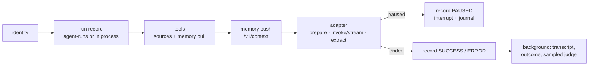

# Architecture

The harness is an attach layer. It owns no control flow: a framework runs the agent, and the
harness sits around one run of it — identity, the run record, memory in and out, the tools the
agent may call and who must approve them, the pause, the recording, the judge.

## Modules

```
src/trellis/
  __init__.py          the public API (lazy; extends __path__ for trellis.contracts / .memory)
  worker.py            python -m trellis.worker module:harness
  eval/                judge, budget, grounding, rubric, datasets, experiments, gate (+ __main__)
  harness/
    harness.py         Harness: settings → clients, writes, judge; wrap / tools / worker / feedback
    agent.py           Agent: run, stream, start, resume, schedule, serve_*; RunHandle
    pipeline.py        one attempt of one run (the fixed pipeline below)
    runtime.py         Runtime (trellis.current()), ask, the pause exception, interrupt ids
    journal.py         what a re-run needs: answers and tool outputs, keyed by content
    events.py          a run's RunEvent stream (built only when someone listens)
    writes.py          background writes with auto-drain
    identity.py        tenant / user / thread / agent / run → memory scope, contracts context
    result.py          Result
    settings.py        the environment
    telemetry.py       OTel spans and counters; OTLP / Langfuse export
    redaction.py       what may leave the process
    worker.py          Worker: claim, lease, heartbeat
    adapters/          detect(target) and one adapter per framework (base, langgraph,
                       openai_agents, claude, react, function)
    tools/             base (Tool), sources (tool, mcp, a2a, openapi), policy (tiers, approve
                       rules), bridge (every call), convert/ (one module per native format)
    clients/           bifrost, memory, runs — the only modules that call those services
    surfaces/          agui (serve_chat), a2a (serve_a2a, the a2a() client)
```

Each service has exactly one client module; nothing else in the harness calls it. The core
imports no framework: an adapter imports its framework the first time a target of its type is
wrapped, and `tests/contract` checks that `import trellis` and `Harness()` load none.

## The pipeline

Every run of every framework goes through `pipeline.attempt`:



A failed memory read is a `warning` event, not a failed run. Writes to agent-runs are awaited
(a pause that was not recorded cannot be resumed); writes to the memory service are queued.

## The adapter contract

Four functions per framework, nothing else (`adapters/base.py`):

* `prepare_input(target, input, context)` — the framework's input, the memory context as a
  system message (or appended to the system prompt);
* `invoke(target, native_input, run)` / `stream(...)` — run it; the stream yields text deltas
  and finally `Output(value)`;
* `extract(target, output)` — the answer, the assistant transcript, and a pause the framework
  reported itself (LangGraph's `interrupt`, an OpenAI Agents `needs_approval`);
* `resume_input(target, native_input, pending, resolution)` — what continues a pause:
  `Command(resume=...)` for a checkpointed graph, the SDK's `RunState` for its approvals,
  otherwise the original input (a re-run).

Per-run harness tools reach the adapter already converted (`tools/convert/<format>.py`). An
adapter with fixed tools (a compiled graph) refuses `tools=` at wrap time; its tools come from
`h.tools(...)` when the graph is built.

## Tools

A source resolves to `Tool`s (a contracts `ToolSpec` and a runner), once per agent and again
after `TOOLS_TTL_SECONDS` (300). Every call, whoever makes it, goes through `tools/bridge.call`:

1. **replay** — the journal already has this call (same tool, same arguments, n-th time): its
   recorded output is returned and nothing runs;
2. **policy** — the tier from the tool's side effects: `read` runs, `write` runs and is
   announced (`tool_notice` event), `irreversible` asks for approval. An `approve` rule for the
   tool replaces the tier: it asks exactly when its condition holds (a small safe expression
   language, parsed at wrap time; a condition that cannot be evaluated asks);
3. **execution** — in a `trellis.tool` span, between `TOOL_CALL_*` events; a failure is an
   error result the model reads, a pause propagates;
4. **record** — journaled, counted, and with `memory="read_write"` sent to the memory
   service's tool records in the background.

A tool called outside a harness run is refused.

`mcp(...)` sources are listed through Bifrost (`<client>-<tool>` names) and executed one call at
a time through it. A source goes to **Code Mode** when it has at least 20 tools or 3 servers
*and* the memory service's catalog says every one of its tools is `read`: the agent then gets
Bifrost's meta-tools (`listToolFiles`, `readToolFile`, `getToolDocs`, `executeToolCode`)
scoped to those servers, scripts run under the run id, and their nested calls are read back
from Bifrost's MCP log (after `CODE_MODE_LOG_DELAY_SECONDS`, 10) into the memory tool records.
A write tool anywhere in a source keeps it in normal mode. Agent Mode is never used.

## Pauses and resumes

`Runtime.ask` is the one pause. Its interrupt (a contracts `Interrupt`) has the id
`<run_id>.<attempt>.<n>`: it names its run, so `resume` needs nothing else. How a run
continues:

* **LangGraph with a checkpointer**: `ask` *is* `langgraph.types.interrupt`; the resume is
  `Command(resume={<LangGraph interrupt id>: resolution})` and the graph continues where it stopped.
* **Everything else**: `ask` raises and the attempt ends (a framework that swallows the
  exception is still paused: the runtime records the pause first). The resume runs the agent
  again from its input, as the next attempt, with the **journal**: questions already answered
  return their answers where they are asked, and tool calls already made return their
  recorded outputs (keyed by content, consumed in order — a re-planned call nobody approved is
  asked about again, never matched to another approval).

The journal is the run's checkpoint: `runs.paused(interrupt, checkpoint=journal)` stores it
with the pause, agent-runs returns it as `RunRecord.checkpoint` on every read and claim (and
clears it when the run ends), and the attempt that resumes the run — in this process or in a
worker elsewhere — files `last_resolution` under the pending question and replays the rest.

A run started in process (`run`/`stream`) continues in the process that resumes it; a run that
came from the queue (`start`, a schedule) goes back to it and a worker continues it. Approve,
reject and edit decisions on tool calls are also feedback records.

## Background writes

`writes.Writes`: a bounded queue (`MAX_PENDING` 10 000) drained by `WRITERS` (4) tasks. A
failed write is logged, counted (`trellis.writes.failed`) and emitted as a `warning` event to
the run's listeners. When the event loop shuts down it cancels the workers, and a cancelled
worker finishes the queue first (the write it was cut off in included; writes are idempotent),
within `DRAIN_SECONDS` (10). `await h.aclose()` drains explicitly.

## Telemetry

The OTel API only: spans `trellis.run` and `trellis.tool`, counters `trellis.runs`,
`trellis.tool_calls`, `trellis.writes.failed`, histogram `trellis.judge.score`. Attributes pass
the redactor. `OTEL_EXPORTER_OTLP_ENDPOINT` and/or a Langfuse key pair install an SDK provider
with OTLP exporters (Langfuse through `/api/public/otel/v1/traces`) — unless the application
installed one itself.
