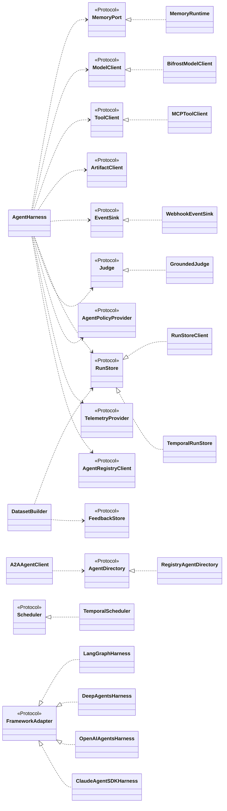

# Architecture

## The one rule

**The harness is not an agent framework.** It owns no control flow, no state model and no
topology. It is a cross-cutting runtime layer that runs *around* an agent someone else
wrote, in a framework the harness does not control and whose version it does not pin.

```
User application
      |
LangGraph / CrewAI / plain Python / a future framework
      |
Framework adapter                      (the only place a framework may be imported)
      |
trellis-harness core           (contracts + pipeline; imports no framework)
      |
      +--> Memory Service (trellis-memory SDK)
      +--> Model client
      +--> Tool runtime
      +--> Artifact runtime
      +--> OpenTelemetry
      +--> Langfuse (optional)
      +--> Policy hooks
      +--> Evaluation events
```

A test enforces the rule rather than trusting it:
`tests/compatibility/test_matrix.py::test_core_never_imports_a_framework` imports the core
in a clean interpreter and asserts that `langgraph`, `crewai`, `google.adk`, `langchain`
and `langfuse` are absent from `sys.modules`.

## Hexagonal layering

Every outbound dependency is a `Protocol`, and they live in the **contracts distribution**, not
here: `trellis/contracts/ports.py` in `trellis-contracts`. `MemoryPort`, `ModelClient`,
`ToolClient`, `ArtifactClient`, `TelemetryProvider`, `TelemetryRedactor`,
`EvaluationProvider`, `EvaluationSink`, `PromptProvider`, `AgentPolicyProvider`,
`AgentRegistryClient`, `EventSink`, `RunStore`, `Scheduler`, `FeedbackStore`, `Judge`,
`AgentDirectory`, `AgentInterceptor`, `LifecycleListener`, `FrameworkAdapter`.

The core depends only on those protocols; concrete adapters are injected. Conformance is
asserted in `tests/contract/test_ports.py` — every shipped implementation is checked
against the protocol it claims.

```
config/        validated settings (YAML + env + code)
runtime/       AgentRuntime, cancellation, structured logging, contextvar propagation
execution/     ContextFactory, ExecutionCoordinator, RuntimeBuilder, retry, sync bridge
interceptors/  the ordered pipeline (identity, policy, memory, telemetry, judge, timeout, result)
memory/        Memory Service adapter, policy, visibility checks, writeback queue
models/        ModelClient implementations (Bifrost, direct) + instrumentation
tools/         ToolClient implementations (local, MCP, memory, composite) + wrap_tool + bridge
reasoning/     the bounded ReAct loop and the ContextAssembler (prompt budget, compaction)
artifacts/     artifact stores + per-run client
events/        the RunEvent stream, its sinks, webhook delivery, target validation
interrupts/    one pause mechanism for every framework; the resolution registry
runs/          the RunStore client over agent-runs, and the ordered run recorder
evaluation/    the grounded judge, datasets, experiments, the regression gate
telemetry/     OTel provider, composite, tracer facade, redaction, sampling, metrics
langfuse/      optional Langfuse provider, interceptor, evaluation, prompts
policy/        policy providers and the PolicyOutcome vocabulary
registry/      the AI Registry client, the agent directory, heartbeat and delta sync
```

The framework adapters and the two surfaces are **not** in that list: each is its own
distribution under `integrations/` (`langgraph`, `deepagents`, `openai_agents`,
`claude_agent_sdk`, `agui`, `a2a`, `temporal`), and the core imports none of them.



## Execution flow

```
harness.wrap(agent)(payload, context=ctx)
  │
  ├─ ContextFactory            explicit context > ambient parent context > harness defaults
  ├─ Sampler.decide            one decision per run, deterministic in the run id
  ├─ RuntimeBuilder.build      memory / model / tools / artifacts, all bound to this run
  ├─ tracer.agent_span         "agent.run" opens; everything below nests inside it
  │   ├─ bind(context, runtime)            contextvars for in-process propagation
  │   ├─ interceptor.before   ascending order
  │   │     identity → policy → memory context → telemetry → langfuse → timeout → user
  │   ├─ the developer's agent             inside asyncio.timeout + a cancellation scope
  │   ├─ AgentResponse.coerce                whatever it returned becomes an AgentResponse
  │   └─ interceptor.after    descending order
  │         result validation → memory observation → evaluation → … → telemetry → identity
  └─ lifecycle events + normalized result (or the original exception re-raised)
```

Ordering is deterministic: `before` ascends by `Order`, `after` descends, so the pipeline
nests like an onion *and* the post-execution sequence is exactly
validation → memory write → evaluation event.

## Context and identity

`AgentExecutionContext` is frozen. A nested agent gets a child via `for_agent()`, which
inherits the trusted identity (tenant, workspace, principal, thread, session, turn, work,
request, correlation, trace, deadline) and replaces only the agent-run fields, recording
`parent_agent_run_id` and `causation_id`.

Run ids are **derived** whenever the execution has a durable position — thread + turn/task
+ agent — so a replayed step produces the same id. Idempotency keys for observations,
artifacts and tool calls hang off that same lineage, which is what makes framework retries
and checkpoint replays safe (§42, §55).

In-process propagation uses `contextvars` (convenience only). Across services the contract
is W3C Trace Context via the configured OpenTelemetry propagator; baggage carries ids only
— never content, never credentials.

## Telemetry

OpenTelemetry is canonical. The harness needs only the OTel **API** at runtime: with no SDK
configured, the API's no-op implementation is used and nothing breaks. `HarnessTracer` is
the single place where three policies are applied — capture (may a payload be attached at
all), redaction (what an allowed payload may contain) and sampling (is this run traced) —
so no call site can forget them.

Langfuse is layered on the same spans. Its SDK attaches a span processor to the
`TracerProvider`, so enabling it adds an exporter rather than a second span tree; the
harness enriches its existing spans with Langfuse's documented OTel attributes
(`langfuse.observation.type`, `session.id`, `user.id`, usage/cost details) and tells the
SDK — through its public `should_export_span` hook — to export harness spans too. A test
asserts the span count is identical with Langfuse on and off.

## Failure philosophy

| Dependency | Default behaviour |
| --- | --- |
| Memory unavailable (read) | run without context, attach a `MEMORY_DEGRADED` warning |
| Memory unavailable (write) | keep the result, attach `MEMORY_WRITE_FAILED` |
| Memory, `fail_closed` | raise `MemoryUnavailableError` |
| Model unavailable | normalized `ModelError` (category `MODEL`) |
| Tool unavailable | normalized `ToolError` (category `TOOL`) |
| Langfuse unavailable | execution continues; events buffered or dropped |
| OTel exporter unavailable | execution continues |
| Policy provider unavailable | allow (or deny, with `policy.failure_mode: fail_closed`) |

Cancellation is never swallowed: `asyncio.CancelledError` always propagates.

## Complexity budget

| Operation | Cost |
| --- | --- |
| Context creation | O(1) |
| Provider/tool lookup | O(1) average (dict) |
| Interceptor chain | O(I), chain materialised once at construction |
| Lifecycle listeners | O(L) |
| Result mapping | O(R) in the result's own size |

Nothing scans all registered agents or tools per call. In-process state is bounded: the
writeback queue refuses work above `max_pending` rather than growing, the in-memory
artifact store evicts, evaluation events carry references rather than payloads, and
completed executions are exported rather than accumulated.

## Patterns used

Decorator (`wrap`, `wrap_tool`), Interceptor/Middleware (the pipeline), Adapter (framework
and provider adapters), Strategy (memory/retry/sampling policies), Factory
(`ContextFactory`, `RuntimeBuilder`, `MemoryFactory`), Registry (tools, descriptors),
Facade (`AgentHarness`), Observer (lifecycle listeners, evaluation sinks), Composite
(telemetry providers, evaluation sinks).

## Extension points

* a new framework → a `FrameworkAdapter` in its own distribution;
* a new model/tool provider → implement `ModelClient` / `ToolClient`;
* a new observability backend → implement `TelemetryProvider` (compose it, do not replace
  OpenTelemetry);
* a new policy engine (OPA, a policy service) → implement `AgentPolicyProvider`;
* an agent registry → implement `AgentRegistryClient` (default: no-op);
* prompt management → implement `PromptProvider`;
* Bifrost / MCP / A2A → `ModelClient`, `ToolClient`, `PromptProvider` and the serializable
  `AgentRequest`/`AgentResponse` exist so these plug in without rewriting agents.
