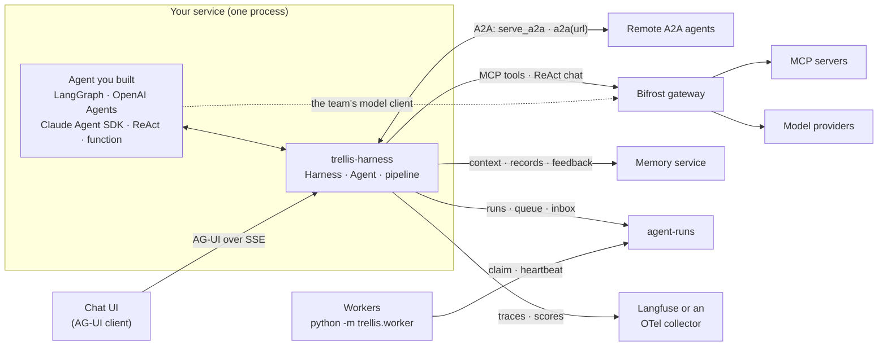
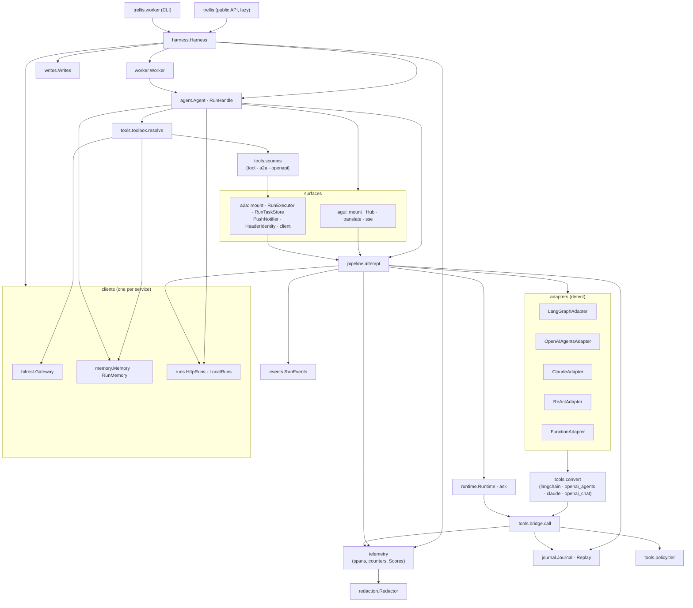
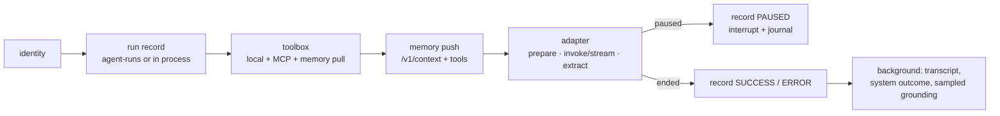
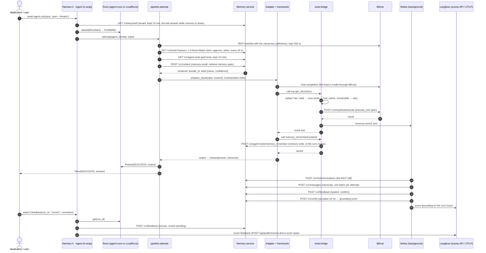
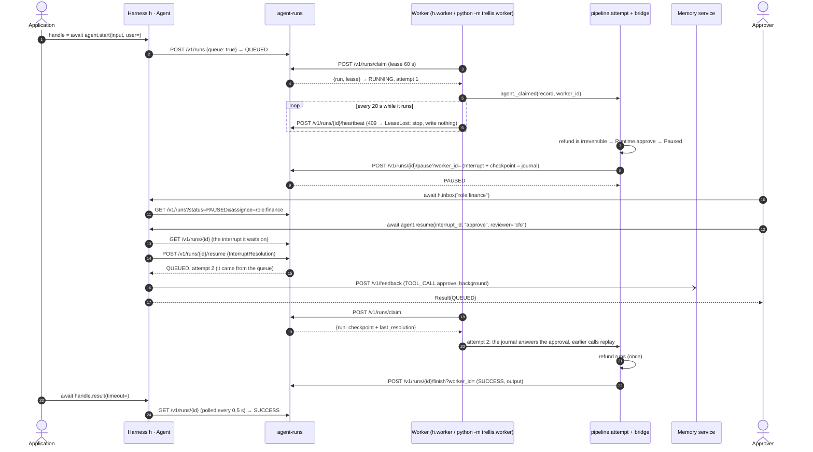
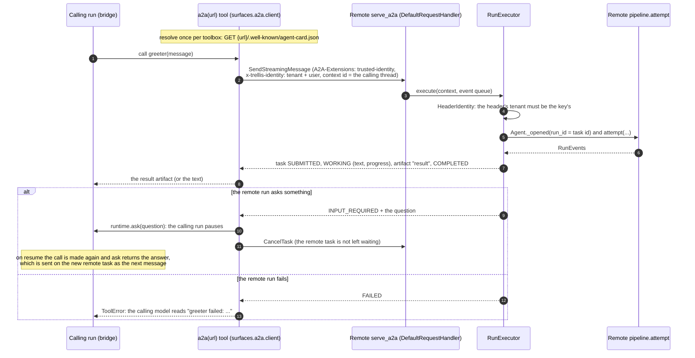
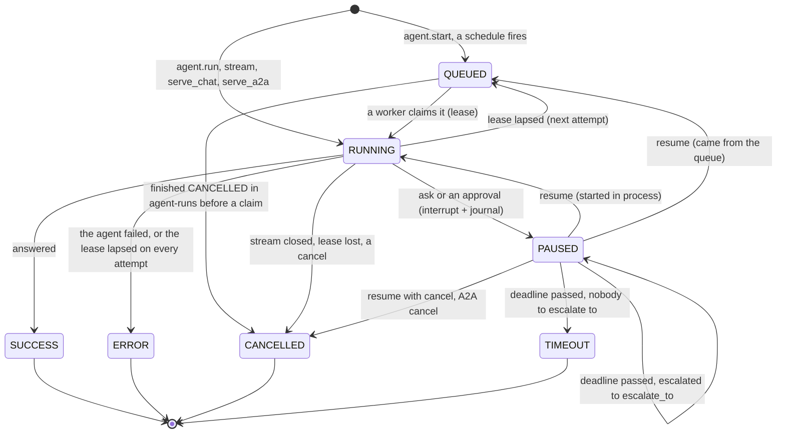
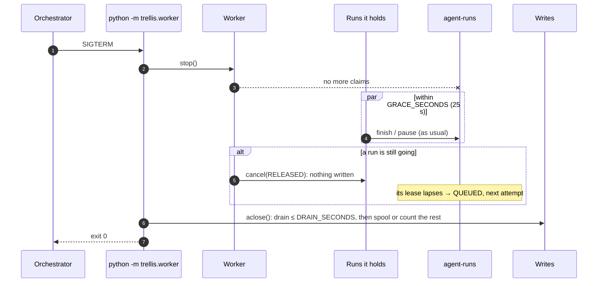

# Architecture

The harness is an attach layer. It owns no control flow: a framework runs the agent, and the
harness sits around one run of it — identity, the run record, memory in and out, the tools the
agent may call and who must approve them, the pause, the recording, the trace.

## System context

What a process that imports `trellis` talks to. Every arrow out of the harness is one client
module (`clients/bifrost.py`, `clients/memory.py`, `clients/runs.py`) or one surface
(`surfaces/agui`, `surfaces/a2a`); the OTLP exporter and the Langfuse scores API are
`telemetry.py`.



| Neighbour | What the harness uses it for | Endpoints (module) |
|---|---|---|
| Bifrost gateway (`BIFROST_URL`, `BIFROST_VIRTUAL_KEY`) | the MCP tools the virtual key allows, their execution, Code Mode, `ReAct`'s model calls, the MCP log of Code Mode scripts | `POST /mcp` (`tools/list`), `POST /v1/mcp/tool/execute`, `POST /v1/chat/completions`, `GET /api/mcp-logs` (`clients/bifrost.py`, through `bifrost-sdk`) |
| Memory service (`MEMORY_URL`, `TRELLIS_API_KEY`) | who the key is, the pushed context, the pull tools, transcripts and tool records, the tool catalog, outcomes and feedback, the grounding check, documents, the agent's model key | `/v1/keys/self`, `/v1/context`, `/v1/agent-tools`, `/v1/messages`, `/v1/tools/invocations`, `/v1/tools`, `/v1/tools/catalog`, `/v1/feedback`, `/v1/verify`, `/v1/documents`, `/v1/agents/model-key` (`clients/memory.py`, through `trellis-memory`) |
| agent-runs (`RUNS_URL`, `TRELLIS_API_KEY`) | run records, the worker queue and leases, pauses with their checkpoint, the inbox, schedules, `ask` artifacts | `/v1/runs`, `/v1/runs/claim`, `/v1/runs/{id}/heartbeat`, `/pause`, `/resume`, `/finish`, `/artifacts`, `/v1/artifacts/{id}`, `/v1/schedules` (`clients/runs.py`) |
| Chat UI | runs and their events, resumes, reconnects, large interrupt payloads | `serve_chat`: `POST {path}/run`, `GET {path}/runs/{id}/events`, `GET {path}/runs/{id}/artifacts/{artifact_id}` (`surfaces/agui`) |
| Remote A2A agents | callers of this agent, and agents this agent calls | `serve_a2a`: the card and JSON-RPC at `url`; `a2a(url)`: `SendStreamingMessage`, `CancelTask` (`surfaces/a2a`) |
| Langfuse / an OTel collector (`OTEL_EXPORTER_OTLP_*`) | traces; grounding and feedback scores | OTLP/HTTP `<endpoint>/v1/traces`, `POST /api/public/scores` (`telemetry.py`) |


Unset variables remove a box: no `BIFROST_URL` means no MCP tools and no `ReAct` model names,
no `MEMORY_URL` means no memory, no `RUNS_URL` keeps runs, the queue and schedules in this
process (`LocalRuns`), no `OTEL_EXPORTER_OTLP_ENDPOINT` means no export
([docs/configuration.md](docs/configuration.md)).

## Modules

```
src/trellis/
  __init__.py          the public API (lazy; extends __path__ for trellis.contracts / .memory)
  worker.py            python -m trellis.worker module:harness
  harness/
    harness.py         Harness: settings → clients, writes, scores; the key (tenant, kept fresh);
                       wrap / tools / worker / inbox / feedback / add_document
    agent.py           Agent: run, stream, start, resume, schedule, serve_*; RunHandle
    pipeline.py        one attempt of one run (the fixed pipeline below)
    runtime.py         Runtime (trellis.current()), ask, the pause exception, interrupt ids
    journal.py         what a re-run needs: answers and tool outputs, keyed by content
    events.py          a run's RunEvent stream (built only when someone listens)
    writes.py          background writes: retries, backpressure, the spool, auto-drain
    fresh.py           a value read from a service, kept for a TTL, the last one through outages
    identity.py        tenant / user / thread / agent / run → memory scope, contracts context
    result.py          Result
    settings.py        the environment
    telemetry.py       OTel GenAI spans, trace ids per run, counters; OTLP export; Langfuse scores
    redaction.py       what may leave the process
    worker.py          Worker: claim, lease, heartbeat
    adapters/          detect(target) and one adapter per framework (base, langgraph,
                       openai_agents, claude, react, function)
    tools/             base (Tool), sources (tool, a2a, openapi), toolbox (MCP tools, catalog
                       tiers and approve_when, Code Mode, publishing), policy (tiers,
                       conditions), bridge (every call), convert/ (one module per native format)
    clients/           bifrost, memory, runs — the only modules that call those services
    surfaces/          agui (serve_chat), a2a (serve_a2a, the a2a() client)
```

Each service has exactly one client module; nothing else in the harness calls it. The core
imports no framework: an adapter imports its framework the first time a target of its type is
wrapped, and `tests/contract` checks that `import trellis` and `Harness()` load none — and that
what the clients send, and what the test doubles of the memory service and agent-runs answer,
match those services' committed OpenAPI documents.

### Components

How the modules depend on each other (an arrow reads "uses"). The adapters and the tool
converters are the only modules that import a framework; the surfaces are the only ones that
import FastAPI or the A2A SDK.



## The pipeline

Every run of every framework goes through `pipeline.attempt`:



A memory service that is down degrades a run, it never fails it: a failed context read is a
`warning` event; the memory tools that cannot be listed are left out (a `warning` event); a
catalog that cannot be read makes every tool that does more than read ask; who
`TRELLIS_API_KEY` is stays what it was last read (`fresh.Fresh`). Only a key the service refuses,
or one it could never be asked about, is a `ConfigurationError`. Writes to agent-runs are
awaited (a pause that was not recorded cannot be resumed) and retried; writes to the memory
service are queued.

### One run, end to end

A wrapped agent answers with memory recalled, calls an MCP tool, writes a memory through the
`memory_remember` pull tool, and a person's feedback arrives later. Calls in the `Writes` lane
are background writes: the run does not wait for them.



The memory tools' own calls are not recorded again (the service logs them); everything else
the bridge runs is.

## The adapter contract

Four functions per framework, nothing else (`adapters/base.py`):

* `prepare_input(target, input, context)` — the framework's input, the memory context as a
  system message (or appended to the system prompt);
* `invoke(target, native_input, run)` / `stream(...)` — run it; the stream yields text deltas
  and finally `Output(value)`;
* `extract(target, output)` — the answer, the assistant transcript, and a pause the framework
  reported itself (LangGraph's `interrupt`, an OpenAI Agents `needs_approval`);
* `resume_input(target, native_input, pending, resolution)` — what continues a pause:
  `Command(resume=...)` for a checkpointed graph, the SDK's `RunState` for its approvals,
  otherwise the original input (a re-run).

Per-run harness tools reach the adapter already converted (`tools/convert/<format>.py`). An
adapter with fixed tools (a compiled graph) refuses `tools=` at wrap time; its tools come from
`h.tools(...)` when the graph is built.

## Tools

The toolbox (`tools/toolbox.py`, one `Toolbox` per agent and tenant) keeps two things fresh on
two clocks: the definitions — the local sources and every MCP tool the Bifrost virtual key
allows — listed again after `TOOLS_TTL_SECONDS` (300), and the governance — the catalog's word on
each tool (`risk`, `approve_when`) — read again after `GOVERNANCE_TTL_SECONDS` (30) with the last
answer's `ETag` (`If-None-Match`; a `304` keeps what was read), so an administrator's new rule
reaches running agents within half a minute. One refresh at a time: concurrent runs that find
the toolbox stale share one read. Code Mode is chosen for the read-only Code Mode servers when
there are enough of them, and every tool is published to the catalog in the background (and
published again at the next listing if that failed). A catalog that cannot be read leaves each
tool its own tier, except that every tool that does more than read asks for approval
(`policy.CATALOG_UNREAD`) until it can (governance read in the last 300 s still stands); the
warning is logged once. Every call, whoever makes it, goes through `tools/bridge.call`:

1. **replay** — the journal already has this call (same tool, same arguments, n-th time): its
   recorded output is returned and nothing runs;
2. **policy** — the tier from the tool's side effects (annotations → declaration → the
   catalog's `risk`): `read` runs, `write` runs and is announced (`tool_notice` event),
   `irreversible` asks for approval. The catalog's `approve_when` replaces the tier: it asks
   exactly when the expression holds, evaluated by `trellis.memory.approval` — the memory
   service's own implementation, which also writes and validates the rules (a rule that cannot
   be read or evaluated asks);
3. **execution** — in an `execute_tool` span, between `TOOL_CALL_*` events; a failure is an
   error result the model reads, a pause propagates;
4. **record** — journaled (the tool is then offered for the rest of the run), counted, and
   with memory writes on sent to the memory service's tool records in the background.

A tool called outside a harness run is refused. What the model is *offered* (the tools the
context names, the memory tools, the tools already used) is `Runtime.offers`; each adapter
narrows as far as its framework allows (`Adapter.narrows`: per turn, per run, or none).
Agent Mode is never used.

## Pauses and resumes

`Runtime.ask` is the one pause. Its interrupt (a contracts `Interrupt`) has the id
`<run_id>.<attempt>.<n>`: it names its run, so `resume` needs nothing else. How a run
continues:

* **LangGraph with a checkpointer**: `ask` *is* `langgraph.types.interrupt`; the resume is
  `Command(resume={<LangGraph interrupt id>: resolution})` and the graph continues where it stopped.
* **Everything else**: `ask` raises and the attempt ends (a framework that swallows the
  exception is still paused: the runtime records the pause first). The resume runs the agent
  again from its input, as the next attempt, with the **journal**: questions already answered
  return their answers where they are asked, and tool calls already made return their
  recorded outputs (keyed by content, consumed in order — a re-planned call nobody approved is
  asked about again, never matched to another approval).

The journal is the run's checkpoint: `runs.paused(interrupt, checkpoint=journal)` stores it
with the pause, agent-runs returns it as `RunRecord.checkpoint` on every read and claim (and
clears it when the run ends), and the attempt that resumes the run — in this process or in a
worker elsewhere — files `last_resolution` under the pending question and replays the rest.

A run started in process (`run`/`stream`) continues in the process that resumes it; a run that
came from the queue (`start`, a schedule) goes back to it and a worker continues it. Approve,
reject and edit decisions on tool calls are also feedback records.

### A pause through agent-runs

A queued run asks for approval of an `irreversible` tool; a person answers from the inbox; a
worker (any worker) continues it from the checkpoint.



Without `RUNS_URL` the same sequence runs against `LocalRuns` in the process, and a run
started with `run`/`stream` resumes in the process that calls `resume` (no queue, no worker).

## Calling a remote agent over A2A

`a2a(url)` makes a remote agent one tool. The remote side is another harness's
`serve_a2a(app, url)` (or any A2A server); the task id there is the remote run id.



## Run states

The run record's status (contracts `RunStatus`) and who moves it. The harness writes `QUEUED`,
`RUNNING`, `PAUSED`, `SUCCESS`, `ERROR` and `CANCELLED`. agent-runs' ticker moves the rest: a
lapsed lease back to `QUEUED` (or to `ERROR` once every attempt lapsed), and a paused run past
its interrupt's deadline to `escalate_to` (once) or to `TIMEOUT`. `PARTIAL` and `REJECTED` are
valid endings of the contract that the harness never writes.



Every attempt (each `RUNNING` stretch) is one `invoke_agent` span in the run's one trace.

## Background writes

`writes.Writes`: a bounded queue (`MAX_PENDING` 10 000) drained by `WRITERS` (4) tasks. A
write whose failure may pass is tried again (`WRITE_ATTEMPTS` 3, full-jitter backoff); a full
queue makes the writer wait (`SUBMIT_WAIT_SECONDS` 5) instead of dropping the write. A write
given up is logged, counted and emitted as a `warning` event to the run's listeners — or, with
`TRELLIS_SPOOL_DIR`, appended to a JSONL spool that the next process replays. When the event loop
shuts down it cancels the workers, and a cancelled worker finishes the queue first (the write it
was cut off in included; writes are idempotent), within `DRAIN_SECONDS` (10); what is left is
spooled or counted lost (`trellis.writes.undelivered`). `await h.aclose()` drains explicitly.
The guarantee is in [docs/memory.md](docs/memory.md#background-writes-what-is-guaranteed).

## Stopping a worker

`python -m trellis.worker` turns `SIGTERM`/`SIGINT` into `Worker.stop()`:



## Telemetry

The OTel API only: an `invoke_agent` span per attempt in a trace whose id derives from the run
id (every attempt, score and piece of feedback of a run in one trace), `execute_tool`,
`chat` (the `ReAct` model calls) and `retrieve memory` spans with GenAI attributes and
Langfuse's trace attributes, `score` spans; counters `trellis.runs`, `trellis.tool_calls`,
`trellis.writes.failed`. Attributes pass the redactor and are built only for a recording span.
`OTEL_EXPORTER_OTLP_ENDPOINT` installs an SDK provider with one OTLP exporter unless the
application installed one. See [docs/observability.md](docs/observability.md).
