# Architecture

The harness is an attach layer. It owns no control flow: a framework runs the agent, and the
harness sits around one run of it — identity, the run record, memory in and out, the tools the
agent may call and who must approve them, the pause, the recording, the trace.

## Two ways

Trellis is used in two ways ([README](README.md#two-ways-to-use-trellis)), and both reach the
same services through the same clients. **Way 1, wrapped:** `h.wrap(agent)`, and the harness's
pipeline calls every block around each run of the framework. **Way 2, pluggable blocks:** the
team's own code runs the framework and calls the blocks it wants itself. The blocks are the
same objects in both: the harness builds its run store on `trellis.runs.RunsClient`, its memory
calls on `trellis.memory`, and checks every tool call with the same `Governance` a team imports.

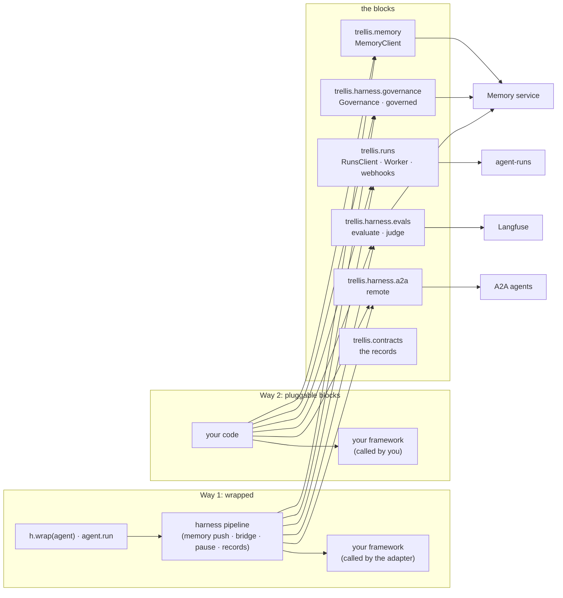

Every block takes and returns `trellis.contracts` records, which is why a run paused either way
is one `RunRecord` in one inbox. What only Way 1 has is the pipeline itself: the journal that
lets a resumed run repeat no side effect, the background writes with their spool, the toolbox
(MCP tools, Code Mode, tool hints), and the AG-UI and A2A servers, which serve a run through
it. The rest of this document is the harness, Way 1; the blocks' pages are
[docs/blocks/](docs/README.md#way-2-pluggable-blocks-your-framework-our-pieces).

## System context

What a process that imports `trellis` talks to. Every arrow out of the harness is one client
module (`clients/bifrost.py`, `clients/memory.py`, and `runs.py`, whose store is the agent-runs
SDK's `trellis.runs.RunsClient`) or one protocol package (`agui`, `a2a`); the OTLP
exporter and the Langfuse scores API are `telemetry.py`.

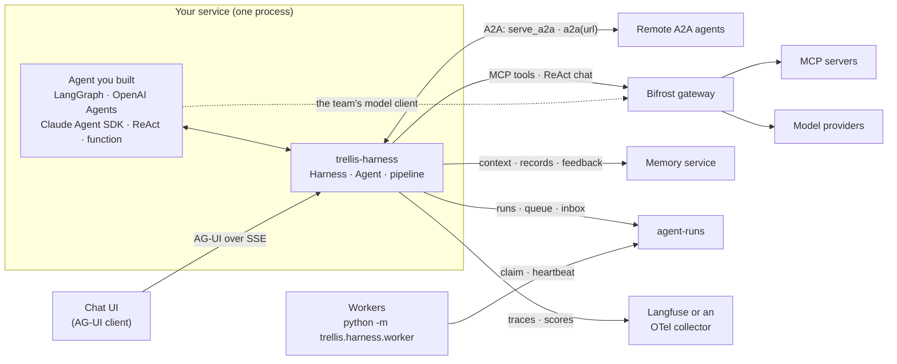

| Neighbour | What the harness uses it for | Endpoints (module) |
|---|---|---|
| Bifrost gateway (`BIFROST_URL`, `BIFROST_VIRTUAL_KEY`) | the MCP tools the virtual key allows (or a Virtual MCP's), their execution, Code Mode, `ReAct`'s and the judge's model calls, the MCP log of Code Mode scripts, stored prompts, skills, the MCP clients' Agent Mode lists | `POST /mcp[/<slug>]` (`tools/list`, `tools/call`), `POST /v1/mcp/tool/execute`, `POST /v1/chat/completions`, `GET /api/mcp-logs`, `GET /api/prompt-repo/prompts`, `GET /api/skills[/...]`, `GET /api/mcp/clients` (`clients/bifrost.py`, through `bifrost-sdk`) |
| Memory service (`MEMORY_URL`, `TRELLIS_API_KEY`) | who the key is, the pushed context, the pull tools, transcripts and tool records, the tool catalog, outcomes and feedback, the grounding check, documents, the agent's model key | `/v1/keys/self`, `/v1/context`, `/v1/agent-tools`, `/v1/messages`, `/v1/tools/invocations`, `/v1/tools`, `/v1/tools/catalog`, `/v1/feedback`, `/v1/verify`, `/v1/documents`, `/v1/agents/model-key` (`clients/memory.py`, the tool catalog's `/v1/tools`, `/v1/tools/catalog` and approval feedback in `governance/catalog.py`, and `/v1/verify` in `evals.grounding_score`, through `trellis-memory`) |
| agent-runs (`RUNS_URL`, `TRELLIS_API_KEY`) | run records, the worker queue and leases, pauses with their checkpoint, the inbox, schedules, `ask` artifacts | `/v1/runs`, `/v1/runs/claim`, `/v1/runs/{id}/heartbeat`, `/pause`, `/resume`, `/finish`, `/artifacts`, `/v1/artifacts/{id}`, `/v1/schedules` (`runs.py`, through `trellis.runs.RunsClient`) |
| Chat UI | runs and their events, resumes, reconnects, large interrupt payloads | `serve_chat`: `POST {path}/run`, `GET {path}/runs/{id}/events`, `GET {path}/runs/{id}/artifacts/{artifact_id}` (`agui`) |
| Remote A2A agents | callers of this agent, and agents this agent calls | `serve_a2a`: the card and JSON-RPC at `url`; `a2a(url)` and `remote(url)`: `SendStreamingMessage`, `CancelTask` (`a2a`) |
| Langfuse / an OTel collector (`OTEL_EXPORTER_OTLP_*`) | traces (an evaluated run's spans with Langfuse's experiment attributes); grounding, feedback and evaluation scores; evaluation datasets and dataset runs | OTLP/HTTP `<endpoint>/v1/traces`, `POST /api/public/scores`, `GET /api/public/v2/datasets/{name}`, `GET /api/public/dataset-items`, `POST /api/public/dataset-run-items` (`telemetry.Langfuse`) |


Unset variables remove a box: no `BIFROST_URL` means no MCP tools and no `ReAct` model names,
no `MEMORY_URL` means no memory, no `RUNS_URL` keeps runs, the queue and schedules in this
process (`runs.LocalRuns`), no `OTEL_EXPORTER_OTLP_ENDPOINT` means no export
([docs/configuration.md](docs/configuration.md)).

## Modules

```
src/trellis/
  __init__.py          the public API (lazy; extends __path__ for trellis.contracts / .memory /
                       .runs)
  harness/
    harness.py         Harness: the blocks given (runs, memory, gateway, governance), the rest
                       built from the settings; writes, evaluation services; the key (tenant,
                       kept fresh); governance per tenant; wrap / tools / worker / inbox /
                       feedback / add_document / evaluate / score
    agent.py           Agent: run, stream, start, execute (a claimed run), resume, schedule,
                       serve_*; RunHandle
    pipeline.py        one attempt of one run, from its record — the one way every entry
                       starts one (the fixed pipeline below)
    runtime.py         Runtime (trellis.current()), ask, the pause exception, interrupt ids
    features.py        without=: the features a run or an agent turns off (Feature)
    hooks/             Hooks (before/after run, model, tool; on_error) and how they chain;
                       langchain (middleware) and openai_agents (RunHooks): the model hooks
                       through each framework's own mechanism
    journal.py         what a re-run needs: answers and tool outputs, keyed by content (and
                       the journals of the sub-agents' runs working inside its calls)
    subagents.py       agent.as_tool(): a wrapped agent as a tool, each call a child run
    sandbox/           sandbox(): the run's own sandbox as three tools, its life the run's
                       (made, recorded, attached, paused, deleted, reaped); base (the
                       provider-neutral interface), docker (DockerSandbox: the Engine API)
    events.py          a run's RunEvent stream (built only when someone listens)
    writes.py          background writes: retries, backpressure, the spool, auto-drain
    fresh.py           a value read from a service, kept for a TTL, the last one through outages
    identity.py        tenant / user / thread / agent / run → memory scope, contracts context
    result.py          Result
    evals.py           evaluation, usable without Harness: EvalServices (Langfuse, the judge;
                       from_env), evaluate (a wrapped Agent or any async callable), judge
                       (on-line, from any code), the evaluators (grounding with grounding_score,
                       exact_match, contains, llm_judge)
    settings.py        the environment
    telemetry.py       OTel GenAI spans, trace ids per run, counters; OTLP export; the Langfuse
                       client (scores, datasets, dataset runs)
    redaction.py       what may leave the process
    runs.py            RunStore (the part of trellis.runs.RunsClient the harness calls, with its
                       signatures) and LocalRuns (the same store in process, when RUNS_URL is
                       unset)
    worker/            Worker: trellis.runs.Worker (claim, lease, heartbeat, graceful stop)
                       running wrapped agents, the background writes around it; __main__:
                       python -m trellis.harness.worker module:harness
    adapters/          detect(target) and one adapter per framework (base, langgraph,
                       openai_agents, claude, react, function)
    governance/        the run / announce / ask decision, usable without Harness: decision
                       (Action, Decision, decide), catalog (Rule, the catalog kept fresh, failing
                       closed, publishing), Governance (check, rules, publish, decided,
                       from_env) and governed
    tools/             base (Tool), sources (tool, a2a, openapi), toolbox (MCP tools, their
                       side effects, Code Mode, publishing), bridge (every call: governance,
                       then pause / announce / run), convert/ (one module per native format)
    clients/           bifrost, memory — the only modules that call those services
    agui/              serve_chat: mount, the Hub (buffered events), translate, sse
    a2a/               A2A both ways: client (remote() → RemoteAgent, usable from any code;
                       the a2a() tool is built on it), server (serve_a2a: mount, the card),
                       executor, tasks, identity, push, translate
```

Each service has exactly one client module; nothing else in the harness calls it (agent-runs'
is the SDK's `RunsClient`, which `runs.py` types as the `RunStore`) — except the tool catalog, which `governance/catalog.py` reads and writes through the memory SDK itself, and
the grounding check, which `evals.grounding_score` asks through the memory SDK's
`MemoryContext`, so governance and evaluation work without a `Harness`. The core imports no framework: an adapter imports its
framework the first time a target of its type is wrapped, and `tests/contract` checks that
`import trellis` and `Harness()` load none — and that what the clients send, and what the test
doubles of the memory service and agent-runs answer, match those services' committed OpenAPI
documents.

### Components

How the modules depend on each other (an arrow reads "uses"). The adapters and the tool
converters are the only modules that import a framework; `agui` and `a2a` are the only ones
that import FastAPI or the A2A SDK.

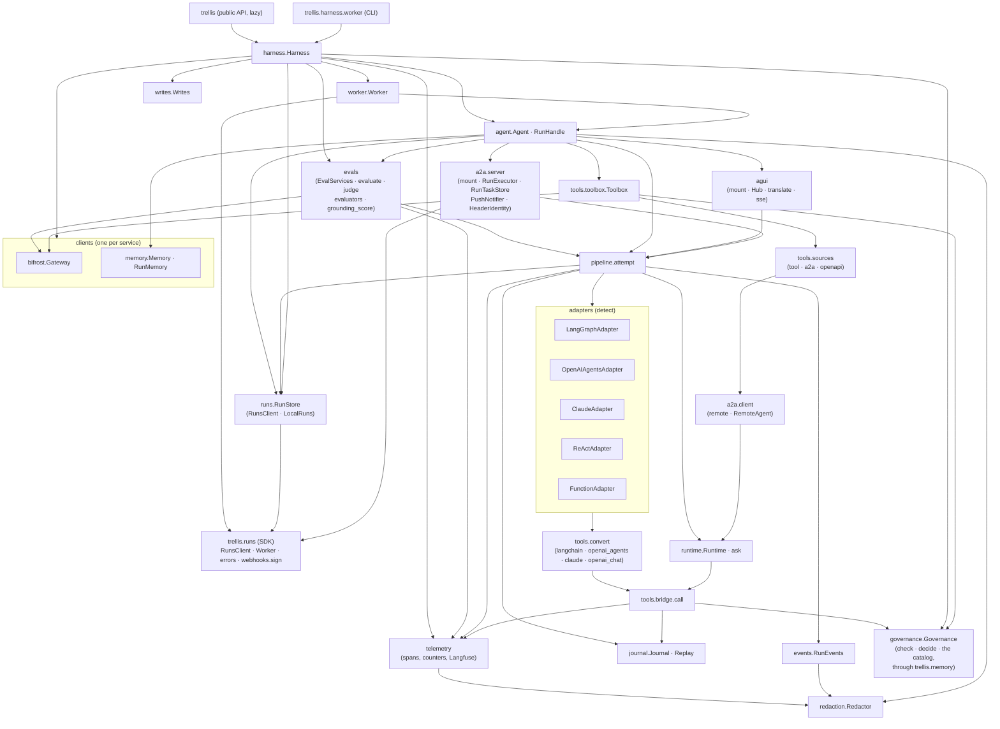

## The pipeline

Every attempt of every run goes through `pipeline.attempt`, from the run's record — however it
started: `agent.run`/`stream`, a resume, `agent.execute(job)` (any worker), a sub-agent's call,
`serve_chat`, `serve_a2a`, `h.evaluate` — so its time limit, version and `without=` apply
everywhere; the run hooks (`on_run_start`, `on_run_end`, `on_error`) fire around it:

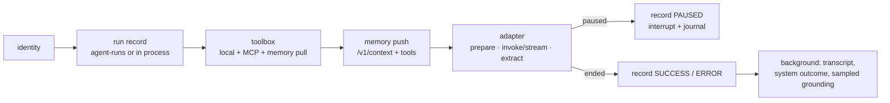

A memory service that is down degrades a run, it never fails it: a failed context read is a
`warning` event; the memory tools that cannot be listed are left out (a `warning` event); a
catalog that cannot be read makes every tool that does more than read ask; who
`TRELLIS_API_KEY` is stays what it was last read (`fresh.Fresh`). Only a key the service refuses,
or one it could never be asked about, is a `ConfigurationError`. Writes to agent-runs are
awaited (a pause that was not recorded cannot be resumed) and retried; writes to the memory
service are queued.

### One run, end to end

A wrapped agent answers with memory recalled, calls an MCP tool, writes a memory through the
`memory_remember` pull tool, and a person's feedback arrives later. Calls in the `Writes` lane
are background writes: the run does not wait for them.

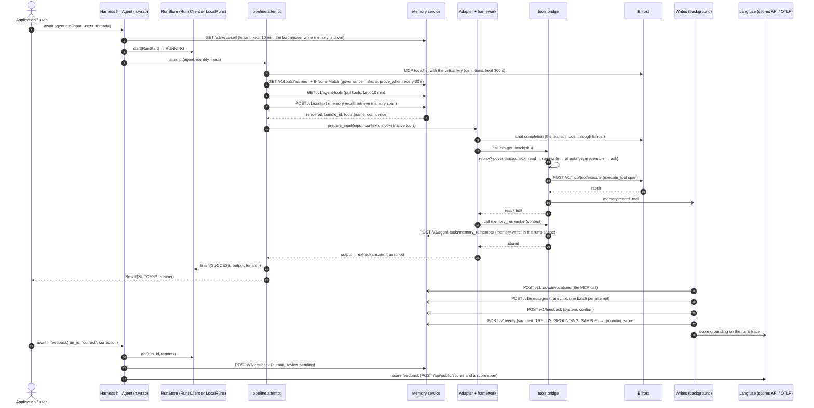

The memory tools' own calls are not recorded again (the service logs them); everything else
the bridge runs is.

## The adapter contract

Four functions per framework, nothing else (`adapters/base.py`):

* `prepare_input(target, input, context)` — the framework's input, the memory context as a
  system message (or appended to the system prompt);
* `invoke(target, native_input, run)` / `stream(...)` — run it; the stream yields text deltas
  and finally `Output(value)`;
* `extract(target, output)` — the answer, the assistant transcript, and a pause the framework
  reported itself (LangGraph's `interrupt`, an OpenAI Agents `needs_approval`);
* `resume_input(target, native_input, pending, resolution)` — what continues a pause:
  `Command(resume=...)` for a checkpointed graph, the SDK's `RunState` for its approvals,
  otherwise the original input (a re-run).

Per-run harness tools reach the adapter already converted (`tools/convert/<format>.py`). An
adapter with fixed tools (a compiled graph) refuses `tools=` at wrap time; its tools come from
`h.tools(...)` when the graph is built. How each framework looks from the outside — the lines
to add to an existing project, which pauses resume in place, the framework's own tools and
gates, the limits — is one page per framework under [docs/frameworks/](docs/README.md#which-target).

## Tools

The toolbox (`tools/toolbox.py`, one `Toolbox` per agent and tenant) keeps the definitions — the
local sources and every MCP tool the Bifrost virtual key allows — fresh: listed again after
`TOOLS_TTL_SECONDS` (300), one listing at a time (concurrent runs that find it stale share one).
A new listing is published to the catalog through governance, in the background (and published
again at the next listing if that failed). Code Mode is chosen for the Code Mode servers whose
tools all only read as governance says now, when there are enough of them; its meta-tools are
offered under the harness's names, so the gateway (which runs a declared meta-tool itself under
its own name) returns every call to the bridge. With `mcp=` the definitions are the named
Virtual MCPs' tools, each run through its bundle; a tool its client lists in
`tools_to_auto_execute` is left out ([docs/gateway.md](docs/gateway.md)).

Governance (`governance/`, one `Governance` per tenant: `Harness.governance`) is the only place a
call's action is decided ([docs/governance.md](docs/governance.md)). It reads the catalog's word
on each tool it is asked about (`risk`, `approve_when`) again after `GOVERNANCE_TTL_SECONDS` (30)
with the last answer's `ETag` (`If-None-Match`; a `304` keeps what was read), so an
administrator's new rule reaches running agents within half a minute; a tool asked about for the
first time is read at once, and concurrent calls share one read. A catalog that cannot be read
leaves each tool its own risk, except that every tool that does more than read asks for approval
(`catalog.CATALOG_UNREAD`) until it can (rules read in the last 300 s still stand); the warning
is logged once. Governance never sees the run (`Runtime`): the same `Governance` checks the
tools of code that does not use `h.wrap` (`Governance.from_env`, `governed`).

Every call, whoever makes it, goes through `tools/bridge.call`:

1. **replay** — the journal already has this call (same tool, same arguments, n-th time): its
   recorded output is returned and nothing runs; a tool of a feature the run is `without=` is
   refused;
2. **hooks** — the run's `before_tool` hooks may deny the call, rewrite its arguments or ask a
   person about it; their decision is journaled with the call's occurrence
   ([docs/hooks.md](docs/hooks.md));
3. **governance** — `Harness.governance(tenant).check(tool, args, side_effects=...)`, by the
   tool's name, as the catalog says at the time of the call (so a rule set after a graph was
   compiled, or on a tool an OpenAI Agents handoff carries, still applies): `read` runs,
   `write` runs and is announced (`tool_notice` event), `irreversible` asks for approval. The
   catalog's `approve_when` replaces that: it asks exactly when the expression holds, evaluated
   by `trellis.memory.approval` — the memory service's own implementation, which also writes
   and validates the rules (a rule that cannot be read or evaluated asks). The bridge acts on
   the decision: it pauses the run (`Runtime.approve` with the decision's question), announces
   the call, or runs it;
4. **execution** — `tools.base.execute`, the one executor `governed` uses too (the tool's
   timeout within the run's, retries of reads, an unknown outcome for a write out of time), in
   an `execute_tool` span, between `TOOL_CALL_*` events; a failure is an error result the
   model reads, a pause propagates; the `after_tool` hooks may change the outcome;
5. **record** — journaled (the tool is then offered for the rest of the run), counted, and
   with memory writes on sent to the memory service's tool records in the background.

A tool called outside a harness run is refused. What the model is *offered* (the tools the
context names, the memory tools, the tools already used) is `Runtime.offers`; each adapter
narrows as far as its framework allows (`Adapter.narrows`: per turn, per run, or none).
Agent Mode is never used.

## Pauses and resumes

`Runtime.ask` is the one pause (built as a `Question`, `asking.py`, which Way 2 and a graph's
own `interrupt(value)` use too; an approval is the same pause, and so is a result from outside
the run, which is an `ask` in the tool).
Its interrupt (a contracts `Interrupt`) has the id `<run_id>.<attempt>.<n>`: it names its run,
so `resume` needs nothing else. Once the pause is recorded, the notifiers are told
(`notify.py`, in the background). With `RUNS_URL` every attempt's events also go to the run's
event log in agent-runs (`runlog.py`), the last ones before the pause or the ending is recorded.
How a run continues:

* **LangGraph with a checkpointer**: `ask` *is* `langgraph.types.interrupt`; the resume is
  `Command(resume={<LangGraph interrupt id>: resolution})` and the graph continues where it stopped.
* **Claude Agent SDK**: the attempt ends the same way, and the CLI's session (`Journal.session`)
  is resumed by the next attempt (`resume=`), which calls the paused tool again: the journal
  answers it, and the built-in tools the session ran are not run again.
* **Everything else**: `ask` raises and the attempt ends (a framework that swallows the
  exception is still paused: the runtime records the pause first). The resume runs the agent
  again from its input, as the next attempt, with the **journal**: questions already answered
  return their answers where they are asked, and tool calls already made return their
  recorded outputs (keyed by content, consumed in order — a re-planned call nobody approved is
  asked about again, never matched to another approval).

The journal is the run's checkpoint: a worker saves it as progress on a heartbeat after every
call with side effects (`runs.heartbeat(..., checkpoint=journal)`: a worker that dies repeats
none of them), `runs.pause(interrupt, checkpoint=journal)` stores it with the pause, agent-runs returns it as `RunRecord.checkpoint` on every read and claim (and
clears it when the run ends), and the attempt that resumes the run — in this process or in a
worker elsewhere — files `last_resolution` under the pending question and replays the rest.
A journal over agent-runs' 1 MiB checkpoint bound is uploaded as a run artifact and the
checkpoint is `{"journal_ref": ArtifactRef}` (`Journal.checkpoint`); `Journal.read` downloads it
back before the attempt.

A run started in process (`run`/`stream`) continues in the process that resumes it; a run that
came from the queue (`start`, a schedule) goes back to it and a worker continues it. Approve,
reject and edit decisions on tool calls are also feedback records.

### A pause through agent-runs

A queued run asks for approval of an `irreversible` tool; a person answers from the inbox; a
worker (any worker) continues it from the checkpoint.

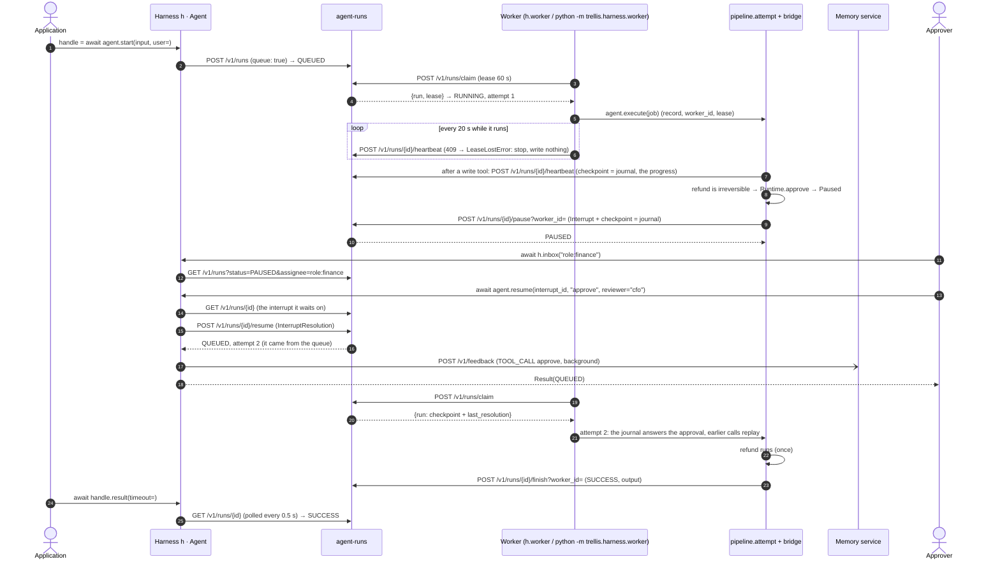

Without `RUNS_URL` the same sequence runs against `LocalRuns` in the process, and a run
started with `run`/`stream` resumes in the process that calls `resume` (no queue, no worker).

## Calling a remote agent over A2A

`remote(url, tenant=, user=)` (`a2a/client.py`) is the one A2A client: a `RemoteAgent` any
code awaits with a message; a remote question goes to its `on_input`, or is raised as
`InputRequired` and answered with `reply(task_id, answer)`. `a2a(url)` makes a remote agent one
tool: the card read once, then each call a `RemoteAgent` as the calling run, with `on_input`
the run's `ask`. The remote side is another harness's `serve_a2a(app, url)` (or any A2A server);
the task id there is the remote run id.

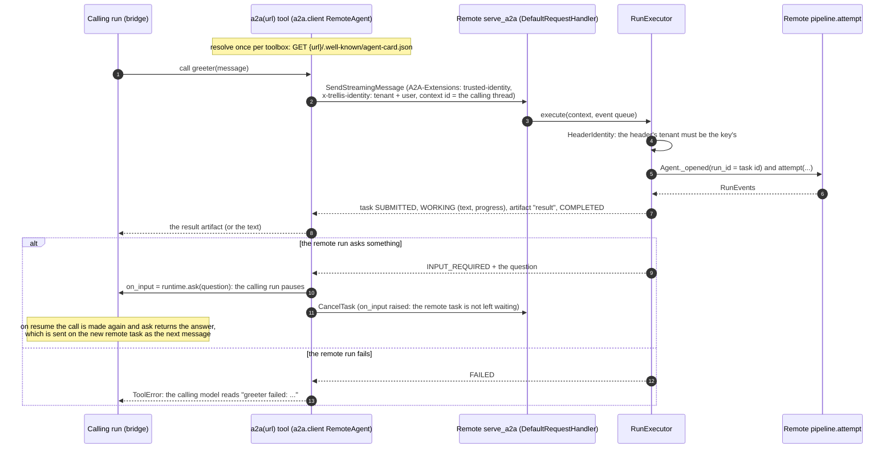

## Evaluation

`evals.py` is a block usable with or without `Harness`: an evaluator is any
`async (EvalCase) -> EvalScore | None`; the built-ins are `grounding()` (`grounding_score`: the
memory service's `/v1/verify` in the case's memory scope — the same function the sampled check
of a wrapped run calls), `exact_match()`, `contains()` and `llm_judge(criteria)`. What they reach
is an `EvalServices`: Langfuse, and the judge's gateway and model — the deployment's
(`TRELLIS_JUDGE_MODEL`, `TRELLIS_JUDGE_VIRTUAL_KEY`), never the code's. `EvalServices.from_env()`
builds them for any code; a harness builds one (`h.evals`, sharing its gateway and Langfuse
client) and each wrapped agent has its own copy (`agent.evals`), whose judge falls back to a
`ReAct` target's model. `evaluate(target, ...)` runs a wrapped `Agent` through the pipeline
(`h.evaluate` delegates to it) or calls any `async (input) -> answer` in a root span of its own;
`judge(case, judges, services=)` scores one case on-line from any code, and is what a wrapped
agent's online judges run. Every score goes on a trace through `EvalServices.score` (`h.score`
delegates to it): the case's `trace_id`, else its run's ([docs/evaluation.md](docs/evaluation.md)).

### Offline: `h.evaluate` over a Langfuse dataset

A callable target takes the same path, with one difference: instead of `pipeline.attempt`, the
item is one call of the callable inside `telemetry.item_span` (the item's root span, in the trace
of a run id made for the item), and only what the callable returns as an `EvalOutput` (a
`bundle_id` and the memory scope) gives grounding something to check.

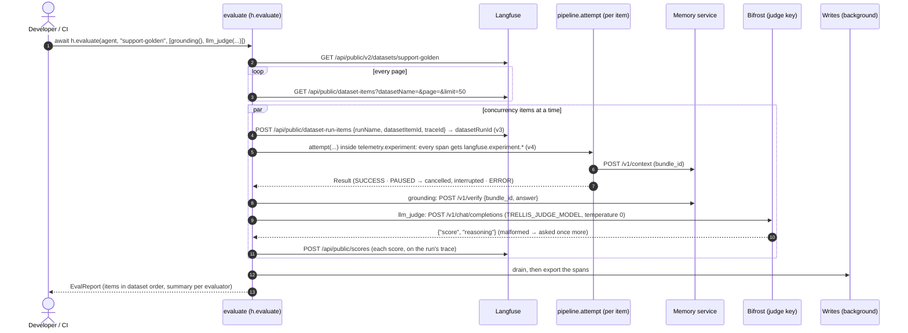

### Online: judges on sampled runs

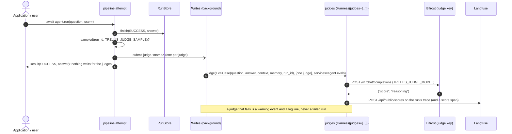

## Run states

The run record's status (contracts `RunStatus`) and who moves it. The harness writes `QUEUED`,
`RUNNING`, `PAUSED`, `SUCCESS`, `ERROR`, `TIMEOUT` (an attempt out of its run's working time or
past its deadline) and `CANCELLED`. agent-runs moves the rest: a lapsed lease back to `QUEUED`
after a backoff (or to `ERROR` at the fifth lapse), a queued run that ended `ERROR` with a
retryable error back to `QUEUED` (at most 3 times), a released run back to `QUEUED` at once, a
cancel of a queued or paused run to `CANCELLED`, a run past its working-time limit or its
deadline to `TIMEOUT`, and a paused run past its interrupt's deadline to `escalate_to` (once) or
to `TIMEOUT`. `PARTIAL` and `REJECTED` are valid endings of the contract that the harness never
writes. ([docs/reliability.md](docs/reliability.md) has the limits, retries and cancel.)

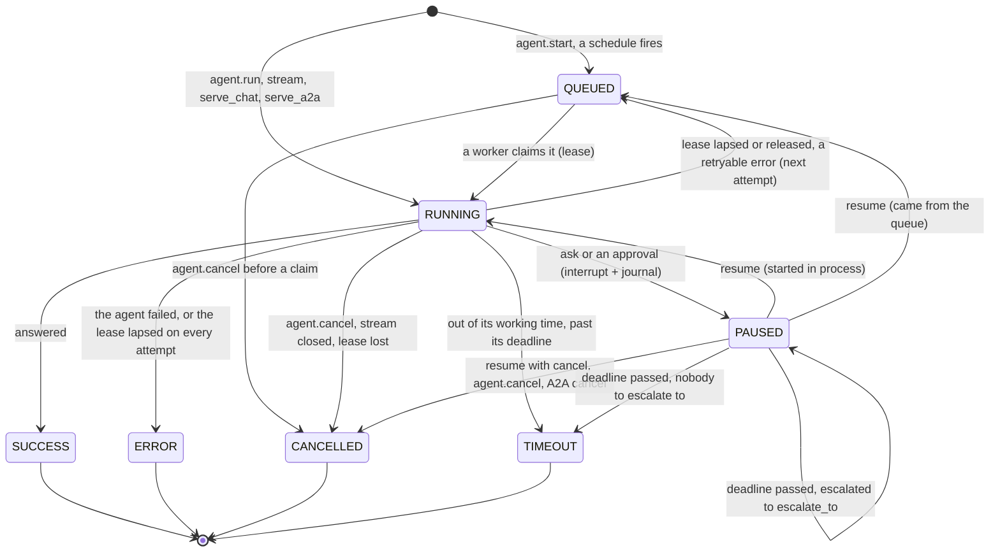

Every attempt (each `RUNNING` stretch) is one `invoke_agent` span in the run's one trace.

## Background writes

`writes.Writes`: a bounded queue (`MAX_PENDING` 10 000) drained by `WRITERS` (4) tasks. A
write whose failure may pass is tried again (`WRITE_ATTEMPTS` 3, full-jitter backoff); a full
queue makes the writer wait (`SUBMIT_WAIT_SECONDS` 5) instead of dropping the write. A write
given up is logged, counted and emitted as a `warning` event to the run's listeners — or, with
`TRELLIS_SPOOL_DIR`, appended to a JSONL spool that the next process replays. When the event loop
shuts down it cancels the workers, and a cancelled worker finishes the queue first (the write it
was cut off in included; writes are idempotent), within `DRAIN_SECONDS` (10); what is left is
spooled or counted lost (`trellis.writes.undelivered`). `await h.aclose()` drains explicitly.
The guarantee is in [docs/memory.md](docs/memory.md#background-writes-what-is-guaranteed).

## Stopping a worker

`python -m trellis.harness.worker` serves the worker: `trellis.runs.Worker.serve()` turns
`SIGTERM`/`SIGINT` into `stop()`, and the harness worker drains the writes when the loop ends:

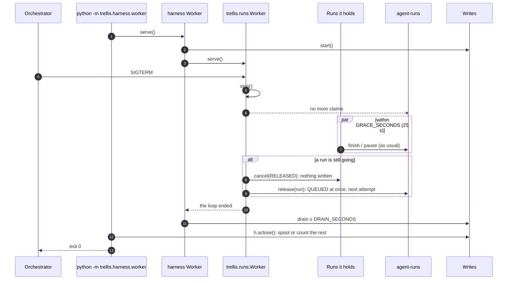

## Telemetry

The OTel API only: an `invoke_agent` span per attempt in a trace whose id derives from the run
id (every attempt, score and piece of feedback of a run in one trace), `execute_tool`,
`chat` (the `ReAct` model calls) and `retrieve memory` spans with GenAI attributes and
Langfuse's trace attributes, `score` spans; counters `trellis.runs`, `trellis.tool_calls`,
`trellis.writes.failed`. Attributes pass the redactor and are built only for a recording span;
so do a tool call's arguments and output on the event stream (`events.py`: AG-UI, A2A, push)
and in the memory service's tool records (`Agent.record_tool`), once each.
`OTEL_EXPORTER_OTLP_ENDPOINT` installs an SDK provider with one OTLP exporter unless the
application installed one. See [docs/observability.md](docs/observability.md).
