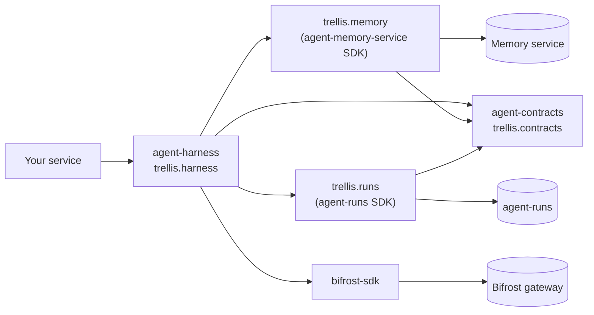

# trellis-harness

Trellis gives an agent you already built the platform around it: memory of the people it works
for, tools and MCP tools through the Bifrost gateway, governance of every tool call and a person
in the loop, durable runs that wait for a person and survive a restart, evaluation, tracing,
and AG-UI and A2A serving. The agent stays what it is — a LangGraph graph (Deep Agents
included), an OpenAI Agents SDK `Agent`, a Claude Agent SDK setup, a `ReAct` agent for teams
with no framework, or a plain async function — and the framework is neither modified nor
re-implemented.

## Start here

Level 0 — wrap the agent you have, run it:

```python
h = Harness()  # the deployment is the environment
agent = h.wrap(my_agent, id="support")  # a graph, an Agent, ClaudeAgentOptions, a function
result = await agent.run("Where is my order?", user="ada")
```

One page per framework says what to add to an existing project:
[LangGraph and LangChain](docs/frameworks/langgraph.md), [Deep Agents](docs/frameworks/deepagents.md),
[OpenAI Agents SDK](docs/frameworks/openai-agents.md),
[Claude Agent SDK](docs/frameworks/claude-agent-sdk.md), [ReAct](docs/frameworks/react.md),
[plain functions](docs/frameworks/functions.md).

That is the whole integration. Each piece switches on when its service is configured
(`MEMORY_URL`, `RUNS_URL`, `BIFROST_URL`, `OTEL_EXPORTER_OTLP_ENDPOINT`); with nothing set
everything runs in this process. Run it now, with no services:

```bash
make install                         # uv sync (the sibling repositories are path sources)
.venv/bin/python -m examples.01_start.hello
.venv/bin/python -m examples.01_start.first_agent   # a model, two tools, an approval
```

## What do I need?

| I need | One line | More |
|---|---|---|
| my existing agent with memory, approvals and traces | `agent = h.wrap(graph, id="triage")` | [frameworks](docs/README.md#way-1-wrapped-the-harness-runs-your-agent) |
| a tool-calling agent, no framework | `h.wrap(ReAct(system="...", model="provider/model"), id="a")` | [react.md](docs/frameworks/react.md) |
| the agent to remember the user | `export MEMORY_URL=... TRELLIS_API_KEY=...` | [memory.md](docs/memory.md) |
| a tool of my own | `h.wrap(target, id="a", tools=[lookup])` | [tools.md](docs/tools.md) |
| the gateway's MCP tools | `export BIFROST_URL=... BIFROST_VIRTUAL_KEY=...` | [gateway.md](docs/gateway.md) |
| a person to approve a risky call | `@tool(side_effects="irreversible")`, then `agent.resume(id, "approve", reviewer="lee")` | [governance.md](docs/governance.md) |
| to ask a person something | `await trellis.current().ask("Which plan?", options=["basic", "pro"])` | [interrupts.md](docs/interrupts.md) |
| a rule of my own around calls | `h.wrap(target, id="a", hooks=[MyRule()])` | [hooks.md](docs/hooks.md) |
| runs that outlive the process | `await agent.start(...)` and `python -m trellis.harness.worker app:h` | [runs.md](docs/runs.md) |
| a run on a cadence | `await agent.schedule("weekdays", "Digest", on_behalf_of="ada")` | [runs.md](docs/runs.md#schedules) |
| a part turned off | `await agent.run(q, user="ada", without={"memory"})` | [configuration.md](docs/configuration.md#what-is-on-and-how-to-turn-it-off) |
| a time limit | `h.wrap(target, id="a", timeout=600)` | [reliability.md](docs/reliability.md) |
| the framework's own options | `h.wrap(graph, id="a", framework_options={"recursion_limit": 50})` | [configuration.md](docs/configuration.md#the-frameworks-own-run-options) |
| sub-agents | `h.wrap(planner, id="p", tools=[scout.as_tool()])` | [subagents.md](docs/subagents.md) |
| a chat UI, or other agents calling mine | `agent.serve_chat(app)`, `agent.serve_a2a(app, url)` | [surfaces.md](docs/surfaces.md) |
| to call another agent | `h.wrap(target, id="a", tools=[a2a("https://...")])` | [surfaces.md](docs/surfaces.md) |
| a score for a test set | `await h.evaluate(agent, dataset, [exact_match(), called("lookup")])` | [evaluation.md](docs/evaluation.md) |
| quality on live traffic | `Harness(judges=[llm_judge("Polite and correct.")])` | [evaluation.md](docs/evaluation.md) |
| traces in Langfuse | `export OTEL_EXPORTER_OTLP_ENDPOINT=... OTEL_EXPORTER_OTLP_HEADERS=...` | [observability.md](docs/observability.md) |
| code run away from the host | `h.wrap(target, id="a", tools=[sandbox()])` with `SANDBOX=docker` | [sandbox.md](docs/sandbox.md) |
| only one piece, in my own loop | `from trellis.memory import MemoryClient` (or runs, governance, evals) | [Way 2](#two-ways-to-use-trellis) |

Every line has a runnable example: [examples/](examples/README.md).

## Two ways to use Trellis

**Way 1, wrapped: the harness runs your agent.** `h.wrap(agent)` attaches every piece at once,
and you call `agent.run` where you called the framework. Around each run the harness pushes the
memory context in, governs every tool call, pauses for approvals in agent-runs and resumes them
without repeating a side effect, records the transcript and every call, judges a sample of
answers and traces it all.

**Way 2, pluggable blocks: your framework, our pieces.** Your framework keeps running the agent,
untouched, and your code calls the blocks it wants where it chooses: `trellis.memory`,
`trellis.runs` (durable runs, the inbox, workers, webhooks), `trellis.harness.governance`,
`trellis.harness.evals`, `trellis.harness.a2a.remote`. Your framework's own pause (a LangGraph
checkpointer and `interrupt`, an OpenAI Agents `RunState`, a Claude session) stays the pause.

**Without the harness: the SDKs alone.** `trellis.memory`, `trellis.runs`, `trellis.contracts`
and `bifrost_sdk` are separate distributions; code that needs no governance or evaluation
stitches only them into its own LangGraph or Deep Agents code
([examples/04_no_harness](examples/README.md#04_no_harness-only-the-sdks)).

All three use the same services and the same records, so one deployment mixes them
([mixing both ways](docs/blocks/mixing.md)).

| Question | Way 1, wrapped | Way 2, blocks |
|---|---|---|
| Should Trellis run your agent loop? | Yes: `agent.run`, `agent.stream`, `agent.start` call the framework for you | No: you call `graph.ainvoke`, `Runner.run`, `query()` as today |
| Do you need to serve the agent over AG-UI or A2A? | `agent.serve_chat(app)`, `agent.serve_a2a(app, url)` | Serving is the harness's; *calling* A2A agents is a block (`remote`) |
| Should durable pause and resume be handled for you? | Yes: the resumed run replays its journal, so no question is asked twice and no side effect repeats | You keep your framework's state and hand agent-runs its checkpoint |
| Is the framework code something you cannot change? | It is unchanged, but its runs go through `agent.run` | Nothing changes: the blocks are calls around it |
| Do you want only one capability? | You get all of them, each on with its service; turn parts off with `without=` | Import that one block |

## The five repositories



| Repository | Distribution (import) | What it is |
|---|---|---|
| [agent-harness](https://github.com/amitmohapatra/agent-harness) (this one) | `trellis-harness` (`trellis`, `trellis.harness`) | the harness: Way 1, and the governance, evaluation and A2A blocks |
| [agent-memory-service](https://github.com/amitmohapatra/agent-memory-service) | `trellis-memory` (`trellis.memory`) | the memory service and its SDK: context, records, documents, the tool catalog, feedback |
| [agent-runs](https://github.com/amitmohapatra/agent-runs) | `trellis-runs` (`trellis.runs`) | durable runs: records, the queue and leases, pauses, the inbox, schedules, webhooks |
| [agent-contracts](https://github.com/amitmohapatra/agent-contracts) | `trellis-contracts` (`trellis.contracts`) | the records every block takes and returns |
| [bifrost-sdk](https://github.com/amitmohapatra/bifrost-sdk) | `bifrost-sdk` (`bifrost_sdk`) | the client of the Bifrost gateway: models, MCP tools, prompts, skills |

How they fit, and the harness inside: [docs/architecture.md](docs/architecture.md). Which
versions this release was tested with: [docs/versioning.md](docs/versioning.md).

## Install

The platform is not published to PyPI yet: install from source, with the sibling repositories
checked out next to this one — they are path dependencies (`[tool.uv.sources]` in
`pyproject.toml`):

```bash
mkdir trellis && cd trellis
for repo in agent-contracts bifrost-sdk agent-memory-service agent-runs agent-harness; do
  git clone https://github.com/amitmohapatra/$repo.git
done
cd agent-harness
uv sync --all-extras    # the core, every framework extra and the dev tools, in .venv
```

Into an environment of your own, with pip, the siblings first:

```bash
pip install -e ../agent-contracts -e ../bifrost-sdk -e ../agent-memory-service/sdk/python \
  -e ../agent-runs/sdk/python
pip install -e '.[langgraph]'    # or any extras, below
```

One distribution; each framework is an extra (the core imports none of them), pinned to the
range this release was tested with: `langgraph` (LangGraph and LangChain's `create_agent`),
`deepagents`, `react` (`ReAct`), `openai-agents`, `claude-agent-sdk`, `agui` (`serve_chat`),
`a2a` (`serve_a2a`, `a2a()`, `remote()`), `otel` (OTLP export), `all`. A Way 2 team that wants
only `trellis.memory`, `trellis.runs` or `trellis.contracts` installs that one sibling.

## Configuration

The environment, and nothing else: `BIFROST_URL`, `BIFROST_VIRTUAL_KEY`, `TRELLIS_API_KEY`,
`MEMORY_URL`, `RUNS_URL`, `OTEL_EXPORTER_OTLP_ENDPOINT`, `OTEL_EXPORTER_OTLP_HEADERS`,
`TRELLIS_SPOOL_DIR`, `TRELLIS_WORKER_CONCURRENCY`, `TRELLIS_AGENT_VERSION`,
`TRELLIS_GROUNDING_SAMPLE`, `TRELLIS_JUDGE_MODEL`, `TRELLIS_JUDGE_VIRTUAL_KEY`,
`TRELLIS_JUDGE_SAMPLE`, `PROMPTS_DIR`, `SKILLS_DIR`, `LANGFUSE_HOST`, `LANGFUSE_PUBLIC_KEY`,
`LANGFUSE_SECRET_KEY`, `SANDBOX`, `SANDBOX_IMAGE`. Each one, its default, an example and what
it turns on: [docs/configuration.md](docs/configuration.md) (and
[`.env.example`](.env.example)). A real deployment, from running services to a configured
application: [docs/onboarding.md](docs/onboarding.md).

## Documentation

| Page | |
|---|---|
| [docs/README.md](docs/README.md) | the map: every page, by way and by feature |
| [docs/api.md](docs/api.md) | every public name, its arguments and defaults |
| [docs/configuration.md](docs/configuration.md) | every setting, what is automatic, `without=`, `framework_options=` |
| [docs/architecture.md](docs/architecture.md) | the five repositories, then the harness inside (diagrams) |
| [docs/flows.md](docs/flows.md) | sequence diagrams of each flow, written from the code |
| [docs/scenarios.md](docs/scenarios.md) | which feature to use when |
| [docs/troubleshooting.md](docs/troubleshooting.md) | what an error means and what to do |
| [docs/versioning.md](docs/versioning.md) | tested versions, the policy, how to upgrade |
| [examples/README.md](examples/README.md) | every example, simple to complex |
| [CHANGELOG.md](CHANGELOG.md) | what changed in each release |

## Development

```bash
make install       # uv sync (the sibling trellis checkouts are path sources)
make check         # ruff, pyright, tests at 100% coverage
make examples      # every example, offline, in parallel
make matrix        # the generated feature matrix (build/matrix.md)
make docs-check    # links, anchors, and every snippet against the real API
make bench         # the overhead benchmark against benchmark-results.json
make test-live     # opt-in tests against BIFROST_URL / MEMORY_URL / RUNS_URL / TRELLIS_API_KEY
```

`make test-live` reads the deployment environment and skips whatever is unset or unreachable;
`tests/live/conftest.py` says what it registers in the gateway for the session. The memory
service in the tests is an in-process fake behind the real SDK, and every request and answer
is checked against the service's committed `docs/openapi.json`; `tests/contract` does the same
for agent-runs. The documents are read from the sibling checkouts, or from
`TRELLIS_MEMORY_OPENAPI` / `TRELLIS_RUNS_OPENAPI`.
