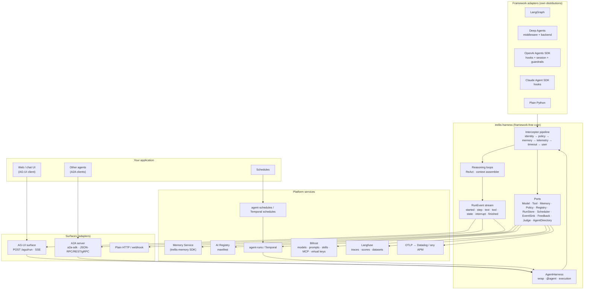
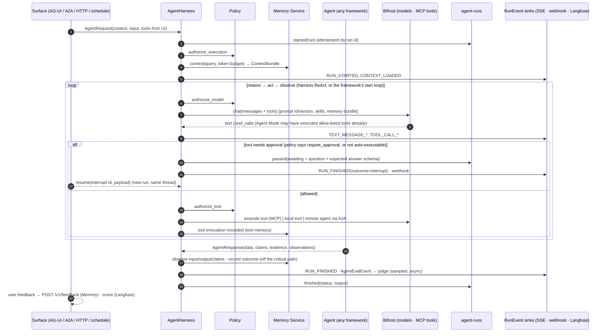
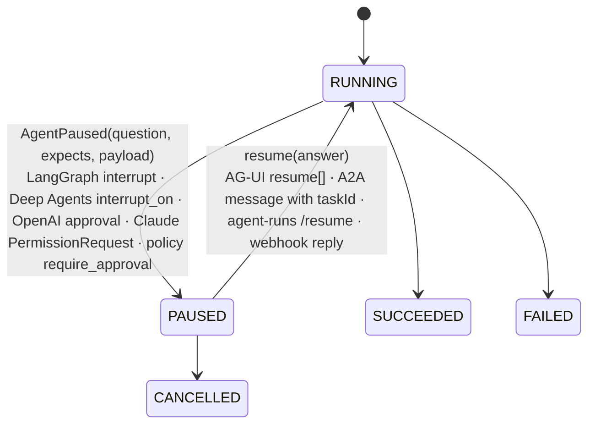
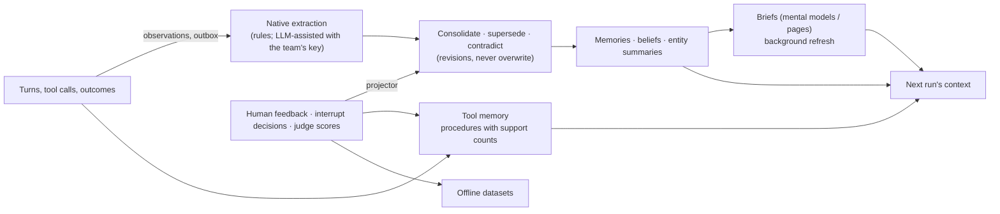

# The agent platform: a pluggable harness around agents people already have

Date: 2026-09-28. Status: design and execution order, not implemented. Sources: the six
platform repositories as they are today, and the protocol/framework documentation read on
this date (A2A 1.0, AG-UI 1.0, Bifrost MCP, LangChain Deep Agents, OpenAI Agents SDK,
Claude Agent SDK). Where this document names a hook or a method it was read in that source;
where it says "verify" it was not.

## 1. What already exists, repo by repo

| Repo | What it is | State |
|---|---|---|
| `agent-contracts` | The types every other repo shares: `AgentRequest`/`AgentResponse`, `AgentExecutionContext` (tenant, workspace, user, groups, thread/session/turn, work/task, agent lineage, deadline), artifacts (`ArtifactRef`, `EvidenceRef`, `Claim`, `MemoryObservation`), tools (`ToolSpec`/`ToolCall`/`ToolOutcome`), model (`ModelRequest`/`ModelResponse`/`ModelUsage`), events (`LifecycleEvent`, `AgentEvalEvent`), errors (`AgentError`, `AgentPaused`), descriptors, and the ports (`ModelClient`, `ToolClient`, `ArtifactClient`, `MemoryPort`, `TelemetryProvider`, `EvaluationProvider/Sink`, `PromptProvider`, `AgentPolicyProvider`, `AgentRegistryClient`, `AgentInterceptor`, `LifecycleListener`, `FrameworkAdapter`) | solid; no runtime, depends only on pydantic |
| `agent-harness` | The runtime around an agent: `AgentHarness` facade (`wrap`, `@agent`, `execution`), the interceptor pipeline (identity → policy → memory context → telemetry → langfuse → timeout → user; after: result validation → memory observation → evaluation), `MemoryRuntime`, instrumented tools and models, a bounded ReAct loop, Langfuse on OTel spans, policy providers, artifacts, an AI-Registry client with startup reconciliation, an agent-runs client, a LangGraph adapter | tested against real Memory Service, Bifrost, Langfuse; LangGraph only |
| `agent-runs` | Durable runs: `PENDING → RUNNING → PAUSED → resume → SUCCEEDED/FAILED/CANCELLED`; `awaiting` carries the human question and answer schema; idempotent starts; `webhook_url`; tenant-bound keys | running service |
| `agent-schedules` | Cron schedules that fire runs; due/claim; pause/resume | running service |
| `bifrost-sdk` + gateway | Models behind one URL; prompts (injected by id/version); **skills** (versioned `SKILL.md` bundles); **MCP gateway** (servers, per-key tool filtering, `/mcp` JSON-RPC, `/v1/mcp/tool/execute`, **Agent Mode** that auto-executes allow-listed tools up to a depth, Code Mode); governance (virtual keys = provider/model/MCP allow-lists + budget + rate); routing rules | gateway live on `:8091`; SDK exposes all of it |
| `agent-memory-service` | Conversation, semantic, document, graph and tool memory; scope-aware retrieval; grounding; briefs; multi-team platform layer (this week) | see its own plan |
| AI Registry | External product: the control plane for what agents and tools exist, their versions and who may see them. The harness reads its per-product **manifest** (`entities[{type: agent|tool, name, version, views{audience: {enabled, spec}}}]`, ETag-cached, last-known-good on outage) and reconciles by name at startup | consumed, not owned |

Not present anywhere: AG-UI, A2A, Temporal, feedback/HITL storage, an online or offline judge, adapters for Deep Agents / OpenAI Agents SDK / Claude Agent SDK, a memory MCP server, webhooks out of the harness.

## 2. The shape: one core, many ports, adapters in their own packages



Rules that do not change:

1. The core imports no framework and no vendor SDK (a test already enforces it). Every new
   capability is a **port in `agent-contracts`** and an **adapter in its own distribution**.
2. Every surface speaks the same two types: `AgentRequest` in, `AgentResponse` out, and the
   same `RunEvent` stream in between. A chat turn, a week-long cowork run and a 6 a.m.
   schedule differ in *who drives* and *where state lives*, not in their contract.
3. Identity is trusted once (`AgentExecutionContext`) and propagated; nothing downstream
   re-derives who is asking.
4. A dependency being down degrades a feature, never availability (last-known-good manifest,
   memory-degraded warning, buffered telemetry). The one exception is policy in
   `fail_closed` mode, by choice.

## 3. Where each kind of data lives, and why

| Data | Owner | Why there and nowhere else |
|---|---|---|
| Threads, messages, turns; extracted memories; documents and their graph; tool invocations, outcomes and mined procedures; standing briefs; **human feedback and HITL decisions**; the read audit | **Memory Service** | It is the only store that understands tenant/workspace/user/run visibility, revisions and forgetting. Learning lives where the boundary is enforced. |
| Which agents and tools exist, versions, audiences, input/output schemas, **A2A Agent Card location**, MCP server binding of a tool | **AI Registry** | Control plane: approval of *exposure*. It never holds runtime state, and being down must not stop agents. |
| Run state machine, the question a paused run is asking, the answer it got, retries, lineage, webhook subscriptions | **agent-runs** (or **Temporal** behind the same port) | A run outlives a process and a framework swap; a UI needs an inbox of `PAUSED` runs that knows nothing about the agent. |
| Standing intents ("every weekday at 8") | **agent-schedules** (or Temporal Schedules) | Editable without touching the history of what fired. |
| Model access, budgets, provider/model and MCP tool allow-lists per team, prompts (injected by id/version), skills (versioned SKILL.md), routing | **Bifrost** | One credential per team carries the whole spend-and-permission envelope; the harness never sees a provider key. |
| Traces, spans, **scores (judge and human)**, datasets and experiments | **Langfuse** (OTel is canonical; Datadog or any APM via OTLP) | Where a request is inspected after the fact; one trace = one request, with its scores and feedback attached. |
| Large payloads (files, big tool results) | **Artifact store** (blob) | Results carry references, not bytes; memory keeps `EvidenceRef`s to them. |
| Types | **agent-contracts** | Nothing else. |

Two things deliberately have **one** source of truth where two were possible: prompts are
authored in Bifrost (the gateway injects them; Langfuse shows the version used), and the
*catalogue* of tools is the Registry (Bifrost's MCP clients are configured from it by a sync
job, so a tool nobody approved cannot appear in a model's tool list).

## 4. One request, end to end



The pipeline is the same object for every entry point; the surfaces only decide how the
request arrives and how the `RunEvent`s leave.

## 5. The loop: what goes into the model each step, and how it stays bounded

The harness's `react()` is the reference loop; frameworks bring their own. In either case
the **context assembler** owns the prompt budget:

| Slot | Source | Rule |
|---|---|---|
| System prompt | Bifrost prompt id + version (`bf.prompt(id, version)`), or the agent's own | never pasted into code; the version is recorded on the span |
| Skills | Bifrost skills (versioned `SKILL.md`), progressive disclosure as Deep Agents does it: names and descriptions at start, full body only when a skill is invoked | a skill is a *procedure* memory; humans publish versions, agents do not self-edit them |
| Memory | `ContextBundle` from `/v1/context` under `token_budget`, rendered with citations; plus `memory.recall` and `memory.remember` exposed **as tools** so the agent can ask for more mid-loop instead of the harness guessing up front | automatic before the run, agentic during it |
| Tool observations | truncated (`MAX_OBSERVATION_CHARS`); anything larger becomes an artifact and the model sees a reference | keeps step 3 from eating the window |
| Conversation | the framework's session or the Memory Service thread history | one owner per run kind, never both |
| Compaction | when usage crosses a threshold: summarize older steps (Deep Agents `SummarizationMiddleware`, Claude `PreCompact`, or the harness's own) and write the summary to memory as an observation | the summary is a memory, so it survives the process |

Cost is accounted per step from `ModelUsage` (Bifrost returns `cost`), and every run carries
its spend on the trace. Budgets are enforced at the gateway (virtual key), not by hope.

## 6. Tools: three modes, one policy surface

| Mode | Who runs the loop | When | How the harness stays in control |
|---|---|---|---|
| **A. Bifrost Agent Mode** | the gateway executes tools in `tools_to_auto_execute` up to `max_agent_depth`, in parallel, and returns any non-auto tool calls as pending | simple agents, no streaming needed (Agent Mode is non-streaming by design) | the virtual key's `tools_to_execute` is the allow-list; pending calls come back to the harness → policy → approve/execute (`bf.execute_tool`) or pause for a human |
| **B. Harness loop** | the harness (`react()` or the developer's loop through `runtime.tools`) | streaming, mixed local/MCP/remote tools, fine-grained HITL | one `ToolClient` port with three adapters: `LocalToolClient` (exists), `MCPToolClient` (Bifrost `/mcp` with the team key; `tools/list` is already filtered per key), `A2AAgentClient` (a remote agent as a tool, discovered through the Registry) |
| **C. Framework-native** | Deep Agents / OpenAI Agents SDK / Claude Agent SDK / LangGraph | you already built on one | the adapter bridges that framework's hooks to the same `AgentPolicyProvider`, tool memory and event stream (§8) |

Whatever the mode, memory is not a tool the model has to remember to call: the
interceptors load context before and write observations after, automatically, through the
SDK. Tools that *read* memory are additionally offered to the model for the agentic case.

## 7. Humans in the loop, and what the system learns from them

Two different things are both called HITL; they get two different records.

**Interrupts** stop a run to ask. One mechanism, however the agent is built:



- `AgentPaused` (in contracts) is the framework-neutral signal; the coordinator already marks
  the span OK and the run `PAUSED` with `awaiting = {question, expects, payload}`.
- Surfaces translate it: AG-UI `RunFinished{outcome: interrupt, interrupts:[{id, reason,
  message, toolCallId}]}` with the answer arriving as `RunAgentInput.resume[]`; A2A
  `TASK_STATE_INPUT_REQUIRED` / `AUTH_REQUIRED` with the answer as the next message on the
  same `contextId`+`taskId`; a webhook for disconnected clients (agent-runs already carries
  `webhook_url`; A2A push notification configs map onto the same notifier).
- Policy can *produce* an interrupt: `authorize_tool` returns `require_approval`, and the
  harness raises `AgentPaused` carrying the tool call. That is where a rules engine (OPA,
  Cedar, or plain predicates over the call and the memory facts) plugs in as a
  `AgentPolicyProvider`: the "symbolic layer" is a policy adapter, not a fork of the loop.

**Feedback** judges what happened. It is stored **separately from memory content**, in the
Memory Service (`POST /v1/feedback`, its M3): `target_kind ∈ {run, answer, memory, tool_call,
brief, procedure}`, `verdict ∈ {confirm, reject, correct, approve, edit}`, the correction,
the reviewer, the evidence. Every interrupt decision is also written here (approve/reject/edit
of a tool call), so the two records meet in one table.

What learns from it, without touching model weights:

- a `correct` on a memory supersedes it through the existing revision machinery; a `reject`
  invalidates; `confirm` reinforces (a projector job, idempotent, off the request path);
- tool approvals/rejections and run outcomes feed **tool memory** (procedures with support
  counts), so the planner stops proposing what humans keep rejecting;
- judge and human scores go to Langfuse as `scores` on the trace, so one request shows its
  spans, its evidence, its judge verdict and its human verdict in one place;
- corrections become **offline dataset items** (Langfuse datasets) for the next experiment;
- skills and prompts are versioned by people in Bifrost. The system may *propose* a change
  from accumulated feedback; it never publishes one without a human (an interrupt, again).

## 8. Framework adapters: the same six hooks, mapped

Every adapter binds the same six moments to the same core. The names below are the ones
in each framework's documentation as read today; the Deep Agents custom-middleware page
was unavailable, so its hook names are from LangChain 1.0 middleware and must be verified
against the installed version.

| Moment | Harness core | LangGraph (exists) | Deep Agents | OpenAI Agents SDK | Claude Agent SDK |
|---|---|---|---|---|---|
| run starts / context | `MemoryContextInterceptor` | `wrap_node` + lineage from `checkpoint_ns` | `before_agent` middleware injects the bundle into the system prompt; `/memories/*` served by a `MemoryServiceBackend` (their `StoreBackend` seam) | `RunHooks.on_agent_start`; `Session` implemented by `MemoryServiceSession` (`get_items/add_items/pop_item/clear_session`) | `UserPromptSubmit` hook returns `additionalContext` (the bundle); sessions persisted to the Memory Service |
| model call | `InstrumentedModelClient` → Bifrost | same | `wrap_model_call`; model = Bifrost's OpenAI-compatible endpoint via `init_chat_model` | model provider pointed at Bifrost | `ANTHROPIC_BASE_URL` → Bifrost's Anthropic-compatible endpoint (verify) |
| tool call | `authorize_tool` + `InstrumentedToolClient` | `wrap_tool` | `wrap_tool_call`; MCP through Bifrost `/mcp` | tool guardrails (input/output, tripwires) + `on_tool_start/end`; MCP servers → Bifrost `/mcp` | `PreToolUse` (`permissionDecision` allow/deny + policy), `PostToolUse` (tool memory) |
| pause | `AgentPaused` | `interrupt()` (`GraphInterrupt`, already handled) | `HumanInTheLoopMiddleware` / `interrupt_on={tool: {allowed_decisions}}` with a checkpointer | approval flows for MCP/function tools | `PermissionRequest` / `canUseTool` |
| run ends | `MemoryObservationInterceptor`, outcome, `AgentEvalEvent` | same | `after_agent` | `on_agent_end`, output guardrails | `Stop` / `SubagentStop` |
| compaction | context assembler | n/a | `SummarizationMiddleware` | `Session` trimming | `PreCompact` (summary → memory) |

Each adapter is its own distribution (`trellis-harness-deepagents`, `-openai-agents`,
`-claude-agent-sdk`), added to the compatibility matrix test that already proves the core
imports none of them.

## 9. Agents talking to agents: Registry + A2A

- **Serving.** Any harness agent can be published as an A2A server with `a2a-sdk`: an
  `AgentExecutor` that calls `harness.run`, a `TaskStore` backed by agent-runs, streaming
  from the `RunEvent` stream (`TaskStatusUpdateEvent`, `TaskArtifactUpdateEvent`), push
  notifications through the webhook notifier, `input-required` from `AgentPaused`. The
  **Agent Card** (name, skills, capabilities `streaming`/`pushNotifications`, security
  schemes) is generated from the Registry entity and its `AgentDescriptor`, and the card URL
  is written back to the Registry, so discovery and approval stay in one place.
- **Calling.** `A2AAgentClient` implements the tool port: the planner sees registry agents as
  callable skills, sends `SendMessage`/`SendStreamingMessage` with the caller's `contextId`,
  keeps `taskId`s per follow-up (tasks are immutable once terminal; refinements are new tasks
  on the same context), and passes `AgentPaused` through when the remote task says
  `input-required`. Auth is per Agent Card security scheme; the platform default is the
  team's key. Multi-tenancy: the caller's tenant/workspace travel as trusted context on the
  A2A extension header, never inferred by the callee.
- **Sync.** `reconcile()` at startup already classifies bound/unbound/unregistered agents;
  add a heartbeat and a manifest delta subscription (ETag poll or channel), and the same
  sync job configures Bifrost MCP clients from the Registry's tool entities. Drift is loud,
  never fatal.

## 10. Talking to people: AG-UI, webhooks, schedules

- **AG-UI surface**: one route (`POST /agui/run`, SSE) that runs the harness and translates
  `RunEvent`s to the 17 AG-UI events: `RunStarted`, `StepStarted/Finished`,
  `TextMessageStart/Content/End`, `ToolCallStart/Args/End/Result`, `StateSnapshot/Delta`,
  `MessagesSnapshot`, `RunFinished{outcome}` / `RunError`, `Raw`, `Custom`. Frontend tools in
  `RunAgentInput.tools` become `ToolSpec`s the model may call (confirmations, UI actions);
  feedback from the UI is a `Custom` event or the REST feedback endpoint. Shared state
  (`StateDelta`) is how a cowork UI follows a long run.
- **Webhooks** are one notifier used by three things: agent-runs (`webhook_url`), A2A push
  configs, and the Memory Service's own event subscriptions. Signed, retried, delivered from
  an outbox; the receiver verifies the signature.
- **Schedules** create runs with the same request contract and a service principal that acts
  for the user who set the schedule (`on_behalf_of`), so memory and policy see the right
  identity at 6 a.m.
- **Long-running / cowork**: the run is the unit. Interactive turns and multi-day runs
  differ only in how often they pause and who resumes them. Temporal, where a team has it,
  is a `RunStore`/`Scheduler` adapter (workflow per run, signals for resume, Temporal
  Schedules); agent-runs/agent-schedules remain the default adapters. Both behind the same
  ports, chosen by configuration.

## 11. Evaluation: online, offline, and one place to look

- **Online judge**: sampled per agent (config), asynchronous, cheap model via a budgeted
  Bifrost key, rubric prompts versioned in Bifrost, **grounded first**: the Memory Service's
  `/v1/verify` (deterministic citation validation + NLI) runs before any LLM judge, so the
  judge spends tokens only on what the classifier cannot decide. Output: `scores` on the
  trace + a `judge` feedback record.
- **Offline judge**: datasets assembled from traces + human corrections; experiments per
  agent version in Langfuse; a regression gate in CI (the harness already publishes
  `benchmark-results.json`).
- **One place per request**: the Langfuse trace (spans, cost, judge score, human score,
  feedback thread) linked from every surface by `trace_id`, and `GET /v1/reads` on the Memory
  Service for what memory was served to that request.

## 12. Continuous learning: what evolves, how it stays bounded and verified



Every arrow is an idempotent outbox job with a bounded batch, a revision bump and a test;
nothing here retrains a model. Verification is the existing discipline: agent-perspective
suites through the SDK only, the isolation oracle, fixed-depth retrieval metrics, judged
runs with the ruler named, and no number claimed that a gate artifact does not contain.

## 13. Developer experience: what "pluggable" has to feel like

```python
harness = AgentHarness(
    memory=MemoryClient(url, api_key=team_key),           # tenant + workspace come from the key
    model=BifrostModelClient(gateway, virtual_key=vk),     # models, prompts, skills, MCP, budget
    tools=[MCPToolClient(gateway, vk), A2AAgentClient(registry)],
    runs=AgentRunsClient(...) or TemporalRuns(...),
    policy=OpaPolicy(...),                                 # or CallablePolicyProvider
    registry=AIRegistryClient(...),
    surfaces=[AGUISurface(), A2AServer(), Webhooks()],
    evaluation=[LangfuseJudge(sample=0.1)],
)

@harness.agent(agent_id="refund-agent", skills=["billing.refund"])
async def refund_agent(state, agent): ...                  # plain Python, ReAct, or a framework

app.include_router(harness.agui.router)                    # UI talks AG-UI
harness.a2a.serve(port=9000)                               # other agents talk A2A
```

A team that only wants memory adds one line; a team that wants everything adds the
adapters it needs. Nothing is enabled by a flag that has to agree with something else: a
provider is on because it was passed.

## 14. What is missing today (the gap list this plan closes)

| Gap | Where it lands |
|---|---|
| `RunEvent` stream and the `EventSink` port; AG-UI surface; webhook notifier | contracts + harness + `-agui` |
| Interrupt unification across frameworks; `require_approval` from policy; resume handling on every surface | contracts + harness |
| Feedback store and projector; feedback client in the harness; interrupt decisions as feedback | Memory Service M3 + harness |
| Team-level Bifrost keys (workspace/tenant) resolved by the Memory Service; harness passes only the service key | Memory Service M3 |
| `MCPToolClient` (Bifrost `/mcp`), Agent Mode handling of pending tool calls, memory-as-tools, context assembler with compaction | harness |
| A2A server + client, Agent Cards from the Registry, planner over registry agents | `-a2a` + registry sync |
| Deep Agents / OpenAI Agents SDK / Claude Agent SDK adapters; compatibility matrix rows | three distributions |
| Online judge (grounded first) and offline datasets/experiments; one-place view | harness `-langfuse` |
| Temporal adapters for runs and schedules | `-temporal` |
| Registry heartbeat + delta sync; Bifrost MCP clients configured from Registry tools | harness registry |
| Memory Service: multilingual runtime (M2), accuracy programme (M4), retention for messages/documents, tenant export/delete, pagination, webhooks, MCP server | Memory Service plan |
| Docs: per-API pages with mermaid, models page, examples; README | both repos |

## 15. Execution order (each phase: `/spec` → build → `/review` (+ `/cso` where security-relevant) → `/ship`)

| # | Phase | Repos | Output | LLM cost |
|---|---|---|---|---|
| 0 | Close Memory M1; Bifrost virtual key with a $10 hard budget; 20-question cost smoke | memory | committed M1, cap in place, real per-question cost | ~$0.05 |
| 1 | **Contracts v2**: `RunEvent`, `Interrupt`, `Feedback`, `AgentCard` mapping; ports `RunStore`, `Scheduler`, `EventSink`, `FeedbackStore`, `Judge`, `AgentDirectory`; ADR | contracts | typed seams every adapter builds on | $0 |
| 2 | **Memory M3-lite**: team credentials, `POST /v1/feedback` + projector, pagination, outbound webhooks | memory | what the harness needs | $0 |
| 3 | **Harness core**: event stream, AG-UI surface (SSE), webhook notifier, interrupt unification + `require_approval`, feedback client, `MCPToolClient` + Agent Mode pending calls, memory-as-tools + context assembler + compaction | harness, `-agui` | a UI can drive, pause, resume and rate any agent | $0 |
| 4 | **A2A**: server + client on `a2a-sdk`, Agent Cards from the Registry, planner over registry agents, registry heartbeat/delta sync | `-a2a`, harness | agents call agents through the catalogue | $0 |
| 5 | **Adapters**: Deep Agents (middleware + memory backend + skills), OpenAI Agents SDK (hooks + session + guardrails), Claude Agent SDK (hooks); compatibility matrix | three new packages | build on any of them, keep the platform | $0 |
| 6 | **Eval + durability**: grounded online judge (sampled, budgeted), offline datasets/experiments, one-place view; Temporal adapters; OTLP → Datadog doc | harness, `-temporal` | see and improve every request | ≤ $1 |
| 7 | **Memory M2 + M4**: multilingual runtime; free retrieval wins; arm A0 (no LLM) vs A1 (LLM ingestion), nano reader/judge; one mini rerun | memory | the with/without-LLM numbers, published with rulers | ≈ $6 |
| 8 | **Docs**: per-API mermaid + examples, models page, README, `/health`, `/document-generate`, `/diagram` | both | anyone can understand it | $0 |

Phases 1–3 unblock everything else and are where I would start after 0. Phases 4–6 are
independent of each other and can be reordered by need. Everything is behind the $10 cap.

## 16. Decisions to take before starting

1. **Durability default**: agent-runs + agent-schedules as the default adapters, Temporal as
   an alternative behind the same ports (recommended), or Temporal first.
2. **Frameworks and order**: Deep Agents → OpenAI Agents SDK → Claude Agent SDK
   (recommended order by how much of their hook surface is documented today).
3. **Prompt source of truth**: Bifrost prompts (recommended; the gateway injects them) with
   Langfuse recording the version, or Langfuse prompt management.
4. **Registry**: the external AI Registry manifest is the catalogue for agents *and* tools;
   Bifrost MCP clients are configured from it. Confirm that product is the one to target.
5. **Judge model**: `gpt-4.1-nano` for online/offline judging with `/v1/verify` first
   (recommended), within the same $10 key.
