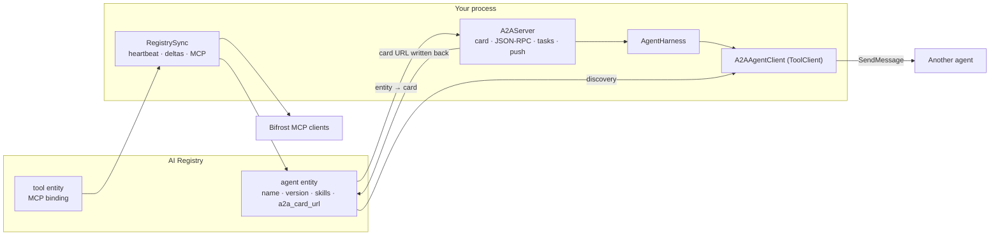

# A2A: agents calling agents through the catalogue

Design §9. Any harness agent can be published as an [A2A](https://a2a-protocol.org) agent, and the
agents an AI Registry lists become tools a planner can choose. Both halves live in the
`trellis-harness-a2a` distribution (`pip install "trellis-harness[a2a]"`); the core imports none of
it, and that package is the only place `a2a-sdk` is imported.

Verified against **a2a-sdk 1.1.5**, which speaks A2A protocol **v1.0** — protobuf types, the
endpoint in `supportedInterfaces`, `security` renamed to `securityRequirements`, and no
`a2a.server.apps` module.

One version detail, because it is visible on the wire: a served card's `protocolVersion` is the
installed SDK's `PROTOCOL_VERSION_CURRENT` (`"1.0"` here), while
`trellis.contracts.a2a.A2A_PROTOCOL_VERSION` — the default a card constructed in the contracts
package carries when nobody sets one — is still `"0.3.0"`. Everything this surface serves says
`1.0`; the constant is stale, and the contracts README records it.



## Serving

```python
from trellis.harness_a2a import A2AServer, TrustedHeaderIdentity

server = await A2AServer.from_registry(
    harness,
    agent=refund_agent,
    url="https://agents.example.com/a2a",
    registry=harness.registry,
    identity=TrustedHeaderIdentity(allowed_tenants={"acme"}),
    webhook_secret=os.environ["TRELLIS_WEBHOOK_SECRET"],
)
app.mount("/", server.app())
```

`url` is the one input that decides the rest: JSON-RPC is served at its path, the card document at
`<url>/.well-known/agent-card.json`, and that same card URL is written back to the Registry entity.
`A2AServer(...)` without `from_registry` serves a card built from the `AgentDescriptor` alone.

| Option | What it does |
|---|---|
| `identity` | How the caller is placed (below). Without one, the harness's own defaults are used — single-tenant only |
| `entity` | A Registry entity (`AIRegistryClient.agents()` shape) whose description and skills overlay the descriptor's |
| `task_store` | Defaults to `HarnessTaskStore(harness.runs)`: this process's tasks, rebuilt from the run store on a miss |
| `webhook_secret` / `push_notifier` | Turns push notifications on, and advertises the capability |
| `security_schemes` / `security` | Defaults to the team key (`teamKey`, an API key in `Authorization`) |
| `rest=True` | Also serve the SDK's REST routes; JSON-RPC is the default and what the tests exercise |
| `enable_v0_3_compat=True` | Accept A2A 0.3 clients on the same endpoint (untested here) |

### The event mapping

| Run event | A2A |
|---|---|
| `RUN_STARTED` | `working` |
| `TEXT_MESSAGE_CONTENT` | `working`, the delta as agent text |
| `TOOL_CALL_*`, `STEP_*`, `CONTEXT_LOADED`, `STATE_*`, `CUSTOM`, `RAW` | `working`, the event as a data part |
| `RUN_FINISHED(success/partial)` | `artifact(result)` then `completed` |
| `RUN_FINISHED(interrupt)` | `input-required` with the question and its `expects` schema |
| `RUN_FINISHED(error/timeout)` | `failed` with the error's code and message |
| `RUN_FINISHED(rejected)` | `rejected` |
| `RUN_FINISHED(cancelled)` | `canceled` |

Text start/end, `MESSAGES_SNAPSHOT` and the harness's own `INTERRUPT` event are not carried: the
deltas already said the text, and the finish event carries the pause. Every payload has been
through the harness's redactor before a sink — and therefore this surface — sees it.

### Identity

The caller's tenant, user and workspace arrive on `X-Trellis-Identity` (compact JSON), set by an
edge that authenticated the caller and **overwrites** whatever the client sent. The A2A extension
`https://trellis.dev/a2a/extensions/trusted-identity/v1` is declared on the card and activated with
the protocol's `A2A-Extensions` header.

- `TrustedHeaderIdentity(allowed_tenants=..., require_user=...)` reads that header and refuses a
  missing, oversized, malformed or foreign one. Unknown fields in it are dropped.
- `require_authenticated=True` turns the deployment contract into something this process checks: the
  header is believed only on a call the deployment's own middleware authenticated (the SDK's
  `ServerCallContext.user`). Off by default, because the documented topology authenticates at the
  edge where this process sees no principal — but turn it on wherever the process authenticates too,
  and a server that accidentally becomes reachable directly fails closed.
- `FixedIdentity(tenant_id=...)` ignores the header entirely, for a server that is not multi-tenant.
- A2A requests also carry a `tenant` of their own — the SDK's JSON-RPC dispatcher lifts it straight
  off the request body, the REST routes take it from the path. It is never identity here, and a
  call that contradicts the authenticated caller is refused.
- A refusal happens before a run starts: no run, no memory, no task state for anyone else.

### Tasks and the run store

The A2A task id **is** the harness run id. `HarnessTaskStore` keeps this process's A2A view (status,
history, artifacts) and, on a miss, rebuilds a task from `harness.runs.get(task_id)` — status from
`RunStatus`, the run's input as the first message, its output as an artifact, a paused run's
question as the status message. It returns nothing for a run that is not the caller's, and it writes
no run transitions: the harness's own `RunRecorder` remains the single writer of run records. With
no run store configured it is purely in-memory.

Tasks are partitioned by the authenticated tenant and user, which is what makes a task id useless to
anyone else: the SDK answers `TaskNotFound` for a task the caller does not own, before the executor
runs.

### Pauses and resumes

`input-required` is the platform's one pause. The next message on the same task is claimed through
`harness.resolutions.claim(...)` — the run's own tenant, user, workspace and context, or nothing —
and answered through `harness.resume(...)`, so the run store, the feedback record and tool memory
see an A2A answer exactly as they see a UI's.

A caller answers a question with text (or a data part), and an approval with `approve`, `reject`,
`cancel`, a data part naming the `decision`, or an object of edited arguments. An answer that cannot
be acted on — malformed, a decision the interrupt cannot take, or one from a caller that may not
answer — does not fail the task: the agent says why and asks again, and the pause goes back on the
registry. That is deliberate: raising would make the SDK mark a task that is *waiting* as failed,
ending a wait the harness itself keeps open.

What a caller is told about a pause is the question, which interrupt it is, why, and the shape of
the answer. The interrupt record itself is not published: `Interrupt.awaiting()` carries the held
tool call's arguments unredacted, so both the live stream and a task rebuilt from the run store
publish the same pruned view.

The identity used for that ownership check is the resolver's, with the harness's own defaults
filling only the fields the resolver did not assert — the run got those defaults too, so the check
compares like with like instead of locking a caller out of its own pause.

**Resume is in-process.** `harness.resolutions` is in-process by design (the durable record is the
run store), so a task's follow-ups must reach the instance that owns the run. Behind a load
balancer, pin them, or resume through the run store's own API.

### Push notifications

`HarnessPushNotifier` reuses the harness's webhook rules end to end: https only, no credentials in
the URL, public addresses only, re-resolved at delivery. The same check is handed to the SDK as its
`push_url_validator`, so a bad URL is refused when it is **registered** rather than quietly at
delivery time. Bodies are signed `X-Trellis-Signature: t=…,v1=…` (verify with
`trellis.memory.webhooks.verify_signature`) and carry A2A's own `X-A2A-Notification-Token` when the
caller registered one. `HarnessPushNotifier.from_sink(sink, store)` takes its secret and target
policy from an existing `WebhookEventSink`, so one receiver verifies run webhooks and A2A pushes the
same way.

## Calling

```python
from trellis.harness.registry import RegistryAgentDirectory
from trellis.harness_a2a import A2AAgentClient

agents = A2AAgentClient(
    RegistryAgentDirectory(harness.registry),
    credentials={"teamKey": os.environ["TRELLIS_TEAM_KEY"]},
)
harness = AgentHarness(tools=CompositeToolClient([local_tools, agents]), ...)
```

Each registry agent becomes one tool named `a2a_<agent id>` (unsafe characters replaced, because a
model's tool list will not take `product:agent`) whose schema is `{message, data?, task_id?}`. The
description a model reads is somebody else's text — a Registry entity's and a remote card's — so it
is flattened to one bounded line and a skill id is cut to the id it should have been: a catalogue
entry cannot carry an instruction block into the planner's tool list, and what an agent may actually
do is decided by policy, not by what its card says about itself. A call:

1. resolves the card from the location the Registry published — that URL passes the same target
   checks a webhook does (https, no credentials, a public address, re-resolved), because it is an
   outbound fetch of a URL somebody else wrote — and **refuses a card whose `name` is not the agent
   asked for**;
2. sends `SendMessage` with the caller's thread as the `contextId`, the trusted identity header, the
   activated extension and W3C trace context;
3. keeps the `taskId` per (tenant, context, agent) so a follow-up continues the same task, and
   forgets it once the task ends — A2A tasks are immutable once terminal, so a refinement is a new
   task on the same context. A thread id is caller-chosen material, which is why the tenant is part
   of the key; and a `task_id` named in the tool arguments is honoured only when it *is* this
   conversation's task, since the planner choosing it is a model;
4. returns a `ToolOutcome` (`ok` / `error` / `rejected` / `cancelled`) whose `output` is the
   artifacts the remote agent published, else what it said. An agent that answers with a message
   and no task at all is a success, not a failure; a task still `submitted` or `working` when the
   stream ended is reported `A2ATaskIncomplete` with its id kept, so the next call continues it;
5. raises `AgentPaused` when the remote task says `input-required`, so the local run pauses through
   the one mechanism and the answer is sent as the next message on the same task.

Because it is a `ToolClient`, policy, instrumentation, idempotency keys and tool memory apply
unchanged: an approval rule about "tools that spend money" covers a remote agent that spends money,
and a denial stops the call before it leaves the process.

Credentials come from your own store through `MappingCredentials` (a mapping or a callable) and are
applied per the card's security scheme by the SDK's `AuthInterceptor`. An agent whose card requires a
scheme you have no credential for is refused by name rather than called unauthenticated. A caller
that is not a run (a script, a scheduled job) passes `identity={"tenant_id": ...}`; without either a
run context or that, the call is refused rather than sent with no caller.

## Registry: directory, card write-back, sync

These live in the harness core (`trellis.harness.registry`) and import no `a2a-sdk`.

- **`RegistryAgentDirectory`** implements the contracts `AgentDirectory` over the manifest:
  `get`/`find` return contracts `AgentCard`s for agents that have a published card location, and
  `publish(card)` writes one back. An entity with no card URL is skipped and logged — a planner that
  "found" an agent it cannot call is worse than one that found nothing.
- **`AIRegistryClient.publish_card_url(agent_id, url)`** is the one control-plane write the harness
  performs. It needs `registry.control_plane_token`; without it the write is skipped with a warning
  (discovery keeps working off whatever the entity already holds). The entity is addressed through
  `registry.entity_path` (default `/v1/entities/{entity_id}`, the id taken from the manifest), and
  the URL passes the same checks as a webhook target first, because a card URL is a fetch target for
  every other agent. The field written is the entity spec's `a2a_card_url`.
- **`RegistrySync`** keeps it all honest while the process runs:

```python
from trellis.harness.registry import RegistrySync

sync = RegistrySync(
    harness.registry,
    descriptors=list(harness.descriptors.values()),
    gateway=bifrost,  # optional: configure MCP clients from tool entities
    telemetry=harness.telemetry,
    channel=my_redis_channel,  # optional: the registry's own change channel
)
await sync.start()
...
await sync.aclose()
```

  Each cycle re-reads the manifest (an unchanged one costs a 304), reports a `ManifestDelta` of
  added, removed and changed entity names, heartbeats every declared agent, and reconciles Bifrost's
  MCP clients against the Registry's **tool** entities. Cycles are rate-limited
  (`min_cycle_seconds`), so a talkative change channel wakes the job without turning it into a busy
  loop. Nothing in the loop raises: a registry outage, a gateway error or a malformed entity is
  logged, counted (`agent.registry.sync.count`, `agent.registry.drift.count`) and slept off.

### Bifrost MCP clients from Registry tools

A tool entity declares its binding as `mcp: {connection_type, connection_string}` (or flat
`connection_type`/`connection_string`/`url`). Those two fields are all the catalogue owns: no other
key of that block is forwarded, because gateway options apply to a client every team's key can reach
and belong in the gateway's own configuration. The sync job adds what is listed and missing, updates
what changed, and removes only clients **it** actually wrote — a hand-registered server is never
deleted because a catalogue does not mention it, not even one whose configuration already matches.
Gateway client names may not contain hyphens, so `invoice-lookup` becomes `invoice_lookup`; every
entity that wants a name two others wanted is refused rather than merged, and a tool with no binding
is reported as unbound. One gateway refusal is one tool nobody can call, not a reason to stop
configuring the rest of the catalogue.

Two things a catalogue entry may not do on its own, because the gateway acts on them with this
deployment's network position and credentials:

- **point somewhere private.** An `http`/`sse` connection string goes through the same target checks
  as a webhook, so an entry naming `169.254.169.254` or an internal service is refused
  (`allow_local_targets=True` for development).
- **introduce a `stdio` client**, which makes the gateway run a local process. `connection_types`
  defaults to `{"http", "sse"}`; a deployment that wants stdio from the catalogue says so.

## What is not here

- gRPC (`grpcio` is not installed, and the SDK's gRPC transport is `None` without it), the SDK's SQL
  task store, and card signing (`a2a-sdk[signing]`).
- A concrete delta-channel implementation. The protocol is defined (`DeltaChannel.watch()`), the
  ETag poll is the shipped default, and a deployment that runs Redis wires its own subscriber in.
- Creating Registry entities. Exposure stays a reviewed, human action; the harness publishes a card
  *location* onto an entity that already exists.
