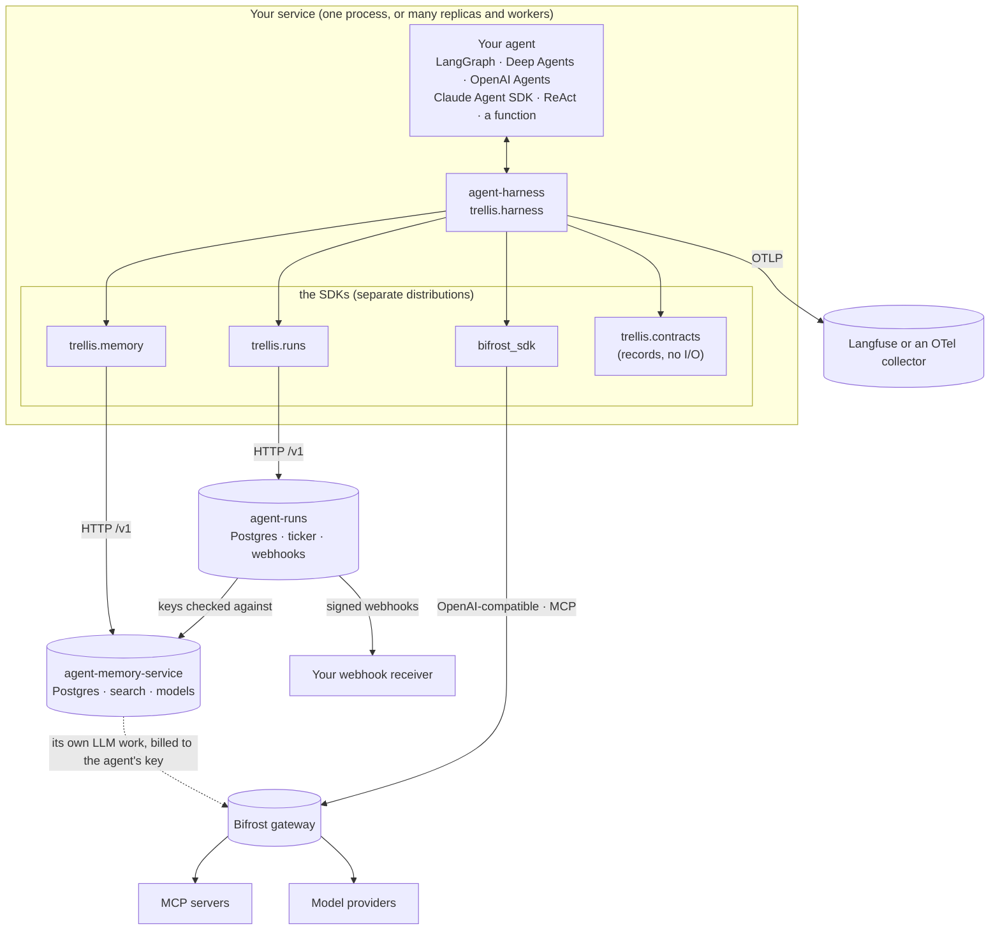
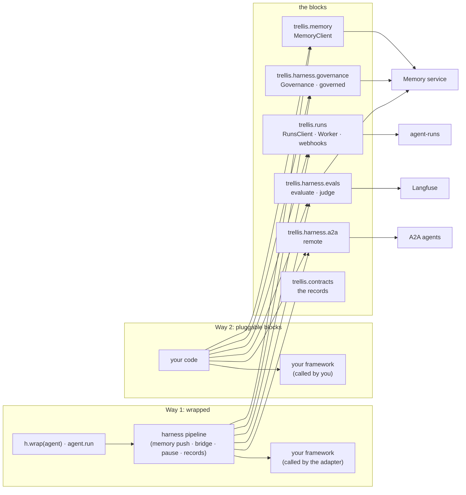
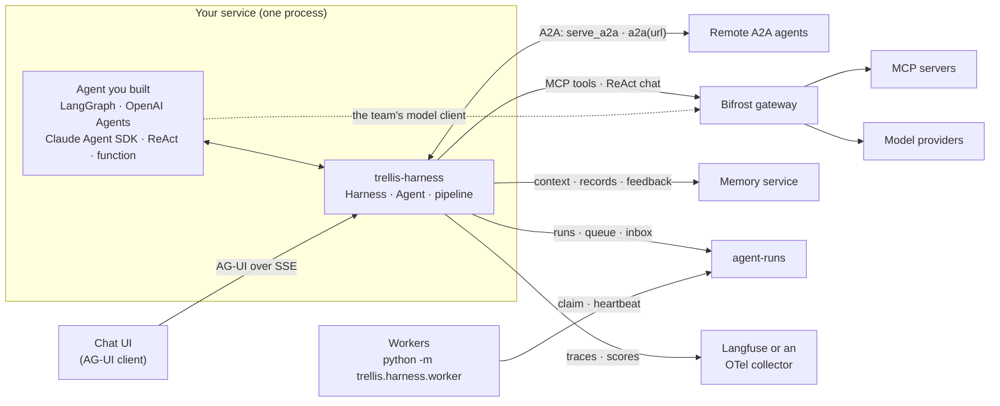
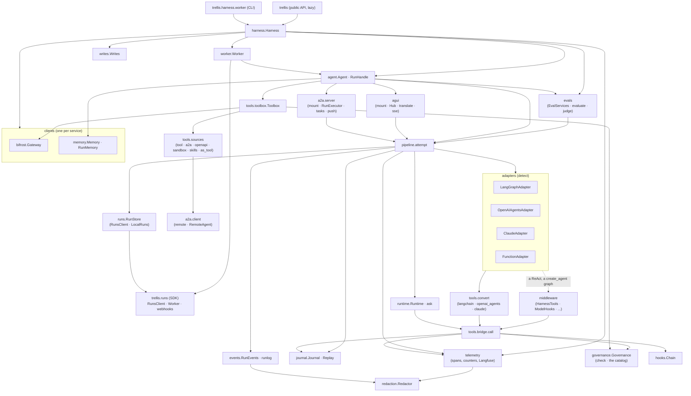
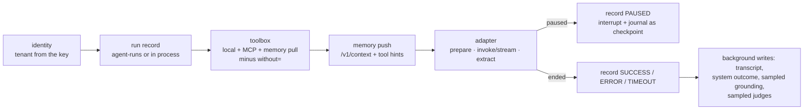
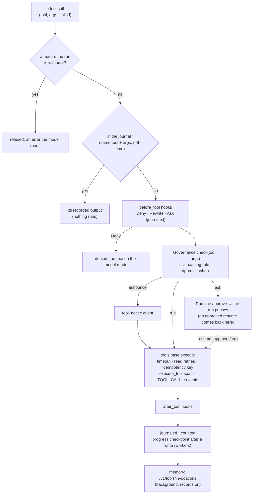
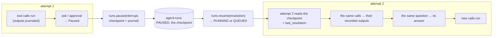
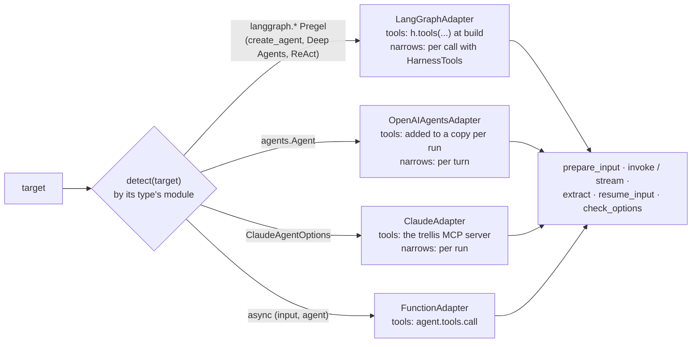
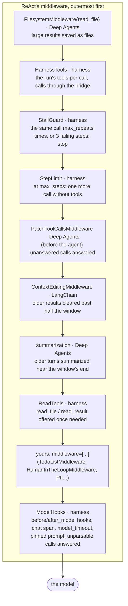
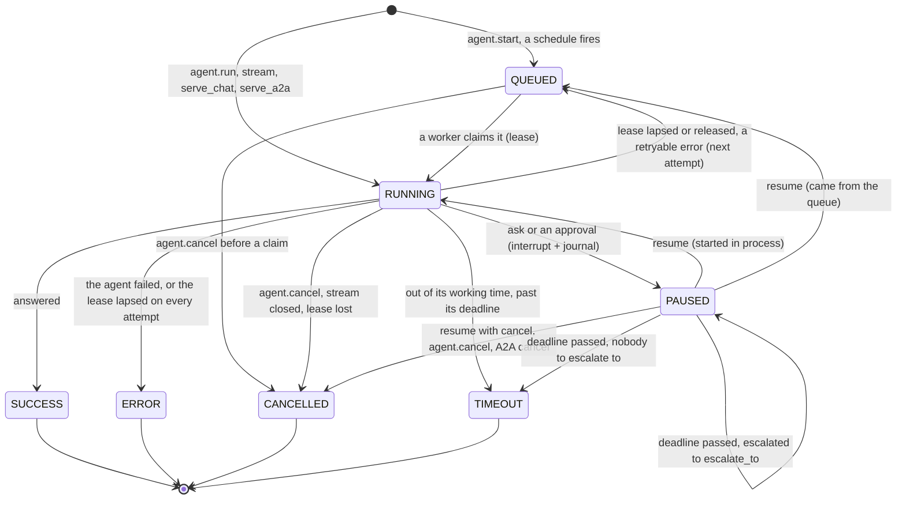

# Architecture

First the platform — the five repositories and the services they reach — then the harness
inside: its modules, the pipeline every run goes through, the bridge every tool call goes
through, the journal, the runtime, the adapters and the LangChain middleware. How each flow
runs step by step, as sequence diagrams written from the code, is [flows.md](flows.md).

The harness is an attach layer. It owns no control flow: a framework runs the agent, and the
harness sits around one run of it — identity, the run record, memory in and out, the tools the
agent may call and who must approve them, the pause, the recording, the trace.

## The five repositories



| Repository | Owns | The harness uses it for |
|---|---|---|
| [agent-contracts](https://github.com/amitmohapatra/agent-contracts) | the records (`RunStart`, `RunRecord`, `Interrupt`, `InterruptResolution`, `RunEvent`, `Feedback`, `ToolCall`, `AgentError`...) and the ports; no runtime | everything it returns and every record it writes |
| [agent-memory-service](https://github.com/amitmohapatra/agent-memory-service) | memory: the context for a question, the memory tools, transcripts and tool records, documents, the tool catalog (risks, `approve_when`), feedback, grounding (`/v1/verify`), the keys (`/v1/keys/self`: who a key is) | memory push and pull, records, governance's catalog, the tenant, feedback, grounding |
| [agent-runs](https://github.com/amitmohapatra/agent-runs) | durable runs: records, the queue, leases and heartbeats, pauses with their checkpoint, the inbox, schedules and their ticker, deadlines and escalation, artifacts, the event log, signed webhooks | the run store with `RUNS_URL` (else the in-process `LocalRuns`), workers, schedules |
| [bifrost-sdk](https://github.com/amitmohapatra/bifrost-sdk) | the Bifrost gateway's client: completions, MCP listing and execution, the MCP log, prompts, skills, Virtual MCPs, the deny-all scope | MCP tools and Code Mode, `ReAct`'s and the judge's models, stored prompts and skills |
| agent-harness (this one) | Way 1 (the pipeline, the bridge, the journal, the adapters, the surfaces) and the governance, evaluation and A2A blocks | — |

The run lifecycle is agent-runs': its
[architecture](https://github.com/amitmohapatra/agent-runs/blob/main/docs/ARCHITECTURE.md) owns
every transition; [run states](#run-states) below says which ones the harness writes.

## Two ways

Trellis is used in two ways ([README](../README.md#two-ways-to-use-trellis)), and both reach the
same services through the same clients. **Way 1, wrapped:** `h.wrap(agent)`, and the harness's
pipeline calls every block around each run of the framework. **Way 2, pluggable blocks:** the
team's own code runs the framework and calls the blocks it wants itself. The blocks are the
same objects in both: the harness builds its run store on `trellis.runs.RunsClient`, its memory
calls on `trellis.memory`, and checks every tool call with the same `Governance` a team imports.



Every block takes and returns `trellis.contracts` records, which is why a run paused either way
is one `RunRecord` in one inbox. What only Way 1 has is the pipeline itself: the journal that
lets a resumed run repeat no side effect, the background writes with their spool, the toolbox
(MCP tools, Code Mode, tool hints), and the AG-UI and A2A servers, which serve a run through
it. The blocks' pages are [docs/blocks/](README.md#way-2-pluggable-blocks-your-framework-our-pieces).

## System context

What a process that imports `trellis` talks to. Every arrow out of the harness is one client
module (`clients/bifrost.py`, `clients/memory.py`, and `runs.py`, whose store is the agent-runs
SDK's `trellis.runs.RunsClient`) or one protocol package (`agui`, `a2a`); the OTLP exporter and
the Langfuse scores API are `telemetry.py`.



| Neighbour | What the harness uses it for | Endpoints (module) |
|---|---|---|
| Bifrost gateway (`BIFROST_URL`, `BIFROST_VIRTUAL_KEY`) | the MCP tools the virtual key allows (or a Virtual MCP's), their execution, Code Mode, `ReAct`'s and the judge's model calls, the MCP log of Code Mode scripts, stored prompts, skills, the MCP clients' Agent Mode lists | `POST /mcp[/<slug>]` (`tools/list`, `tools/call`), `POST /v1/mcp/tool/execute`, `POST /v1/chat/completions`, `GET /api/mcp-logs`, `GET /api/prompt-repo/prompts`, `GET /api/skills[/...]`, `GET /api/mcp/clients` (`clients/bifrost.py`, through `bifrost-sdk`) |
| Memory service (`MEMORY_URL`, `TRELLIS_API_KEY`) | who the key is, the pushed context, the pull tools, transcripts and tool records, the tool catalog, outcomes and feedback, the grounding check, documents, the agent's model key | `/v1/keys/self`, `/v1/context`, `/v1/agent-tools`, `/v1/messages`, `/v1/tools/invocations`, `/v1/tools`, `/v1/tools/catalog`, `/v1/feedback`, `/v1/verify`, `/v1/documents`, `/v1/agents/model-key` (`clients/memory.py`, the catalog in `governance/catalog.py`, `/v1/verify` in `evals.grounding_score`, through `trellis-memory`) |
| agent-runs (`RUNS_URL`, `TRELLIS_API_KEY`) | run records, the worker queue and leases, pauses with their checkpoint, the inbox, schedules, `ask` artifacts, the event log | `/v1/runs`, `/v1/runs/claim`, `/v1/runs/{id}/heartbeat`, `/pause`, `/resume`, `/finish`, `/release`, `/artifacts`, `/events`, `/v1/artifacts/{id}`, `/v1/schedules` (`runs.py`, `runlog.py`, through `trellis.runs.RunsClient`) |
| Chat UI | runs and their events, resumes, reconnects, large interrupt payloads | `serve_chat`: `POST {path}/run`, `GET {path}/runs/{id}/events`, `GET {path}/runs/{id}/artifacts/{artifact_id}` (`agui`) |
| Remote A2A agents | callers of this agent, and agents this agent calls | `serve_a2a`: the card and JSON-RPC at `url`; `a2a(url)` and `remote(url)`: `SendStreamingMessage`, `CancelTask` (`a2a`) |
| Langfuse / an OTel collector (`OTEL_EXPORTER_OTLP_*`) | traces; grounding, feedback and evaluation scores; evaluation datasets and dataset runs | OTLP/HTTP `<endpoint>/v1/traces`, `POST /api/public/scores`, `GET /api/public/v2/datasets/{name}`, `GET /api/public/dataset-items`, `POST /api/public/dataset-run-items` (`telemetry.Langfuse`) |

Unset variables remove a box: no `BIFROST_URL` means no MCP tools and no `ReAct` model names,
no `MEMORY_URL` means no memory, no `RUNS_URL` keeps runs, the queue and schedules in this
process (`runs.LocalRuns`), no `OTEL_EXPORTER_OTLP_ENDPOINT` means no export
([configuration.md](configuration.md)).

## Modules

```
src/trellis/
  __init__.py          the public API (lazy; extends __path__ for trellis.contracts / .memory / .runs)
  testing/             Reviewer, Decide, ANY: scripted answers to a run's questions (tests)
  harness/
    harness.py         Harness: the blocks given (runs, memory, gateway, governance), the rest built
                       from the settings; writes, evaluation services; the key (tenant, kept fresh);
                       governance per tenant; wrap / tools / worker / inbox / feedback /
                       add_document / evaluate / score / prompt / model_headers
    agent.py           Agent: run, stream, start, execute (a claimed run), resume, cancel, events,
                       schedule, as_tool, serve_*; RunHandle; memory push and records
    pipeline.py        one attempt of one run, from its record: the fixed pipeline below
    runtime.py         Runtime (trellis.current()): ask, approve, the pause, interrupt ids,
                       progress checkpoints, tools.call
    asking.py          Question: what ask, an approval and a graph's interrupt() build (Way 2 too)
    journal.py         what a re-run needs: answers and tool outputs keyed by content; the
                       checkpoint (or an artifact reference past 1 MiB); sub-agents' journals
    features.py        without=: the features a run or an agent turns off (Feature)
    compat.py          the framework versions this release was tested with; the wrap-time warning
    hooks/             Hooks and how they chain; openai_agents: model hooks through RunHooks
    middleware.py      LangChain v1 middleware: HarnessTools, ModelHooks, StepLimit, StallGuard,
                       ReadTools, read_result, RunCheckpointer
    react.py           ReAct(...): a create_agent graph with the native middleware and the harness's
    subagents.py       agent.as_tool(): a wrapped agent as a tool, each call a child run
    sandbox/           sandbox(): the run's own sandbox as three tools (base: the provider
                       interface; docker: DockerSandbox)
    prompts.py         prompt sources (code, PROMPTS_DIR, Langfuse, the gateway), pinned per run
    skills.py          skill sources (code, SKILLS_DIR, the gateway), progressive disclosure
    repository.py      what prompt and skill sources share: lookup order, pins, the last good copy
    events.py          a run's RunEvent stream (built only when someone listens)
    runlog.py          a run's events into agent-runs' event log (RUNS_URL), read back from any replica
    writes.py          background writes: retries, backpressure, the spool, auto-drain
    fresh.py           a value read from a service, kept for a TTL, the last one through outages
    identity.py        tenant / user / thread / agent / run → memory scope, contracts context
    result.py          Result
    evals.py           evaluation, usable without Harness: EvalServices, evaluate, judge, the
                       evaluators (grounding, exact_match, contains, called, tool_sequence, llm_judge)
    settings.py        the environment
    telemetry.py       OTel GenAI spans, trace ids per run, counters; OTLP export; Langfuse client
    redaction.py       what may leave the process
    logs.py            JSON log lines (the worker CLI's, or the application's own)
    testing.py         Reviewer and Decide (trellis.testing)
    runs.py            RunStore (the part of trellis.runs.RunsClient the harness calls) and
                       LocalRuns (the same store in process, when RUNS_URL is unset)
    worker/            Worker: trellis.runs.Worker running wrapped agents; __main__: the CLI
    adapters/          detect(target) and one adapter per framework (base, langgraph,
                       openai_agents, claude, function)
    governance/        the run / announce / ask decision, usable without Harness: decision,
                       catalog (the rules, kept fresh, failing closed, publishing), Governance, governed
    tools/             base (Tool, execute), sources (tool, a2a, openapi), toolbox (MCP tools,
                       Code Mode, publishing), bridge (every call), convert/ (one module per format)
    clients/           bifrost, memory: the only modules that call those services
    agui/              serve_chat: mount, the Hub (buffered events), translate, sse
    a2a/               A2A both ways: client (remote, RemoteAgent), server (serve_a2a), executor,
                       tasks, identity, push, translate
```

Each service has exactly one client module; nothing else in the harness calls it (agent-runs'
is the SDK's `RunsClient`, which `runs.py` types as the `RunStore`) — except the tool catalog,
which `governance/catalog.py` reads and writes through the memory SDK itself, and the grounding
check, which `evals.grounding_score` asks through the memory SDK, so governance and evaluation
work without a `Harness`. The core imports no framework: an adapter imports its framework the
first time a target of its type is wrapped, and `tests/contract` checks that `import trellis`
and `Harness()` load none — and that what the clients send, and what the test doubles of the
memory service and agent-runs answer, match those services' committed OpenAPI documents.

### Components

How the modules depend on each other (an arrow reads "uses"). The adapters and the tool
converters are the only modules that import a framework; `agui` and `a2a` are the only ones
that import FastAPI or the A2A SDK.



## The pipeline

Every attempt of every run goes through `pipeline.attempt`, from the run's record — however it
started: `agent.run`/`stream`, a resume, `agent.execute(job)` (any worker), a sub-agent's call,
`serve_chat`, `serve_a2a`, `h.evaluate` — so its time limit, version, `without=` and
`framework_options=` apply everywhere; the run hooks (`on_run_start`, `on_run_end`,
`on_error`) fire around it.



A memory service that is down degrades a run, it never fails it: a failed context read is a
`warning` event; the memory tools that cannot be listed are left out (a `warning` event); a
catalog that cannot be read makes every tool that does more than read ask; who
`TRELLIS_API_KEY` is stays what it was last read (`fresh.Fresh`). Only a key the service refuses,
or one it could never be asked about, is a `ConfigurationError`. Writes to agent-runs are
awaited (a pause that was not recorded cannot be resumed) and retried; writes to the memory
service are queued. The whole run, step by step: [flows.md](flows.md#a-run).

## The bridge

Every tool call, whoever makes it — a framework through its converted tool, `HarnessTools` in a
LangChain graph, `agent.tools.call` in a function — goes through `tools/bridge.call`:



1. **replay** — the journal already has this call (same tool, same arguments, n-th time): its
   recorded output is returned and nothing runs; a tool of a feature the run is `without=` is
   refused;
2. **hooks** — the run's `before_tool` hooks may deny the call, rewrite its arguments or ask a
   person; their decision is journaled with the call's occurrence ([hooks.md](hooks.md));
3. **governance** — `Harness.governance(tenant).check(tool, args, side_effects=...)`, by the
   tool's name, as the catalog says at the time of the call: `read` runs, `write` runs and is
   announced (`tool_notice` event), `irreversible` asks for approval; the catalog's
   `approve_when` replaces that ([governance.md](governance.md));
4. **execution** — `tools.base.execute`, the one executor `governed` uses too (the tool's
   timeout within the run's, retries of reads, an unknown outcome for a write out of time), in
   an `execute_tool` span; a failure is an error result the model reads, a pause propagates;
   the `after_tool` hooks may change the outcome;
5. **record** — journaled (the tool is then offered for the rest of the run), counted, and with
   memory writes on sent to the memory service's tool records in the background.

A tool called outside a harness run is refused. What the model is *offered* (the tools the
context names, the memory tools, the tools already used) is `Runtime.offers`; each adapter
narrows as far as its framework allows (`Adapter.narrows`: per turn, per run, or none).

### Tools and governance

The toolbox (`tools/toolbox.py`, one `Toolbox` per agent and tenant) keeps the definitions — the
local sources and every MCP tool the virtual key allows — fresh: listed again after
`TOOLS_TTL_SECONDS` (300), one listing at a time. A new listing is published to the catalog
through governance, in the background. Code Mode is chosen for the Code Mode servers whose
tools all only read as governance says now, when there are enough of them
(`CODE_MODE_MIN_SERVERS` 3 or `CODE_MODE_MIN_TOOLS` 20); its meta-tools are offered under the
harness's names, so the gateway returns every call to the bridge. With `mcp=` the definitions
are the named Virtual MCPs' tools; a tool its client lists in `tools_to_auto_execute` is left
out ([gateway.md](gateway.md)).

Governance (`governance/`, one `Governance` per tenant) is the only place a call's action is
decided. It reads the catalog's word on each tool (`risk`, `approve_when`) again after
`GOVERNANCE_TTL_SECONDS` (30) with the last answer's `ETag`, so an administrator's new rule
reaches running agents within half a minute. A catalog that cannot be read leaves each tool
its own risk, except that every tool that does more than read asks (`catalog.CATALOG_UNREAD`)
until it can (rules read in the last 300 s still stand). Governance never sees the run: the
same `Governance` checks the tools of code that does not use `h.wrap`.

## The journal and the runtime

`Runtime` (`runtime.py`) is the run as code inside it sees it (`trellis.current()`): its
identity, its time left, its tools, its memory scope, and the one way to pause, `ask` (built as
a `Question`, `asking.py`, which an approval, a result from outside the run and a graph's own
`interrupt(value)` use too). Its interrupt's id is `<run_id>.<attempt>.<n>`: it names its run,
so `resume` needs nothing else.



The journal (`journal.py`) is the run's checkpoint: the answers given and the tool calls made,
keyed by content (the question; the tool and its arguments) and consumed in order, plus a
`ReAct`'s graph checkpoint (`RunCheckpointer`), a Claude session id and the sub-agents' journals.
A worker saves it as progress on a heartbeat after every call with side effects (a worker that
dies repeats none of them), `runs.pause` stores it with the pause, and the attempt that resumes
the run — in this process or in a worker elsewhere — files `last_resolution` under the pending
question and replays the rest. A journal over agent-runs' 1 MiB checkpoint bound is uploaded as
a run artifact and the checkpoint is `{"journal_ref": ArtifactRef}`.

How a run continues: a LangGraph graph with a checkpointer resumes in place (`ask` *is*
`interrupt`, the resume `Command(resume=...)`); a Claude session is resumed and the journal
answers the paused call; everything else re-runs from its input against the journal
([flows.md](flows.md#a-pause-an-approval-and-a-resume)). A run started in process (`run`/`stream`)
continues in the process that resumes it; a run that came from the queue (`start`, a schedule)
goes back to it and a worker continues it.

## The adapters

Four functions per framework, and one check (`adapters/base.py`); `detect(target)` picks the
adapter from the target's type, before anything is imported.



* `prepare_input(target, input, context)` — the framework's input, the memory context as a
  system message (or appended to the system prompt);
* `invoke(target, native_input, run)` / `stream(...)` — run it; the stream yields text deltas
  and finally `Output(value)`;
* `extract(target, output)` — the answer, the assistant transcript, and a pause the framework
  reported itself (LangGraph's `interrupt`, an OpenAI Agents `needs_approval`);
* `resume_input(target, native_input, pending, resolution)` — what continues a pause:
  `Command(resume=...)` for a checkpointed graph, the SDK's `RunState` for its approvals,
  otherwise the original input (a re-run);
* `check_options(options)` — refuses `framework_options=` its run call cannot take, at wrap and
  call time ([configuration.md](configuration.md#the-frameworks-own-run-options)).

| Target | Stream | Pause / resume | Harness tools | Tools narrowed | Memory push |
|---|---|---|---|---|---|
| LangGraph graph, Deep Agents | text deltas and tool events | native `interrupt` / `Command(resume=)` with a checkpointer; re-run against the journal without; `HumanInTheLoopMiddleware` / `interrupt_on` pauses are approvals answered with the harness's decisions | built in with `h.tools(..., framework="langgraph")` (a compiled graph refuses `tools=`) | per model call with `HarnessTools`, else no (bound at build) | leading system message, one per checkpointed thread |
| `ReAct` (a `create_agent` graph) | text deltas and tool events | the graph's checkpoint kept in the run: the resume continues it (no repeated model call) | per model call (`HarnessTools`) | per model call | a system message after `system` |
| OpenAI Agents `Agent` | text deltas and tool events | `ask` → re-run against the journal; the SDK's own `needs_approval` → its `RunState` approved or rejected and continued | added to a copy per run | per turn (`FunctionTool.is_enabled`) | leading `system` message |
| Claude Agent SDK `ClaudeAgentOptions` | assistant text blocks and tool events | `ask` → the CLI is stopped; the resume continues its session (built-ins not run again), the journal answering | in-process MCP server `trellis` (`mcp__trellis__*`); built-ins governed through `can_use_tool` | per run | appended to `system_prompt` |
| async function `(input, agent)` | tool events | re-run against the journal | `agent.tools.call(...)` | n/a | `agent.context` (and a leading system message for a message list) |

A framework installed outside the range this release was tested with is said once when its
first target is wrapped (`compat.check`, [versioning.md](versioning.md)). The framework's own
entry point (`graph.ainvoke`, `Runner.run`, `query`) is not intercepted: call
`agent.run`/`stream`/`resume`. One page per framework: [frameworks/](README.md#which-target).

## The middleware

`ReAct(...)` is a LangChain `create_agent` graph; any `create_agent` or Deep Agents graph may
take the harness's middleware too (`middleware.py`). The stack `ReAct` builds, in order — each
`wrap_model_call` wraps the ones after it, so the first is outermost:



One model step through it, and the tool calls it makes, is in
[flows.md](flows.md#react-one-model-step-through-the-middleware); what each piece does and how
to add or replace one is [frameworks/react.md](frameworks/react.md#the-middleware).

## Run states

The run record's status (contracts `RunStatus`); agent-runs owns the transitions (its
[lifecycle](https://github.com/amitmohapatra/agent-runs/blob/main/docs/ARCHITECTURE.md)). The
harness writes `QUEUED`, `RUNNING`, `PAUSED`, `SUCCESS`, `ERROR`, `TIMEOUT` and `CANCELLED`.
agent-runs moves the rest: a lapsed lease back to `QUEUED` after a backoff (or to `ERROR` at the
fifth lapse), a queued run that ended `ERROR` with a retryable error back to `QUEUED` (at most 3
times), a released run back to `QUEUED` at once, a cancel of a queued or paused run to
`CANCELLED`, a run past its working-time limit or its deadline to `TIMEOUT`, and a paused run
past its interrupt's deadline to `escalate_to` (once) or to `TIMEOUT`. `PARTIAL` and `REJECTED`
are valid endings of the contract that the harness never writes.



Every attempt (each `RUNNING` stretch) is one `invoke_agent` span in the run's one trace.

## Background writes

`writes.Writes`: a bounded queue (`MAX_PENDING` 10 000) drained by `WRITERS` (4) tasks. A
write whose failure may pass is tried again (`WRITE_ATTEMPTS` 3, full-jitter backoff); a full
queue makes the writer wait (`SUBMIT_WAIT_SECONDS` 5) instead of dropping the write. A write
given up is logged, counted and emitted as a `warning` event to the run's listeners — or, with
`TRELLIS_SPOOL_DIR`, appended to a JSONL spool that the next process replays. When the event
loop shuts down it cancels the workers, and a cancelled worker finishes the queue first, within
`DRAIN_SECONDS` (10); what is left is spooled or counted lost (`trellis.writes.undelivered`).
`await h.aclose()` drains explicitly. The guarantee is in
[memory.md](memory.md#background-writes-what-is-guaranteed).

## Evaluation

`evals.py` is a block usable with or without `Harness`: an evaluator is any
`async (EvalCase) -> EvalScore | None`; the built-ins are `grounding()`, `exact_match()`,
`contains()`, `called()`, `tool_sequence()` and `llm_judge(criteria)`. What they reach is an
`EvalServices`: Langfuse, and the judge's gateway and model — the deployment's
(`TRELLIS_JUDGE_MODEL`, `TRELLIS_JUDGE_VIRTUAL_KEY`), never the code's. `evaluate(target,
...)` runs a wrapped `Agent` through the pipeline (`h.evaluate` delegates to it) or calls any
`async (input) -> answer`; `judge(case, judges, services=)` scores one case on-line, and is what
a wrapped agent's online judges run ([evaluation.md](evaluation.md),
[flows.md](flows.md#evaluation-offline-and-online)).

## Telemetry

The OTel API only: an `invoke_agent` span per attempt in a trace whose id derives from the run
id (every attempt, score and piece of feedback of a run in one trace), `execute_tool`, `chat`
(the model calls of a graph built with `ModelHooks`, a `ReAct`'s included) and `retrieve
memory` spans with GenAI attributes and Langfuse's trace attributes, `score` spans; counters
`trellis.runs`, `trellis.tool_calls`, `trellis.writes.failed`. Attributes pass the redactor and
are built only for a recording span; so do a tool call's arguments and output on the event
stream (`events.py`: AG-UI, A2A, push) and in the memory service's tool records, once each.
`OTEL_EXPORTER_OTLP_ENDPOINT` installs an SDK provider with one OTLP exporter unless the
application installed one ([observability.md](observability.md)).
