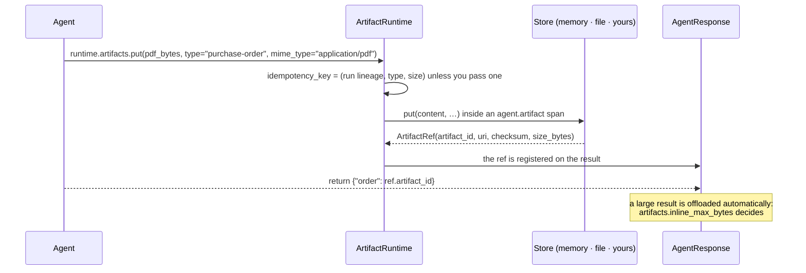

# Artifacts, claims and evidence

Three small APIs that keep a result honest and small: **artifacts** hold the bytes an agent
produced, **claims** say what it asserted, and **evidence references** say where each assertion
came from. All three travel on `AgentResponse`, which is serializable, so a framework's state
keeps a reference rather than a payload.

## Where the bytes go



| Store | Use |
| --- | --- |
| `InMemoryArtifactStore(max_items=1000)` | the default. Bounded and evicting — it is a convenience, not storage |
| `FileArtifactStore(root)` | `artifacts="/var/lib/agent-artifacts"` builds one |
| `NoArtifactStore` | what `artifacts.enabled: false` gives you |
| your own | implement `ArtifactClient` (`put`, `get`) and pass it |

`put` returns an `ArtifactRef`: `artifact_id`, `type`, `uri`, `mime_type`, `checksum`,
`size_bytes`, `created_at`, `metadata`. `should_offload(value)` is the same rule the harness
applies to a result that is too large to inline.

## Example

```python
import asyncio

from trellis.harness import AgentHarness

harness = AgentHarness(defaults={"tenant_id": "acme"})


@harness.agent(agent_id="reporter")
async def reporter(payload: dict, agent) -> dict:
    ref = await agent.artifacts.put(
        b"SKU-1,120,2026-10-01\n",
        type="reorder-csv",
        mime_type="text/csv",
        metadata={"sku": payload["sku"]},
    )
    body = await agent.artifacts.get(ref.artifact_id)
    return {"artifact": ref.artifact_id, "bytes": len(body or b"")}


result = asyncio.run(reporter({"sku": "SKU-1"}))
print(result.data, [a.type for a in result.artifacts])
```

Claims are attached to the response rather than put in prose:

```python
from trellis.contracts import AgentResponse, Claim, EvidenceRef


async def decide(payload, agent) -> AgentResponse:
    evidence = EvidenceRef(source_type="memory", source_id="mem_123")
    return AgentResponse.ok(
        {"reorder": 120},
        claims=[
            Claim(
                claim_id="c1", text="Lead time is 14 days", evidence_ids=["mem_123"], confidence=0.9
            )
        ],
        evidence=[evidence],
    )
```

With `memory.observe_claims` on (the default) each claim is written back to the Memory Service
as an observation, so "what did this agent assert, and on what basis" is answerable after the
process is gone. `RecommendedAction` carries a proposed next step with a concise rationale —
never chain-of-thought.

## The rules that are not settings

* **An idempotency key is derived, not random.** A replayed step stores the same artifact once.
  Pass `idempotency_key=` only when you have a better notion of sameness than the run lineage.
* **A result that is too large is offloaded, not truncated.** `artifacts.inline_max_bytes`
  (default 64 000) is the threshold; the response then carries a reference.
* **The in-memory store evicts.** If an artifact must outlive the process, give the harness a
  `FileArtifactStore` or your own `ArtifactClient`.
* **Artifacts are not memory.** Bytes go to the artifact store; what the bytes *mean* goes to the
  Memory Service as an observation or a claim ([memory.md](memory.md)).
