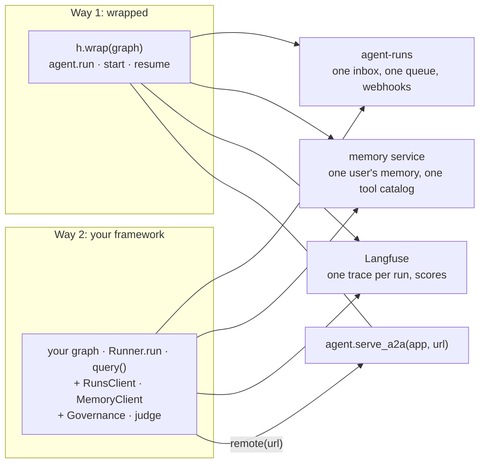

# Mixing both ways

The two ways are not two platforms. A wrapped agent (Way 1) and your own framework's agent
using the blocks (Way 2) talk to the same services, through the same SDKs, with the same
records, so one deployment can run both: a team that wraps its new agents keeps its existing
LangGraph graph as it is, and both share one inbox, one tool catalog, one memory and one place
for scores.

## What is shared

| | Shared how |
|---|---|
| runs and the inbox | both start runs in the same agent-runs: `h.inbox()` and `runs.iterate(status=PAUSED, assignee=...)` list paused runs of both kinds; one webhook subscription hears about both, and one receiver checks both with `verify_signature` |
| governance | one catalog per tenant: an `approve_when` an administrator sets on `create_po` governs the wrapped agent's calls and your `governed(create_po, ...)` alike; approvals from both teach the same approval suggestions |
| memory | one user's profile, memories and documents: what a wrapped agent learned about `ada`, your graph's `scope.context(...)` pushes, and the other way round |
| evaluation | the same evaluators, judge configuration and sampling: a run either way is scored on its trace in Langfuse, and the same `sample` rate picks the same runs |
| the vocabulary | the contracts records ([contracts.md](contracts.md)): a pause is an `Interrupt` and its answer an `InterruptResolution` in both |

## Answering each run its own way

The inbox shows both kinds; answer each the way its run continues:

* **A wrapped agent's run**: `await agent.resume(interrupt_id, decision, reviewer=...)` (or the
  AG-UI and A2A surfaces). It continues the run (in process, or back to the queue for a harness
  worker) and sends the decision to memory as feedback. A queued wrapped run may also be
  answered with `RunsClient.resume` from a UI that is not the harness: a harness worker
  continues it, but nothing is sent to memory.
* **Your own run**: `RunsClient.resume(InterruptResolution(...))`, then your code (or your
  `Worker` handler) continues the framework from `record.checkpoint` and
  `record.last_resolution`, and calls `gov.decided(...)` for memory.

`RunSummary.agent_id` says whose run it is.

## Workers

Harness workers (`h.worker([...])`, `python -m trellis.harness.worker`) and your own
`trellis.runs.Worker`s claim from the same queue by agent id. A wrapped agent's run is
continued by `agent.execute(job)`, so your own worker runs it too: hand it the agent's id and
`agent.execute` as the handler (`Worker(runs, agent.execute, [agent.id])`), or call
`agent.execute(job)` for the wrapped agents' jobs from a handler that also runs your own. What
it must not do is run a wrapped agent's run with your own handler, or yours with
`agent.execute` (it refuses another agent's job).

## Calling across

* **Your code calls a wrapped agent**: serve it with `agent.serve_a2a(app, url)` and call it
  with `remote(url, tenant=, user=)` ([a2a.md](a2a.md)). Its questions come back as
  `InputRequired`, or go to your `on_input`.
* **A wrapped agent calls your agent**: only through a server your agent has. Either serve it
  with the A2A SDK yourself, or wrap the function that calls it (any async function is a target,
  [frameworks/functions.md](../frameworks/functions.md)) and serve that with `serve_a2a`; the
  wrapped agent then calls it with `a2a(url)` in its tools.

## Do not gate twice

Inside a wrapped agent, the harness already governs, records and pauses every harness tool
call. Do not also wrap those tools with `governed`, record them with `record_tool`, or pause the
run in agent-runs yourself: each call would be approved twice and recorded twice. Inside a
wrapped run, `trellis.current().memory` is the memory SDK already bound to the run, for the
reads and writes your own code needs.

## Moving between the ways

From Way 2 to Way 1: delete what the harness now does (the `governed` and `recorded` wrappers,
the `RunsClient` calls, the context push, `judge`), declare each tool's side effects with
`tool(fn, side_effects=...)`, build the agent's tools with `h.tools(...)`, and call
`h.wrap(graph).run(...)` where you called the graph. Its runs, memory and catalog are the same
services, so nothing is migrated. From Way 1 to Way 2, the recipes show what to add:
[LangGraph](langgraph.md), [OpenAI Agents SDK](openai-agents.md),
[Claude Agent SDK](claude-agent-sdk.md).
