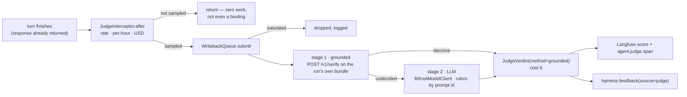
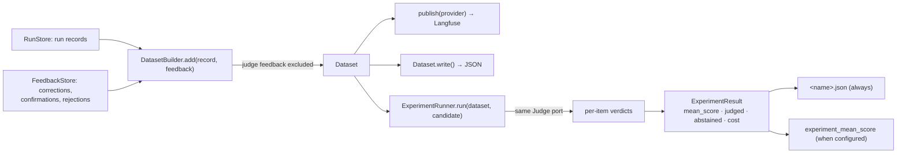
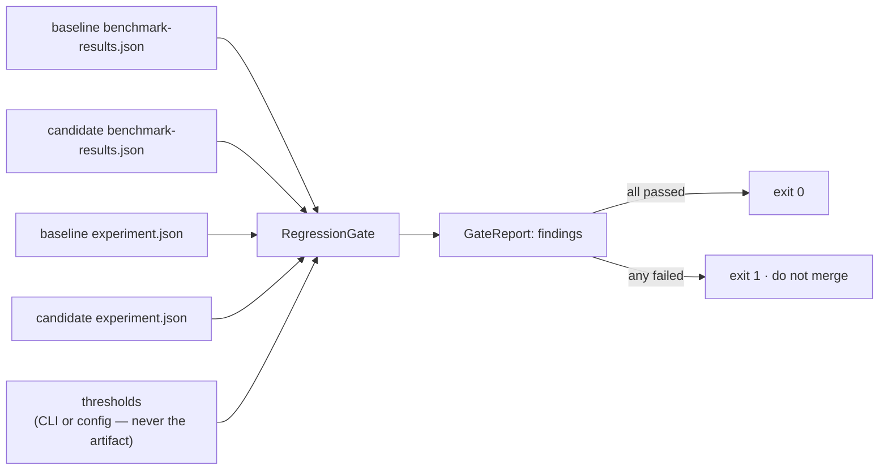

# Evaluation: the online judge, the offline experiment, and the gate between them

A harness that can run, pause, resume and stream an agent still cannot tell you whether the
answer was any good. This is what answers that, in three pieces that share one ruler:

* an **online judge** — sampled live traffic, scored asynchronously, grounded before it spends;
* an **offline experiment** — a dataset built from what already happened, replayed against a
  candidate and scored by the *same* `Judge`;
* a **regression gate** — one command in CI that fails a build that got slower or worse.

The ruler being shared is the point. "Did this version get better?" is asked with the same
thing that answered "was that answer good?" in production, so the two numbers are comparable.

Off by default. Turning the judge on spends money, and nothing should start spending because a
package was upgraded.

---

## 1. Online: grounded first, then a model, never the other way round



### Grounded first, because it is free and it is about *this* run

The Memory Service already answers "is this answer supported by the evidence?" claim by claim:
citations resolved, NLI, a contradiction scan (`POST /v1/verify`). That answer is deterministic,
reproducible, and about the very bundle this run was given — which the harness still holds after
the turn, so the check costs no extra retrieval.

The decision rule is stated once, in `evaluation/grounding.py`, so it is testable:

| Report | Decision | Score | Label |
|---|---|---|---|
| no report at all (memory off, service down, nothing extractable) | escalate | — | — |
| `contradicted > 0` | **decisive** | `supported / total` | `contradicted` |
| `unsupported == 0 and borderline == 0 and total > 0` | **decisive** | `1.0` | `grounded` |
| anything else (`borderline` or `unsupported`, no contradiction) | escalate | — | — |

Both directions are deliberate. "No unsupported and no borderline claims" is a 1.0 and nobody
needs a model to confirm it. A contradiction is decisive the other way: asking a model to
re-litigate evidence that contradicts the answer is asking it to overrule a measurement.

**Only the middle reaches a model**, and that is the whole cost argument.

### The rubric lives in Bifrost

Prompts have one home and it is the gateway. With `judge.rubric_prompt_id` set, the harness
sends the id and **not** the text — `x-bf-prompt-id` (plus `x-bf-prompt-version`) — and Bifrost
injects the stored, versioned rubric at inference time. Two deployments on the same prompt id
are judging by the same rubric by construction, and the rubric's owners can edit it without a
deploy.

Without an id, the built-in rubric is used. Either way the verdict records which:
`metadata.rubric = "bifrost:<id>@<version>"` or `"builtin:grounded-answer"`. A score you cannot
trace to the rubric that produced it is not evidence of anything.

The answer shape is a strict JSON schema — `{score: 0..1, label, rationale}` — asked for through
`response_format`, and parsed rather than trusted.

### Abstaining is a first-class answer

`Judge.judge` returns `None` and nothing is recorded when the run was not sampled, the hour's
count or spend ceiling is reached, there is no answer text to score, the grounded stage was
undecided and this deployment is `grounded_only`, the model was unreachable, or its output could
not be parsed. A missing score is honest. A guessed one is not.

### The turn never waits

`JudgeInterceptor` runs at `Order.EVALUATION` and submits the judging to the same bounded
`WritebackQueue` the memory writes use. The response is already on its way back. If that queue
is saturated the judgement is **dropped** — a sampled opinion is optional, a memory write is
not — and the dropped coroutine is closed rather than abandoned.

### What a verdict becomes

Three records, from one place so they cannot disagree:

| Where | What | Why there |
|---|---|---|
| Langfuse | `judge_score` (numeric) and `judge_method` (categorical) on the trace, by `trace_id` | the one place per request already holds the spans, the cost and the human's score |
| OTel span | `agent.judge` with `judge.score`, `judge.method`, `judge.label`, `judge.model`, `judge.cost_usd` | a deployment on plain OTLP (Datadog) sees the same numbers without Langfuse |
| Memory Service | a `Feedback` record, `source="judge"`, built by the contract's own `JudgeVerdict.as_feedback` | judge and human feedback meet in one table, and learning reads one shape |

A score at or above `judge.threshold` records `confirm`; below it, `reject`. The reviewer is
`judge:<model>`, so no human is ever credited with a machine's opinion.

### Configuration

```yaml
judge:
  enabled: true
  sample_rate: 0.1              # rolled on the run id: a retry is judged the same way, once
  max_per_hour: 60              # a traffic spike must not become a judging spike
  max_usd_per_hour: 1.0
  model: openrouter/openai/gpt-4.1-nano
  rubric_prompt_id: prompt_judge_v2
  rubric_prompt_version: "3"
  grounded_only: false          # true: the deterministic half only, at zero marginal cost
  threshold: 0.5
  agents:                       # "sampled per agent" is this
    refund-agent: { sample_rate: 0.25, max_usd_per_hour: 0.5 }
    batch-importer: { enabled: false }
```

| Setting | Environment variable | Default |
|---|---|---|
| `judge.enabled` | `UAH_JUDGE_ENABLED` | `false` |
| `judge.sample_rate` | `UAH_JUDGE_SAMPLE_RATE` | `0.1` |
| `judge.model` | `UAH_JUDGE_MODEL` | `openrouter/openai/gpt-4.1-nano` |
| `judge.max_usd_per_hour` | `UAH_JUDGE_MAX_USD_PER_HOUR` | `1.0` |
| `judge.rubric_prompt_id` | `UAH_JUDGE_RUBRIC_PROMPT_ID` | unset (built-in rubric) |

Either turn it on in configuration, or pass one in — a provider is on because it was passed:

```python
from trellis.harness import AgentHarness, BifrostModelClient, GroundedJudge

judge = GroundedJudge(
    model=BifrostModelClient(gateway_url, api_key=budgeted_virtual_key),
    config=config.judge,
)
harness = AgentHarness(memory=memory, judge=judge)
```

The three ceilings are per agent and checked **before** the model is called. A judge that is over
budget abstains rather than failing, and a grounded verdict is free but still counts against the
hourly *count*, which is what keeps the judge's own load bounded.

The count slot is **taken at the decision, not when the verdict comes back**. That distinction is
the whole ceiling: judging is asynchronous, so between the check and the verdict there are awaits,
and a ceiling that only recorded at the end would let every judgement that started in that gap see
the same free count — a queue of 256 walks straight through a ceiling of 60. So `reserve()` checks
and takes in one step, with no `await` between them. A run that then abstains still spent its
slot, which is the honest accounting: `max_per_hour` bounds how often the judge *runs*.

> **`max_usd_per_hour` is only as good as the price the gateway quotes.** It accumulates
> `usage.cost_usd` from each response, and not every upstream returns one — Bifrost in front of
> OpenRouter currently does not, so in that deployment the binding ceiling is `max_per_hour` and
> the USD ceiling never fires. Do not rely on it as the hard cap. The hard cap belongs on the
> **virtual key**: a Bifrost governance budget (`max_limit` + `reset_duration`) refuses the call
> at the gateway, which is enforcement rather than discipline. `max_usd_per_hour` is a
> second, softer brake for the deployments whose gateway does quote prices. A negative quoted
> price is ignored rather than credited: a budget that loosens because an upstream said so is
> not a budget.

### The cost model

| Stage | Cost | Notes |
|---|---|---|
| unsampled run | one hash | `roll(run_id, rate, "judge")` |
| grounded, decisive | 0 | the service's own NLI decided; that spend is the service's, on the service's key |
| LLM stage | ~270 tokens for a short answer | the bundle is truncated to 4 000 characters and the answer to 4 000, so a long turn costs more |

**Measured**, 20 judged samples on `openrouter/openai/gpt-4.1-nano` through Bifrost (the
artifact is `judge-smoke-results.json`, reproduced by the smoke in
`tests/e2e/test_live_judge.py`):

| | |
|---|---|
| judged | 20 of 20, none abstained |
| mean tokens per judged sample | 270 |
| cost, from the gateway's governance meter | $0.00054 total, **$0.0000271 per judged sample** |
| mean score, defensible answers | 0.94 |
| mean score, indefensible answers | 0.00 |

The last two rows are why the smoke is worth running: a judge that scored both sets the same
would be returning a number, not a judgement.

At `sample_rate: 0.1` that is roughly **$0.003 per thousand turns**, before the grounded stage
removes the ones it can settle for nothing. `max_usd_per_hour` is the ceiling that matters when a
rubric turns out longer than anyone measured.

Note that the per-response `cost_usd` is only as good as what the gateway quotes: not every
upstream returns a price in `usage`, and a zero there means "nobody quoted one", not "free". The
authoritative figure is the virtual key's metered usage, which is what the smoke records.

---

## 2. Offline: a dataset out of what already happened



A dataset here is not written by hand. It is what the system already knows:

| Feedback | Becomes |
|---|---|
| `correct` / `edit` | an item whose `expected_output` is the correction |
| `confirm` / `approve` | an item anchoring the run's own output as `expected_output` |
| `reject` with no correction | an item with `metadata.rejected = true` and no expected output — "not this" is a test too |

**Judge feedback is excluded by default.** `include_sources` is human + interrupt. A judge's own
verdicts becoming the ground truth it is later measured against is a circle that always closes:
the numbers improve and nothing got better. Overriding it is possible and deliberate.

Items are keyed on the feedback id, so assembling the same page twice adds nothing twice — a
dataset built from a paginated read must not double-count its overlap.

```python
from trellis.harness import DatasetBuilder, ExperimentRunner

dataset = await DatasetBuilder("refunds-goldens").from_store(
    harness.runs, feedback_store, run_ids=recent_run_ids
)
dataset.write("datasets/refunds-goldens.json")

result = await ExperimentRunner(harness.judge, output_dir="build").run(
    dataset, candidate_agent, agent_id="refund-agent", agent_version="0.4.0"
)
print(result.mean_score, result.judged, result.abstained, result.cost_usd)
```

One item failing is recorded, never fatal: an experiment that stopped at the first exception
would report the score of a prefix. `mean_score` is `None` — not `0.0` — when the judge settled
nothing, because "no score" and "a score of zero" are different statements and must never be
reported as one.

The local `<name>.json` is written **always**, not only as a fallback: it is the artifact the
gate reads, and a deployment with no tracing backend still gets its number.

> **Out of scope, stated plainly.** Langfuse's own `run_experiment` API is not called. The
> runner publishes dataset items and the experiment mean through the existing
> `EvaluationProvider` port, and the tested path is the local JSON. Wiring Langfuse experiments
> is a change to one method when a Langfuse instance is available to verify it against.

---

## 3. The gate: one command, two artifacts, one verdict



```bash
python -m trellis.harness.evaluation.gate \
  --baseline benchmark-results.json \
  --current build/benchmark-results.json \
  --baseline-judge main/experiment.json \
  --judge build/experiment.json \
  --max-latency-regression 20 --max-score-drop 0.05 --min-score 0.8
```

The benchmark artifact says what the harness *costs*; the experiment summary says what an agent
is *worth*. A change that made answers better and turns 40% slower is a decision somebody has to
take deliberately, which is what a gate is for.

| Check | Fails when |
|---|---|
| `latency.<scenario>.<percentile>` | any recorded percentile regressed beyond `--max-latency-regression` (percent) |
| `judge.mean_score` | the mean dropped more than `--max-score-drop` below the baseline |
| `judge.min_score` | the mean is below `--min-score`, whatever the baseline was |

Three rules keep it honest:

* **A missing baseline fails.** Silence is not a pass. `--allow-missing-baseline` is the
  deliberate, visible exception for the first run on a new metric.
* **A missing judge score is not a zero.** An experiment where the judge abstained on everything
  reports "no score to gate" and passes, instead of failing on a number nobody measured.
* **Thresholds come from the command line or configuration, never from the artifact.** An
  artifact cannot widen the gate that is checking it.

Latencies below `latency_floor_ms` (0.5 ms) are reported but not gated: a percent change on
0.02 ms is noise, and a gate that fails on noise gets switched off.

---

## Where to look when a score surprises you

One trace holds the spans, the cost, the judge score, the human score and the feedback thread;
`GET /v1/reads` on the Memory Service says what memory the request was actually served. See
[docs/observability.md](observability.md).

## Tests

| Layer | File |
|---|---|
| judge, budget, grounded rule, rubric | `tests/unit/test_judge.py` |
| datasets, experiments, gate and its CLI | `tests/unit/test_evaluation_offline.py` |
| a judged turn through a real harness, sampling, saturation, the prompt headers on the wire | `tests/integration/test_judged_turn.py` |
| `Judge` port conformance | `tests/contract/test_ports.py` |
| the grounded stage against a running Memory Service | `tests/e2e/test_live_judge.py` (`-m live`) |
| a 20-sample judged smoke on a budgeted key | `tests/e2e/test_live_judge.py` (`TRELLIS_JUDGE_SMOKE=1`) |

Everything except the last two rows spends nothing: the judges are scripted and the gateway is a
real HTTP server with a scripted script.
