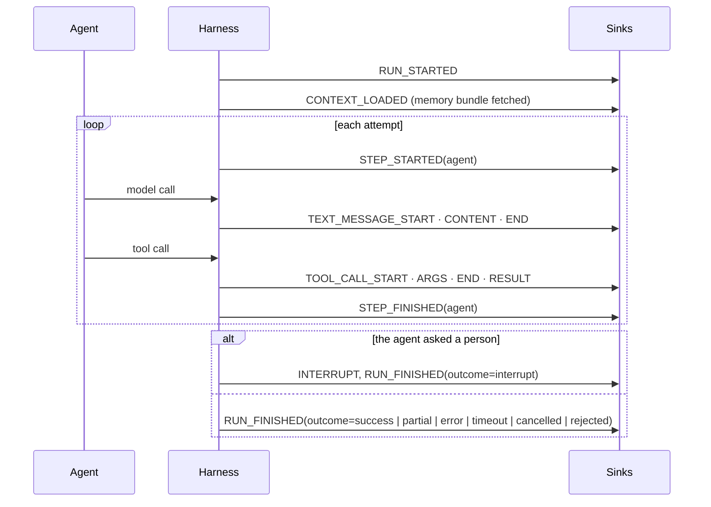

# Run events

Every run emits an ordered stream of `RunEvent`s (the `trellis-contracts` model) to the sinks
the harness was given (`AgentHarness(event_sinks=[...])`): a wrapped agent's run, a
`harness.run(...)`, and an `execution()` block alike. The vocabulary is AG-UI's, plus
`CONTEXT_LOADED` and `INTERRUPT`; a surface renders them, a webhook delivers the ones a
disconnected client needs, and a sink that fails never fails the run. Every payload goes
through the harness's telemetry redactor before any sink sees it, so what leaves the process
on a stream or a webhook is redacted exactly like a span.

| Event | When | Members |
|---|---|---|
| `RUN_STARTED` | the run begins | `agent_id`, `objective`, `webhook_url` when the request named one |
| `CONTEXT_LOADED` | the memory interceptor fetched the bundle | `has_context`, `facts` |
| `STEP_STARTED` / `STEP_FINISHED` | around each attempt of the agent (`step="agent"`) | `attempt` moves on a retry and the sequence restarts |
| `TEXT_MESSAGE_START` / `CONTENT` / `END` | a model answer (one content event for a non-streaming answer, one per delta when streaming); a model call the harness makes for itself (a compaction) is not a message | `message_id`, `role`, `delta` |
| `TOOL_CALL_START` / `ARGS` / `END` / `RESULT` | a tool call through `runtime.tools`, whether it ran, failed or was refused by an approver | `tool_call_id` (the call's idempotency key), `tool`, `args`, `status`, `output` (the result as JSON when it fits, else the head of its JSON text; the error text for a failed call), `error_class`, `invocation_id` |
| `INTERRUPT` | the agent paused (`AgentPaused`, a LangGraph `interrupt()`, a policy approval) | the `Interrupt` as JSON, `webhook_url` when the request named one |
| `RUN_FINISHED` | the run ended, once | `outcome` (`RunOutcome`), `result` (the agent's result as JSON, when it produced one), `error` when it failed, `interrupt` when it paused, `webhook_url` |

A policy refusal ends the run `rejected` in both error modes; a run cancelled by an approver
ends `cancelled`.

Sinks in the box: `CollectingEventSink` (tests and the AG-UI bridge; runs are keyed by tenant
and run id, `subscribe(tenant_id, run_id, replay=True)` is a queue that ends with `None`, and
memory is bounded by `max_runs` and `max_events`), `WebhookEventSink(url, secret=...)` (signed
deliveries of `RUN_FINISHED` and `INTERRUPT`; a run's own `webhook_url` in the request metadata
wins when it passes the same checks as the default: https, a public address, no redirects;
`allow_local_targets=True` is for development), `FilteringEventSink` and `CompositeEventSink`.
`harness.event_sinks` is the live list: a sink appended later reaches the next run. Verify a
delivery with `trellis.memory.webhooks.verify_signature(secret, header, raw_body)`.
