# Flows

Each flow as a sequence diagram, written from the code it names: what calls what, in which
order, and which service each call reaches. The structure these flows run through — the
pipeline, the bridge, the journal, the adapters, the middleware — is
[architecture.md](architecture.md). Calls in a `Writes` lane are background writes: the run
does not wait for them.

* [A run](#a-run)
* [Memory: push, pull, record](#memory-push-pull-record)
* [A pause, an approval and a resume](#a-pause-an-approval-and-a-resume) — in place with a
  checkpointer, and by journal replay
* [A worker claims a run, crashes, and another resumes it](#a-worker-claims-a-run-crashes-and-another-resumes-it)
* [A schedule fires](#a-schedule-fires)
* [A gateway MCP call, and Code Mode](#a-gateway-mcp-call-and-code-mode)
* [Sub-agents](#sub-agents)
* [AG-UI chat](#ag-ui-chat) and [A2A](#a2a)
* [Evaluation, offline and online](#evaluation-offline-and-online)
* [ReAct: one model step through the middleware](#react-one-model-step-through-the-middleware)
* [Stopping a worker](#stopping-a-worker)

## A run

`agent.run` → `pipeline.attempt` (`agent.py`, `pipeline.py`). A wrapped agent answers with
memory recalled, calls an MCP tool, writes a memory through the `memory_remember` pull tool,
and a person's feedback arrives later.

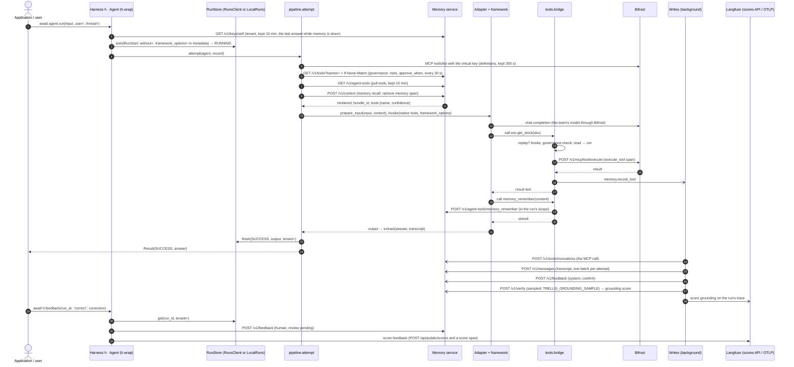

The memory tools' own calls are not recorded again (the service logs them); everything else
the bridge runs is. Runnable: [examples/02_way1_react/agent.py](../examples/02_way1_react/agent.py).

## Memory: push, pull, record

What the harness does with the memory service around one run (`agent.py`:
`Agent.push`, `Agent.record_tool`, `Agent.recorded_run`; `clients/memory.py`). Push is the
context before the framework runs; pull is the memory tools the model calls itself; record is
what the run leaves behind. `without=` turns each off (`memory_push`, `memory_pull`,
`records`; `memory` all three).

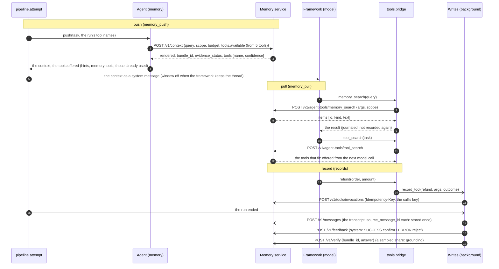

A failed context read is a `warning` event and the run goes on without it; a write given up is
spooled with `TRELLIS_SPOOL_DIR` ([memory.md](memory.md)). Runnable:
[examples/02_way1_function/memory_documents_feedback.py](../examples/02_way1_function/memory_documents_feedback.py),
and with no harness [examples/03_way2_memory/memory_block.py](../examples/03_way2_memory/memory_block.py).

## A pause, an approval and a resume

A call governance asks about pauses the run; a person answers from the inbox; the run continues
and the approved call runs once. How it continues depends on the target
(`pipeline._paused`, `Agent.resume`, `Adapter.resume_input`).

### In place: a LangGraph graph with a checkpointer

The harness's `ask` *is* LangGraph's `interrupt`: the graph stops inside the tool node, its
checkpointer keeps where, and the resume is `Command(resume=...)` — the model is not asked
again ([examples/02_way1_deepagents/agent.py](../examples/02_way1_deepagents/agent.py)).

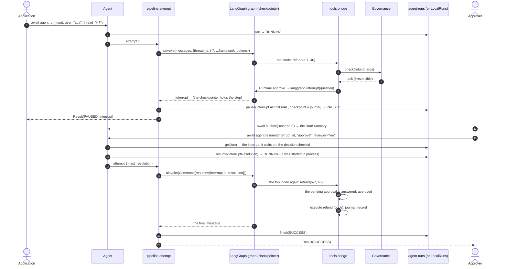

### By journal replay: everything else

A function, an OpenAI Agents `Agent` (for the harness's own approvals), a graph with no
checkpointer: the pause ends the attempt, and the resume runs the target again from its input
against the journal ([examples/02_way1_openai_agents/agent.py](../examples/02_way1_openai_agents/agent.py),
[examples/02_way1_langgraph/agent.py](../examples/02_way1_langgraph/agent.py)).

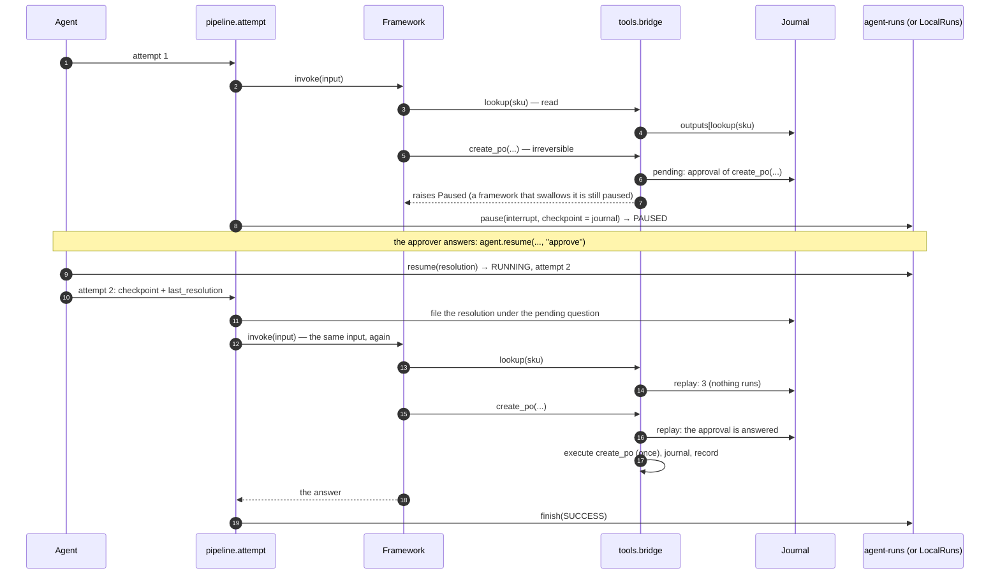

Entries are keyed by content and consumed in order: a re-planned call nobody approved is asked
about again, never matched to another approval. A run that came from the queue goes back to it
on resume (`QUEUED`) and a worker runs attempt 2 the same way
([interrupts.md](interrupts.md#how-a-run-continues)).

## A worker claims a run, crashes, and another resumes it

`agent.start` → `trellis.runs.Worker` (`worker/`) → `agent.execute(job)`; the progress
checkpoint is `Runtime._saved` after every call with side effects
([examples/06_scenarios/worker_crash_resume.py](../examples/06_scenarios/worker_crash_resume.py)).

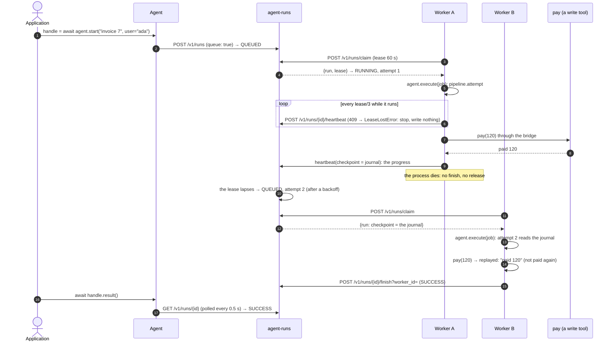

A write that was *running* when its worker died (started, no outcome journaled) is not run
again: the model is told its effect is unknown, with its idempotency key
([reliability.md](reliability.md#unknown-outcomes)).

## A schedule fires

`agent.schedule` (`agent.py`) → agent-runs' schedules and ticker → a worker. The run options a
schedule takes are kept in its `ScheduleSpec.metadata` and copied into every run it fires
([examples/06_scenarios/scheduled_run_selection_limit.py](../examples/06_scenarios/scheduled_run_selection_limit.py)).

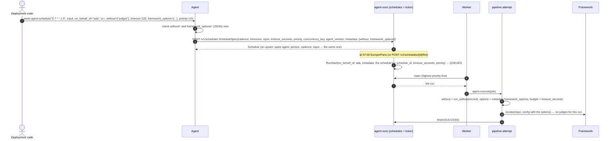

Without `RUNS_URL` the in-process store keeps the schedule and fires it when a worker in this
process asks for work, or when `h.runs.schedules.fire(id)` is called ([runs.md](runs.md#schedules)).

## A gateway MCP call, and Code Mode

`tools/toolbox.py` lists and publishes; `clients/bifrost.py` executes through `bifrost-sdk`
([gateway.md](gateway.md),
[examples/06_scenarios/gateway_code_mode_governed_evals.py](../examples/06_scenarios/gateway_code_mode_governed_evals.py)).

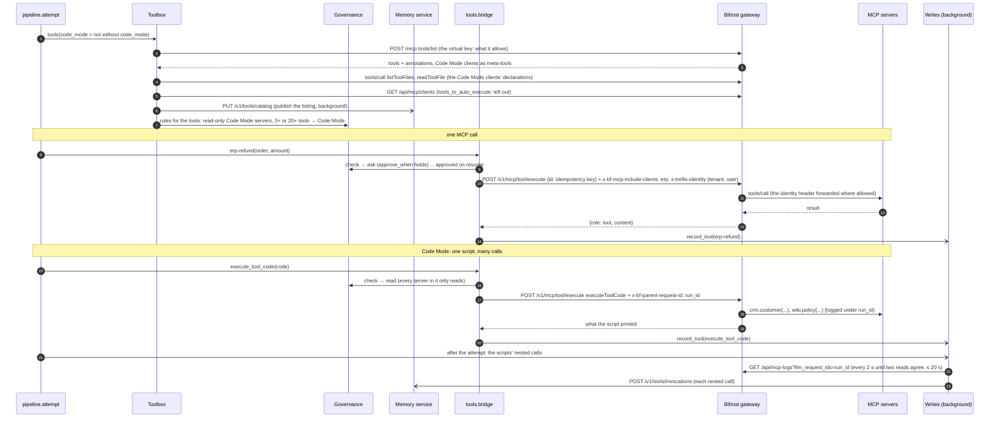

No model request ever gets the gateway's MCP tools: `bifrost-sdk` sends the deny-all scope
(`NO_GATEWAY_TOOLS`) on completions, and a framework's own model client gets it from
`h.model_headers()`.

## Sub-agents

`agent.as_tool()` (`subagents.py`): a planner calls a child agent; the child asks a person;
the answer goes back through the planner
([examples/06_scenarios/parallel_subagents_mixed_frameworks.py](../examples/06_scenarios/parallel_subagents_mixed_frameworks.py)).

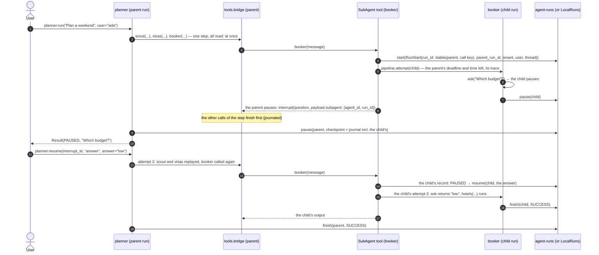

Cancelling the parent cancels its children; a child never works past its parent's time
([subagents.md](subagents.md)).

## AG-UI chat

`agent.serve_chat(app)` (`agui/`): a chat UI runs the agent, answers its question and
reconnects after a dropped connection
([examples/05_features/serve_agui_and_a2a.py](../examples/05_features/serve_agui_and_a2a.py)).

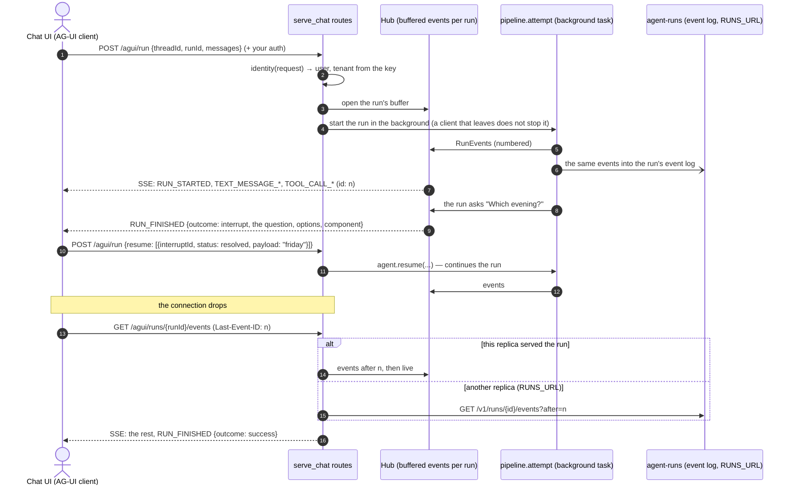

## A2A

The calling side is `remote(url)` (`a2a/client.py`) — what the `a2a(url)` tool runs inside a
calling run; the serving side is another harness's `serve_a2a(app, url)` (or any A2A server).

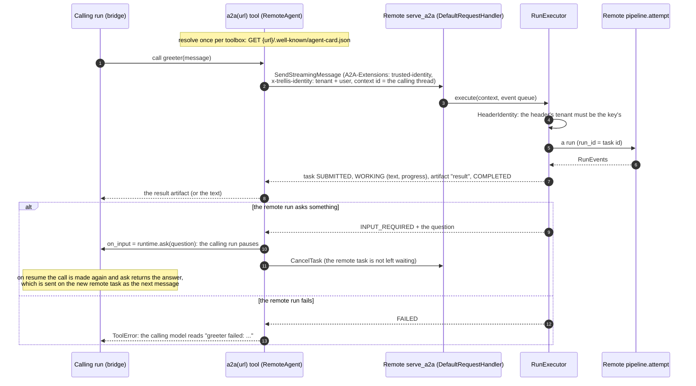

From plain code the same client is `remote(url, tenant=, user=)`: a question goes to `on_input`,
or is raised as `InputRequired` and answered with `reply(task_id, answer)`
([examples/03_way2_a2a/remote.py](../examples/03_way2_a2a/remote.py)). The serving side also
sends signed push notifications to a client's webhook ([surfaces.md](surfaces.md)).

## Evaluation, offline and online

### Offline: `h.evaluate` over a dataset

`evals.evaluate` (`h.evaluate` delegates to it)
([examples/05_features/trajectory_evals.py](../examples/05_features/trajectory_evals.py)).

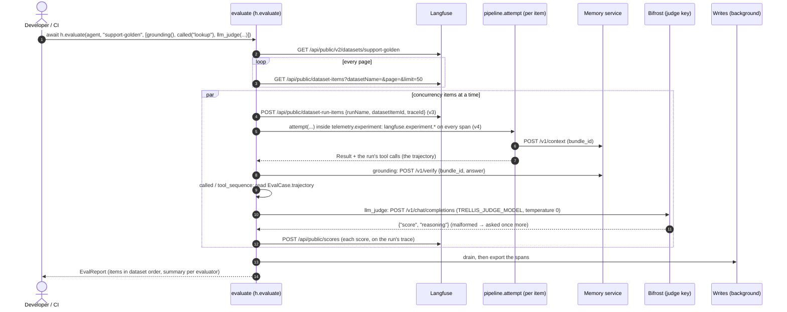

A pausing item is cancelled and reported `interrupted`; a failing one `error` — never fatal.

### Online: judges on sampled runs

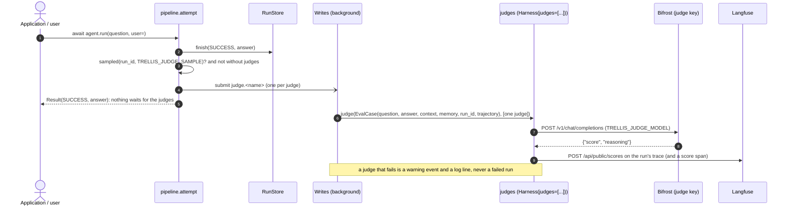

## ReAct: one model step through the middleware

`ReAct(...)` builds a `create_agent` graph whose middleware wrap every model call and every
tool call (`react.py`, `middleware.py`; order in
[architecture.md](architecture.md#the-middleware)). One step: the model is asked, it calls two
tools, the calls go through the bridge.

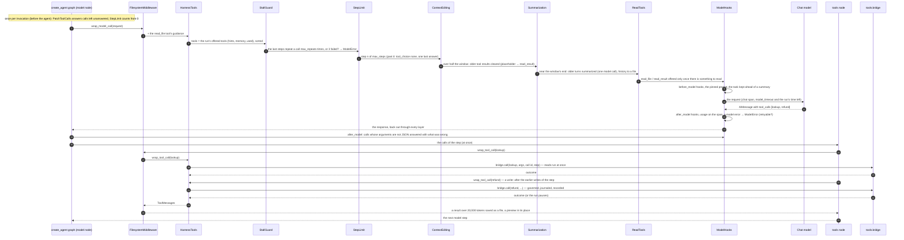

The graph's checkpoint after every step goes into the run's journal (`RunCheckpointer`): a
resume — after a pause, a crash or a requeue — continues from the last step without asking the
model again ([frameworks/react.md](frameworks/react.md)). Middleware you add with
`ReAct(middleware=[...])` sits between `ReadTools` and `ModelHooks`
([examples/06_scenarios/planning_todolist.py](../examples/06_scenarios/planning_todolist.py)).

## Stopping a worker

`python -m trellis.harness.worker` serves the worker: `trellis.runs.Worker.serve()` turns
`SIGTERM`/`SIGINT` into `stop()`, and the harness worker drains the writes when the loop ends.

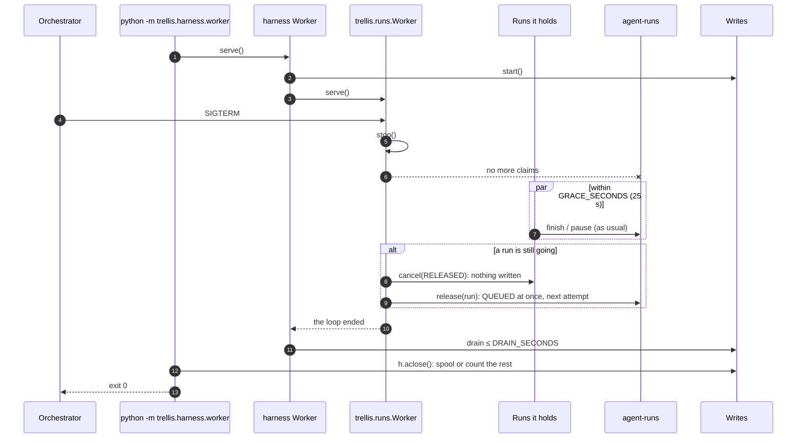
