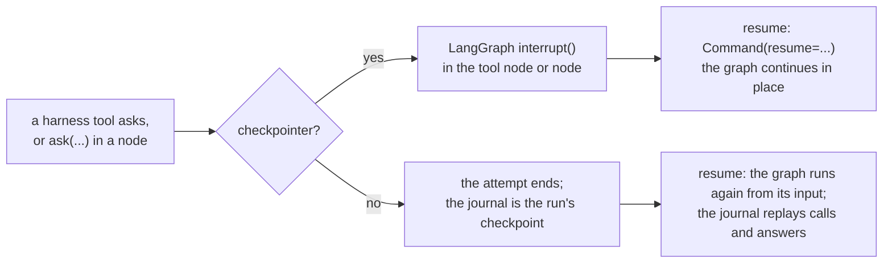

# LangGraph and LangChain

A compiled LangGraph graph is a target: LangChain v1's `create_agent` (it returns one), a
`StateGraph` you built by hand, with or without a checkpointer. Deep Agents is a LangGraph graph
too, with a page of its own ([deepagents.md](deepagents.md)).

**Install:** `pip install 'trellis-harness[langgraph]'` (LangGraph, `langchain-core` and
`langchain`, which has `create_agent` and its middleware). Your model is your own LangChain chat
model — `ChatOpenAI(base_url=BIFROST_URL, default_headers=await h.model_headers(), ...)` to go
through Bifrost (the headers keep the gateway from adding its MCP tools to the model's requests,
and select a stored prompt with `prompt=`: [gateway.md](../gateway.md)); a prompt from any source
— code, `.md` files, Langfuse, the gateway — is `system_prompt=await h.prompt("triage", ...)`
([prompts.md](../prompts.md)).

This page is Way 1: the harness runs the graph. To keep calling the graph yourself and plug in
the blocks (memory, governed tools asking through `interrupt`, the pause in agent-runs, a
judge), see the Way 2 recipe: [blocks/langgraph.md](../blocks/langgraph.md).

## Using an existing LangGraph project

Your graph stays as it is. Three changes:

```python
from trellis import Harness, tool

h = Harness()  # the deployment is the environment


@tool(side_effects="irreversible")  # what it does decides whether a person approves a call
def reorder(sku: str, qty: int) -> str:
    """Order more units of a SKU."""
    ...


# 1. build the graph with the harness's tools (a compiled graph binds its tools when built)
tools = await h.tools(stock, reorder, framework="langgraph")
graph = create_agent(model, tools=tools, system_prompt="...", checkpointer=saver)
#    ...or your own StateGraph: ToolNode(tools), model.bind_tools(tools)

# 2. wrap it
agent = h.wrap(graph, id="stock-keeper")

# 3. call the agent where you called the graph
result = await agent.run("Is SKU-1 low?", user="ada", thread="ticket-7")  # was graph.ainvoke
async for event in agent.stream("Is SKU-1 low?", user="ada"):
    ...  # was graph.astream
result = await agent.resume(result.interrupt.interrupt_id, "approve", reviewer="lead")
```

`h.tools(...)` returns LangChain `BaseTool`s: your functions (and `a2a(url)`, `openapi(spec)`),
every MCP tool the Bifrost virtual key allows, and — memory on — the memory tools
(`memory_search`, `memory_remember`, `memory_update`, `memory_forget`, `profile_edit`,
`tool_search`). Tools that are not the harness's (a `@langchain_core.tools.tool` of your own)
keep working; they are not governed, journaled or recorded. `h.wrap(graph, tools=...)` is refused
for a compiled graph: pass the tools to the graph instead.

**`graph.invoke` itself is not intercepted.** The harness runs the graph through
`agent.run` / `agent.stream` / `agent.resume` / `agent.start`; called directly, the graph runs
without memory, run records or traces, and a harness tool refuses to run (`ToolError`: "runs
inside a Harness run"). Config the graph needs at run time goes in the
input, the graph's defaults or `graph.with_config(...)` before wrapping (still a graph); the
harness sets `configurable.thread_id` itself (the run's thread, else the run id).

## What is automatic

| | |
|---|---|
| Memory push | the context for the question arrives as a leading `SystemMessage` with the fixed id `trellis-memory-context` — with a checkpointer, one per thread, replaced each turn, and asked for *without* the recent conversation (the checkpointer holds it). The input: a string (one user message), a message list, or a dict with `messages`; any other state dict passes through untouched (read `trellis.current().context` in a node) |
| Memory pull | the memory tools are in `h.tools(...)` |
| Records | the transcript (the question and the final AI message), every harness tool call, the run's `system` outcome; approvals as `TOOL_CALL` feedback |
| Governance and approvals | every harness tool call goes through the bridge, governed by the catalog as it is at the call (a rule set after the graph was compiled applies) |
| Tool hints | the context is asked for with the toolbox's names (5 or more); the graph's bound tools are not narrowed (`narrows="none"`) |
| Grounding, judges | sampled successful runs with an answer ([evaluation.md](../evaluation.md)) |
| Hooks | the tool and run hooks as for every target; the model hooks through LangChain's own middleware, given when the graph is built: `create_agent(model, tools=..., middleware=[ModelHooks()])` (`from trellis.harness.middleware import ModelHooks`; a `before_model` call is the request made; the other harness middleware — the run's tools per model call, a step limit, stall detection, the checkpoint in the run — is in [react.md](react.md#the-middleware)) — a hand-built `StateGraph` calls its model itself: none ([hooks.md](../hooks.md)) |
| Tracing | one `invoke_agent` span per attempt, `execute_tool` per harness call, `retrieve memory`; LangChain's own instrumentation nests under it |

The answer is the state's `structured_response` (a `response_format`) or the last AI message's
text.

## Approvals and pauses

| Pause | With a checkpointer | Without one |
|---|---|---|
| a harness tool that asks (`irreversible`, a catalog `approve_when`) | LangGraph's `interrupt` inside the tool node; `resume` is `Command(resume=...)` — the graph continues in place, the model is not asked again | the run re-runs from its input as the next attempt; the journal returns the tool calls already made and the answer given (the model *is* asked again) |
| `trellis.current().ask(...)` in a node or tool | the same | the same |
| the graph's own `interrupt(value)` | a question (`value["question"]` or the value); a dict `value` also carries `options` (strings or `{"value", "label", "description"}`), `multiple`, `expects`, `ui_schema`, `component`, `props` and `assignee` onto the `Interrupt` exactly as `ask(...)` does (the same code: `Question.described`), refused as `ask` refuses them (the run fails saying why); the answer is checked as any answer is (`answer_problem`: an option's value, a list of them with `multiple`, a fit to `expects`) and resumed raw, `Command(resume=answer)` | refused: the run fails saying the graph needs a checkpointer |
| `HumanInTheLoopMiddleware(interrupt_on=...)` | an approval of the calls it holds (the first in `tool_call`, the whole request in `payload`), answered with the middleware's own decisions | needs a checkpointer |



```python
from langgraph.types import interrupt


def pick(state: State) -> dict:
    plans = interrupt(
        {
            "question": "Which plans?",
            "options": [{"value": "a", "label": "Plan A"}, "b"],
            "multiple": True,
            "component": "plan-picker",  # your own screen, where a surface has it
            "props": {"customer": state["customer"]},
            "assignee": "role:sales",
        }
    )
    return {"plans": plans}  # ["a", "b"]: the answer as given, checked against the options
```

Every pause is a contracts `Interrupt` in the run store (agent-runs with `RUNS_URL`), in the
inbox, answered the same way: `approve`, `reject` (with `answer="why"`, the reason the model
reads), `edit` (the edited arguments), `answer`, `cancel`. The middleware's mapping is in
[interrupts.md](../interrupts.md#framework-approvals-langchains-middleware-and-openai-agents-needs_approval).
Gate a tool in one place: a tool the middleware covers is `side_effects="write"` or `"read"` in
the harness, or each call is approved twice.

**Which checkpointer.** A pause resumes in place only where the checkpointer still holds it:
`InMemorySaver` holds it in the process that paused, and nowhere else. Resumed elsewhere — by a
worker, another replica behind AG-UI, after a restart — a pause of the harness's own (an
approval, an `ask`) is answered from the run's journal instead: the graph runs again from its
input, as without a checkpointer (the model is asked again; the calls already made replay, the
approved one runs once). A graph's own `interrupt()` and the middleware's pause can only be
answered by the checkpointer: resumed where it does not hold them, the run fails saying so. When
those may be resumed in another process, give every process a shared, durable checkpointer
(`langgraph-checkpoint-postgres`'s `AsyncPostgresSaver`).

## The graph's own run options

`framework_options=` (on `h.wrap`, or a run's own on `run`/`stream`/`start`) goes into the config
the harness calls `ainvoke`/`astream` with: `recursion_limit`, `configurable` keys your nodes
read, `tags`, `metadata`, `callbacks`. The run's thread is the harness's: its
`configurable.thread_id` wins over one given. Another key is refused when you wrap or run
([configuration.md](../configuration.md#the-frameworks-own-run-options)).

```python
agent = h.wrap(graph, id="triage", framework_options={"recursion_limit": 40})
await agent.run(question, user="ada", framework_options={"configurable": {"region": "eu"}})
```

## Streaming

`agent.stream(...)` yields contracts `RunEvent`s: `RUN_STARTED`, `CONTEXT_LOADED`, text deltas
(`TEXT_MESSAGE_*`, from the graph's `messages` stream: AI message chunks with text), the
harness tool calls (`TOOL_CALL_START/ARGS/END/RESULT`), `tool_notice` for writes, and
`RUN_FINISHED` (its `data.result`, or the interrupt). Closing the stream early cancels the run.

## Durable runs, workers, schedules

`agent.start(input, user=...)` queues the run (its input JSON); `h.worker([agent]).run()` or
`python -m trellis.harness.worker module:h` executes it; `agent.schedule(cron, input, on_behalf_of=...)`
queues one on a cadence ([runs.md](../runs.md)). A worker saves the journal as progress after
every side-effecting harness call, so a worker that dies repeats none of them. The worker that
continues a paused run is any worker: see *Which checkpointer* above. The graph object
must be built the same way in every worker process (build it at import, in the module the
worker loads).

## AG-UI and A2A

`agent.serve_chat(app, identity=...)` and `agent.serve_a2a(app, url)` serve the graph like any
agent ([surfaces.md](../surfaces.md)); a remote A2A agent is a tool with `a2a(url)` in
`h.tools(...)`.

## Evaluation

`await h.evaluate(agent, dataset, [grounding(), exact_match(), llm_judge("...")])` and
`Harness(judges=[...])` work on the graph unchanged (the evaluators come from
`trellis.harness.evals`); `llm_judge` needs `TRELLIS_JUDGE_MODEL` (the harness does not know a
graph's model).

## Native or ours: skills, prompts, sandbox

A `StateGraph` of your own has no skills, prompt store or sandbox: use the harness's
(`h.tools(skills(...), sandbox(), framework="langgraph")`, `await h.prompt(...)`). A LangChain
`create_agent` can take Deep Agents' `SkillsMiddleware` for `SKILL.md` folders instead
([skills.md](../skills.md#native-or-ours)); the harness's skills are for Bifrost's registry and
versions pinned per run. `sandbox()` governs and journals every command
([sandbox.md](../sandbox.md#native-sandboxes-theirs-or-ours)).

## Limits

* Harness tools are fixed when the graph is compiled (hints shape the context, not the
  schemas sent). Build it without what its agent goes without — `h.tools(...,
  without={"mcp"})` neither lists the key's MCP tools nor binds them; `without={"memory_pull"}`
  leaves the memory tools out. A part turned off after the graph was built (`h.wrap(without=)`,
  a run's `without=`) stays bound: the harness's middleware, `create_agent(...,
  middleware=[ModelHooks()])`, leaves its tools out of what each model call is offered; a graph
  built without the middleware (or a hand-built `StateGraph`) is offered them, and a call of
  one is an error the model reads ("off in this run").
* A tool call whose arguments the chat model could not parse (`AIMessage.invalid_tool_calls`,
  as langchain-openai reports broken JSON) is not a call to `create_agent` (or Deep Agents):
  the run ends on that message, and the model is told nothing (OpenAI Agents and `ReAct` tell
  it, and it calls again).
* A custom state without `messages` gets no context message: read `trellis.current().context`.
* An `InMemorySaver` pause resumes in place only in the process that paused; elsewhere a
  harness pause is a re-run from the journal and a graph's own pause fails (above).
* Code outside harness tools — your own nodes, the model calls — runs again on a re-run (no
  checkpointer): keep side effects in harness tools.

## Run it

* [`examples/langgraph_agent.py`](../../examples/langgraph_agent.py) — `create_agent`, no
  checkpointer, an approval re-run from the journal.
* [`examples/langgraph_stategraph.py`](../../examples/langgraph_stategraph.py) — a hand-built
  `StateGraph` with a checkpointer: a harness approval in the tool node, then the graph's own
  `interrupt()`.
* [`examples/langchain_hitl_middleware.py`](../../examples/langchain_hitl_middleware.py) —
  `HumanInTheLoopMiddleware`: an edit, then a reject with a reason.
* Tests: `tests/integration/test_langgraph.py`, `tests/integration/test_hitl_middleware.py`,
  and against the real services `tests/live/test_live_matrix.py` (`langgraph`, `stategraph`).
