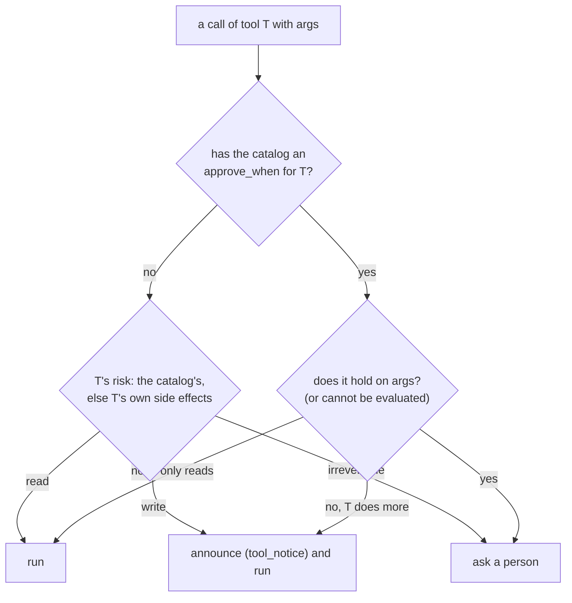

# Governance

Governance decides, for each tool call, one of three actions: the call **runs**, it runs and is
**announced**, or it **asks** a person first. `trellis.harness.governance` is the only place
this decision is made. Tools do not carry policy. A tool says what it does (its side effects),
and governance decides what that means for a call.

This page is how the decision is made, and what a wrapped agent (`h.wrap`, Way 1) does with
it: every harness tool call goes through governance with nothing to write. A team that keeps
its own framework checks its own tools with the same decisions, from the same catalog:
[blocks/governance.md](blocks/governance.md) (Way 2).

## How a call is decided



The decision starts from the tool's **risk**:

* For an MCP tool, the risk comes from its server's annotations: `readOnlyHint` gives `read`,
  `destructiveHint` gives `irreversible`, and anything else gives `write`.
* For a local tool, it is the declared `side_effects` (`"write"` by default).
* For an OpenAPI operation, the method decides it.

When the memory service's tool catalog has a `risk` for the tool, that risk wins. The service
derives it from the annotations the harness published and from what an administrator set.

| Risk | Action |
|---|---|
| `read` | `run` |
| `write` | `announce`: runs, and is announced as a `CUSTOM` `tool_notice` event |
| `irreversible` | `ask`: waits for approval |

**`approve_when`.** The catalog may also hold an approval rule for the tool. The rule is set by
an administrator, or by someone who accepted an approval suggestion
(`POST /v1/tools/approval-suggestions/{id}/accept` in the memory service). A rule replaces the
risk's action: the call asks exactly when the expression holds on the call's arguments. When it
does not hold, the call runs, and it is announced unless the tool only reads.

```text
amount > 10000 and currency in ["EUR", "USD"]
shape == "amount:num:1e4"
```

The expression language belongs to the memory service. `trellis.memory.approval` writes and
validates the rules, and governance evaluates them with that same module, so there is one
implementation, not two. The language has comparisons, `and`/`or`/`not`, `in`, literals,
lists, dotted argument paths, and `shape`. `shape` is the call's argument shape, which approval
decisions are pooled by.

**Governance fails closed.** A rule that does not parse, or cannot be evaluated on a call,
asks. With memory off there is no catalog, and the tools' own risks decide.

Each call becomes a `Decision`:

| Field | Meaning |
|---|---|
| `tool`, `args` | the call |
| `action` | `Action.RUN`, `Action.ANNOUNCE` or `Action.ASK` (also `.runs`, `.announces`, `.asks`) |
| `reason` | why, in words: `"refund is irreversible."`, or the rule that held (`"amount > 100."`) |
| `risk`, `rule` | the risk governance used, and the approval rule, if any |
| `question` | what an approver reads: `"Approve <tool>? <reason>"` |

## The catalog, kept fresh

Governance reads the catalog (`GET /v1/tools?names=`) for the tools it has been asked about, in
`trellis/harness/governance/catalog.py`:

* **Refresh.** The rules are read again after `GOVERNANCE_TTL_SECONDS` (30). The request is
  conditional: it sends `If-None-Match` with the last answer's `ETag`, and a `304` keeps what
  was read. A service that sends no `ETag` is read in full each time. So an administrator's new
  rule reaches running agents within half a minute.
* **New tools.** A tool asked about for the first time is read at once, together with the
  others.
* **One read at a time.** Concurrent calls that find the rules stale share one read.

Governance also publishes every tool to the catalog, so an administrator can see it and set
`approve_when` on it:

* MCP tools are published with their annotations, and never with side effects of the harness's
  making, so an administrator's stays.
* Local, OpenAPI and A2A tools are published with their declared side effects.

A tool is published once per content. A publish that failed is sent again the next time.

**A catalog that cannot be read** (the memory service is down, slow or refusing) does not fail
the call:

1. Rules read in the last `GOVERNANCE_STALE_SECONDS` (300) still stand.
2. Past that, or with none read, every tool that does more than read asks for approval, because
   whether an administrator wants its calls approved is unknown. The approver reads "… the tool
   catalog that says when it needs approval could not be read". A tool that only reads runs.
3. A warning is logged once (logger `trellis.governance`). The catalog is asked again every
   30 s, and its answer ends the fallback.

## Way 1: inside `h.wrap`

With `h.wrap`, governance is automatic. `Harness.governance(tenant)` keeps one `Governance` per
tenant. Its catalog is the memory service's, in that tenant (memory on), and its publishes go
through the harness's background writes, so they are kept on disk across an outage
([memory.md](memory.md)).

* **The toolbox** lists the tools and publishes them. It also asks governance which Code Mode
  servers only read ([tools.md](tools.md#code-mode)).
* **The bridge** (`tools/bridge.py`) checks every harness tool call, from any framework, then
  acts on the decision:
  * `run`: it runs the call;
  * `announce`: it emits `tool_notice` with the decision's risk, then runs the call;
  * `ask`: it pauses the run for approval (`InterruptReason.APPROVAL`, the call attached, the
    decision's `question`).

A call is looked up by its tool's name when it is made. So a rule set after a graph was compiled
with `h.tools(...)` still decides its calls, within the 30 s the rules are kept. This also holds
for a tool an OpenAI Agents handoff or a Claude server carries, and for the memory service's
own agent tools (their own risk decides unless the catalog names them). The span of each call carries
`trellis.governance.action` ([observability.md](observability.md)).

An approver answers with `agent.resume(interrupt_id, decision, ...)`
([interrupts.md](interrupts.md)):

| Decision | What happens |
|---|---|
| approve | the call runs |
| reject | the model is told the call was not run, and why when the reject carries a reason (`resume(id, "reject", answer="why", ...)`) |
| edit | the call runs with the edited arguments |
| cancel | the run ends `CANCELLED` |

Each decision is also `TOOL_CALL` feedback, from which the memory service learns approval
suggestions.

**Gate a tool in one place.** A framework's own approval gate pauses the run as the same
approval and takes the same decisions
([interrupts.md](interrupts.md#framework-approvals-langchains-middleware-and-openai-agents-needs_approval)).
Such gates are LangChain's `HumanInTheLoopMiddleware`, Deep Agents' `interrupt_on` and OpenAI
Agents' `needs_approval`. A tool the framework gates should not also be `irreversible` or under
an `approve_when` in the harness, or each call is approved twice.

A framework's own tools are not harness tools, so governance does not see them. Examples are
Deep Agents' file tools and your own `function_tool`s ([framework pages](README.md#which-target)).
Claude Code's built-ins are the exception: the CLI asks the SDK's permission callback, and the
harness's decides them by risk (`Bash` asks, `Write` is announced, `Read` runs)
([frameworks/claude-agent-sdk.md](frameworks/claude-agent-sdk.md#claude-codes-built-in-tools)).
