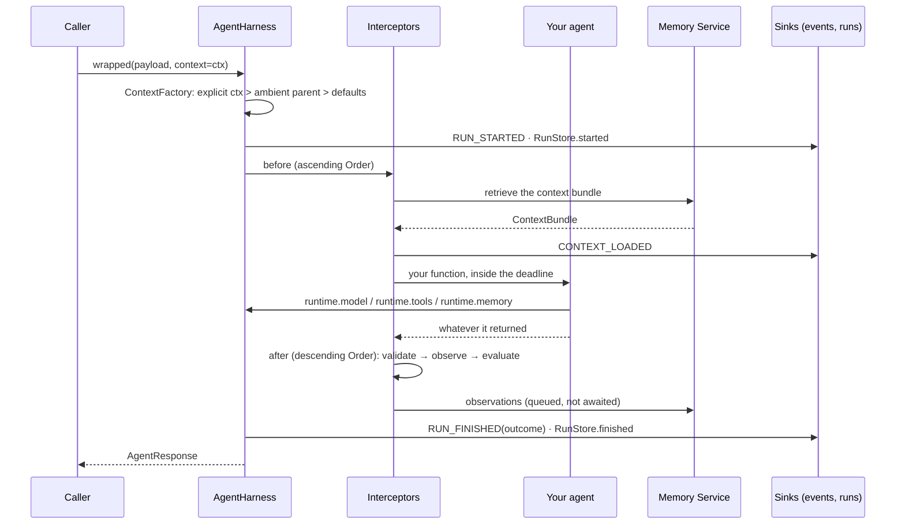
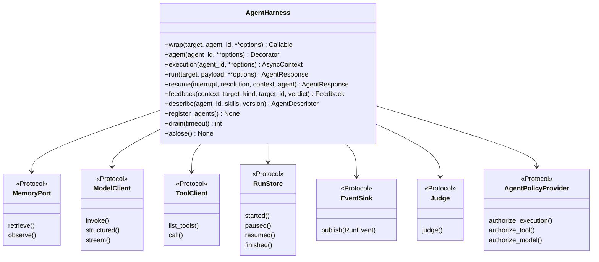

# `AgentHarness` — the object everything hangs off

One class. You give it the providers you have, it gives you back the agent you already wrote
with identity, memory, tracing, tool policy, deadlines, run records and events attached.
There is no flag to turn a provider on: a provider is on because it was passed.

* the ports it binds and what happens when one is missing → [table below](#what-you-pass)
* the pipeline that wraps your function → [ARCHITECTURE.md](../ARCHITECTURE.md)
* the settings that tune it → [configuration.md](configuration.md)

## One run, end to end



## What you pass

Every argument is a port from [`trellis-contracts`](https://github.com/amitmohapatra/agent-contracts)
(`trellis/contracts/ports.py`). Omit one and the harness degrades in a documented way rather
than failing at import.

| Argument | Port | Omitted |
| --- | --- | --- |
| `memory=` | `MemoryPort` (a `trellis-memory` `MemoryClient` or a bound `MemoryContext`) | `NoOpMemoryRuntime`: retrieval returns `None`, writes are skipped |
| `model=` | `ModelClient` (`BifrostModelClient`, or any object with `ainvoke`/`invoke` via `DirectModelClient`) | `runtime.model.invoke` raises `ConfigurationError` naming the fix |
| `tools=` | `ToolClient`, a list of callables, or `{name: callable}` | `runtime.tools.call` raises `ToolNotFoundError` |
| `artifacts=` | `ArtifactClient`, or a path (`FileArtifactStore`) | `InMemoryArtifactStore`, bounded and evicting |
| `policy=` | `AgentPolicyProvider` | everything is allowed |
| `registry=` | `AgentRegistryClient` (`AIRegistryClient`) | `describe`/`register_agents` are no-ops |
| `runs=` | `RunStore` (`RunStoreClient`, `TemporalRunStore`) | `NoRunStore`: nothing is recorded, nothing fails |
| `judge=` | `Judge` (`GroundedJudge`) | no turn is judged |
| `event_sinks=` | `EventSink` list | events are built and dropped |
| `evaluation_sink=` / `evaluation_provider=` | `EvaluationSink` / `EvaluationProvider` | no evaluation events, no scores |
| `prompts=` | `PromptProvider` | prompts come from your own code |
| `redactor=` | `TelemetryRedactor` | `DefaultRedactor` |
| `telemetry=` | `TelemetryProvider` | OTel through `HarnessTracer`; the API's no-op without an SDK |
| `interceptors=` / `listeners=` | `AgentInterceptor` / `LifecycleListener` | the core chain only |
| `config=` | `HarnessConfig`, a path, or a dict | every default in [configuration.md](configuration.md) |
| `defaults=` | the identity used when a call brings no context | `tenant_id` must come from somewhere, or the first run raises |
| `error_mode=` | `"raise"` (default) or `"result"` | a failure raises |



## Three ways to attach

```python
import asyncio

from trellis.harness import AgentExecutionContext, AgentHarness

harness = AgentHarness(defaults={"tenant_id": "acme"})


# 1. wrap an agent you already have: its signature does not change
async def inventory(question: str) -> str:
    return f"answering: {question}"


wrapped = harness.wrap(inventory, agent_id="inventory-agent")


# 2. a runtime-aware agent: the second argument is the runtime
@harness.agent(agent_id="stock-agent")
async def stock(payload: dict, agent) -> dict:
    agent.log("looking", sku=payload["sku"])
    return {"sku": payload["sku"], "on_hand": 12, "run": agent.run_id}


async def main() -> None:
    ctx = AgentExecutionContext.create(tenant_id="acme", agent_id="inventory-agent", user_id="u1")
    print((await wrapped("how much stock of SKU-1?", context=ctx)).data)
    print((await stock({"sku": "SKU-1"})).data)

    # 3. instrument a block that is not a function of yours
    async with harness.execution(agent_id="report", tenant_id="acme") as run:
        run.log("building")  # one span, one run record, one event stream
    await harness.aclose()


asyncio.run(main())
```

`AgentResponse` is what comes back from all three: `status`, `data`, `error`, `warnings`,
`claims`, `artifacts`, `usage`. `result.succeeded` is the branch you want; see
[Results and errors](../README.md#results-and-errors).

## What the runtime gives your agent

`AgentRuntime` is the second argument of a runtime-aware agent (and the value of
`current_runtime()` inside one).

| Member | What it is |
| --- | --- |
| `context` | the frozen `AgentExecutionContext`: tenant, workspace, user, thread, session, turn, run lineage |
| `descriptor` | the `AgentDescriptor` for this agent (id, skills, version) |
| `memory` | `MemoryRuntime` — see [memory.md](memory.md) |
| `model` | the instrumented `ModelClient` — see [models.md](models.md) |
| `tools` | the instrumented `ToolClient` — see [tools.md](tools.md) |
| `artifacts` | `ArtifactRuntime` — see [artifacts.md](artifacts.md) |
| `memory_context` | the bundle the memory interceptor fetched, or `None` |
| `events` | the run's `RunEventStream` — see [events.md](events.md) |
| `tracer`, `logger` | the harness's span factory and structured logger |
| `state` | a plain dict scratch space shared with interceptors (`state["react"]`, `state["resolutions"]`) |
| `model_calls`, `tool_calls` | what this run has called so far, as summaries |
| `agent_id`, `run_id`, `remaining_seconds`, `cancelled` | the run's own facts |
| `check_cancelled()`, `idempotency_key(*parts)`, `log(event, **fields)`, `child_context(agent_id)` | the four methods an agent actually calls |

## Lifecycle events

`harness.on(listener)` or `listeners=[...]`. A listener that raises is logged and swallowed —
an observer can never fail a business execution. The vocabulary is
`trellis.contracts.LifecycleEvent`:

`on_agent_start` · `on_context_loaded` · `on_model_start` · `on_model_end` · `on_tool_start` ·
`on_tool_end` · `on_agent_success` · `on_agent_error` · `on_agent_cancel` · `on_agent_pause` ·
`on_agent_timeout` · `on_agent_finish`

These are the in-process bus. The cross-process stream is `RunEvent`
([events.md](events.md)); the durable record is `RunStore` ([runs.md](runs.md)).

## Closing down

```python
await harness.drain()  # await every queued memory write and run record
harness.flush(5.0)  # flush telemetry
await harness.aclose()  # both, then close the clients the harness owns
```

`async with AgentHarness(...) as harness:` does the same on exit. In a short-lived process
this is not optional: memory writes are queued by design, and a process that exits without
draining loses them.
