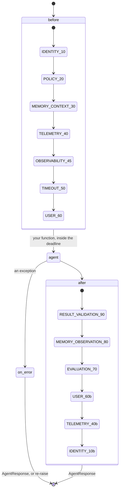

# Interceptors, listeners and policy

Everything the harness adds to a run is an interceptor. So is everything you add: the pipeline
is the extension point, and your interceptor is ordered against the core ones rather than
bolted on beside them.

Three different extension shapes, and picking the wrong one is the usual mistake:

| You want to | Use | Can it change the run? |
| --- | --- | --- |
| change the request, the result, or an error | an **interceptor** | yes |
| watch what happens | a **listener** (`harness.on`) | no — a raising listener is logged and swallowed |
| decide whether something is allowed | a **policy provider** | yes: allow, deny, or ask a person |

## The pipeline



`before` ascends by `Order`, `after` descends, so the pipeline nests like an onion *and* the
post-execution sequence is exactly validation → memory write → evaluation event. The numbers are
`trellis.harness.Order`: `IDENTITY=10`, `POLICY=20`, `MEMORY_CONTEXT=30`, `TELEMETRY=40`,
`OBSERVABILITY=45`, `TIMEOUT=50`, `USER=60`, `EVALUATION=70`, `MEMORY_OBSERVATION=80`,
`RESULT_VALIDATION=90`. `Order.USER` is where yours goes unless you have a reason.

## Writing one

```python
import asyncio

from trellis.harness import AgentHarness, BaseInterceptor, Order


class AuditInterceptor(BaseInterceptor):
    name = "audit"
    order = Order.USER

    async def before(self, request, runtime):
        runtime.logger.info("audit.start", agent_id=runtime.agent_id, run=runtime.run_id)
        return request  # returning a *new* request is how you change one

    async def after(self, result, runtime):
        return result.add_warning("AUDITED", "reviewed by the audit interceptor")

    async def on_error(self, error, runtime):
        runtime.logger.warning("audit.failed", code=error.code)
        return None  # None: let the error continue; an AgentResponse converts it


harness = AgentHarness(interceptors=[AuditInterceptor()], defaults={"tenant_id": "acme"})
harness.on(lambda event, payload: None)  # a listener: observe only


@harness.agent(agent_id="audited")
async def audited(payload: dict, agent) -> dict:
    return {"ok": True}


result = asyncio.run(audited({}))
print(result.status, [w.code for w in result.warnings])
```

`harness.add_interceptor(...)` adds one later; `harness.wrap(..., interceptors=[...])` adds one
for a single agent. An interceptor is constructed once per harness and its chain is materialised
once, so the per-call cost is the chain length and nothing else.

## Policy

A policy provider answers three questions, and may answer each of them three ways.

```python
from trellis.harness import AllowListPolicyProvider, CallablePolicyProvider, PolicyOutcome

# the simple case
policy = AllowListPolicyProvider(tools={"inventory_db"}, agents={"refund-agent"})


# the general case: return True/False, a denial reason, or a PolicyOutcome
def authorize_tool(context, call):
    if call.tool == "issue_refund" and call.args.get("amount", 0) > 100:
        return PolicyOutcome.REQUIRE_APPROVAL  # pauses the run for a person
    return call.tool != "rm"


policy = CallablePolicyProvider(tool=authorize_tool)
```

| Hook | Asked before | Answers |
| --- | --- | --- |
| `authorize_execution(request)` | the agent runs | `True` · `False` · a denial reason string |
| `authorize_tool(context, call)` | every tool call | the same, plus `PolicyOutcome.REQUIRE_APPROVAL` |
| `authorize_model(context, request)` | every model call | `True` · `False` · a reason |

`normalize()` accepts a bool, a reason string, a `PolicyOutcome`, its value, or an
`(outcome, reason)` pair, so a provider can be as simple or as explicit as it likes. A denial
raises `PolicyDeniedError` (category `POLICY`, never retried) and ends the run `REJECTED`;
`REQUIRE_APPROVAL` raises `ApprovalRequired`, which becomes an `Interrupt` on the event stream
and a `PAUSED` run record — see [interrupts.md](interrupts.md).

Passing a policy is what enables it. There is no `policy.enabled` flag that has to agree with
the object you supplied.

## Redaction

`redactor=` is a `TelemetryRedactor`: `redact_attributes`, `redact_input`, `redact_output`. The
`DefaultRedactor` is applied to every span attribute, every event payload and every webhook
body, so what leaves the process on a stream is redacted exactly like a span. Capture policy
decides whether a payload may be attached at all; redaction decides what an allowed payload may
contain; sampling decides whether the run is traced. All three live in `HarnessTracer`, so no
call site can forget one ([privacy.md](privacy.md)).
