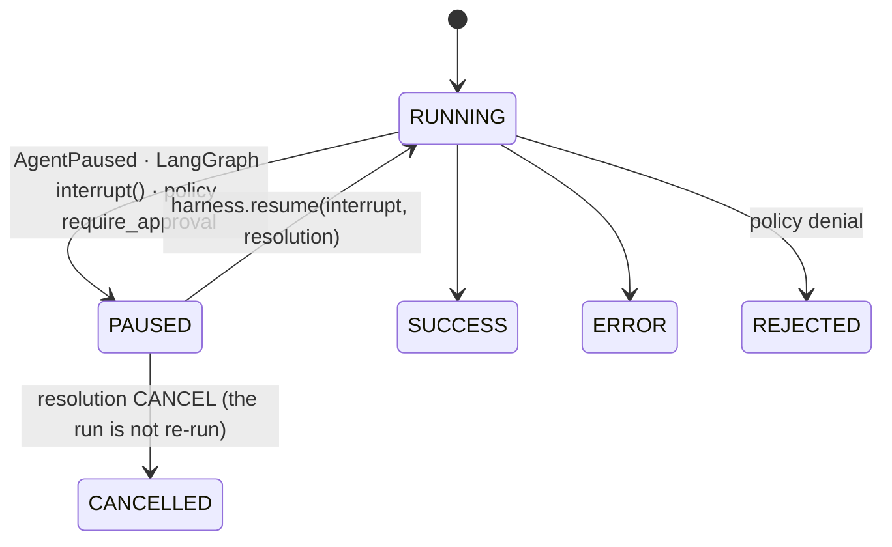

# Interrupts

Two different things are both called human-in-the-loop; they get two different records
(design §7). An **interrupt** stops a run to ask; **feedback** judges what happened.



**One mechanism, however the agent is built.** Whatever an agent raised, the harness turns it
into a contracts `Interrupt` (`interrupt_from_signal`): `AgentPaused` carries the question; a
LangGraph `GraphInterrupt` is read structurally; a policy that answers
`PolicyOutcome.REQUIRE_APPROVAL` to `authorize_tool` raises `ApprovalRequired` with the tool
call. The run store receives `paused(interrupt)`, the stream carries `INTERRUPT` and
`RUN_FINISHED(outcome=interrupt)`, a webhook sink delivers both, and the harness keeps the
unredacted interrupt in `harness.resolutions` (`announced(tenant_id)`; a surface claims one by
id with `claim(interrupt_id, tenant_id=..., user_id=..., workspace_id=..., thread_id=...)`,
which only the run's own caller can do).

**Answering.** `await harness.resume(interrupt, resolution, context=ctx, agent=wrapped)`
checks that the decision fits the question (an approval takes `APPROVE`, `EDIT`, `REJECT` or
`CANCEL`; a question takes `ANSWER` or `CANCEL`), records the `InterruptResolution` on the run
store (after the pause it answers), turns an approval decision into `Feedback` on the Memory
Service, files the answer for the run, and runs the agent again with the same context, so the
same run id, and with `payload` (None unless you pass one): a tool call held for approval finds
its decision (`APPROVE` runs it, `EDIT` runs the edited arguments after the policy has seen
them, `REJECT` yields a rejected outcome, `CANCEL` ends the run `CANCELLED` without running the
agent) and an agent that asked a question finds the answer in `runtime.state["resolutions"][ANSWER]` (the constant is
`trellis.harness.interrupts.ANSWER`, the string `"answer"`). An approval binds the arguments
the approver saw: a resumed agent that asks for a different call asks a person again. Without
`agent`, the caller continues the run itself, for instance a LangGraph graph resuming with
`Command(resume=...)` whose wrapped nodes find the answer the same way.

```python
from trellis.harness.interrupts import ANSWER

@harness.agent(agent_id="deploy")
async def deploy(payload, runtime):
    answer = runtime.state.get("resolutions", {}).get(ANSWER)
    if answer is None:
        raise AgentPaused("Which region?", expects={"type": "string"})
    return f"deploying to {answer.answer}"

resolution = InterruptResolution(interrupt_id=interrupt.interrupt_id, run_id=interrupt.run_id,
                                 decision=InterruptDecision.ANSWER, answer="eu")
await harness.resume(interrupt, resolution, context=ctx, agent=deploy)
```

**Feedback.** `await runtime.memory.feedback("memory", memory_id, "correct", correction=...)`
or `await harness.feedback(ctx, "run", run_id, "confirm", score=0.9)` record a judgement
through the Memory Service (`POST /v1/feedback`); a verdict on a memory reinforces, retracts
or corrects it there.
