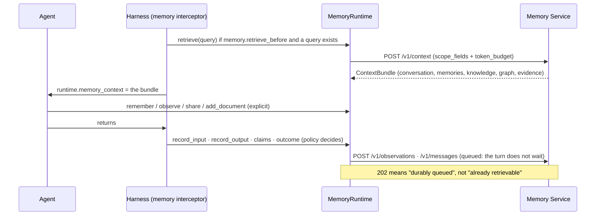

# Memory

The harness talks to one Memory Service through the `trellis-memory` SDK, and does three
things your agent would otherwise do by hand: bind the scope, fetch a context bundle before
the run, and write what happened after it — asynchronously, idempotently, and only to
audiences the run's identity can actually express.

* the service's own API → [`agent-memory-service/docs/api/`](https://github.com/amitmohapatra/agent-memory-service)
* the settings → [configuration.md](configuration.md) (`memory.*`, `timeouts.memory_seconds`)
* what is never exported → [privacy.md](privacy.md)

## A turn with memory



Two service behaviours no setting changes, and they explain most surprises:

1. **Writes are asynchronous.** The API commits the record and its job in one transaction,
   then answers. Reading straight after writing proves nothing — drain, or poll.
2. **Reads are audience-filtered.** A memory is retrievable only by a principal in its
   audience. A THREAD audience needs the thread to exist; WORKSPACE needs a workspace row and
   a member, and AGENT_GROUP needs a group id on the context — neither of which the harness
   can provision for you.

## The runtime

`runtime.memory` is a `MemoryRuntime`: every call is traced as `agent.memory.<operation>`,
bounded by `timeouts.memory_seconds`, keyed for idempotency from the run's lineage, and
scoped by `AgentExecutionContext.scope_fields()`.

| Call | What it does |
| --- | --- |
| `retrieve(query, **options)` | the bundle for this turn (`POST /v1/context`) |
| `recall(query, **options)` | ranked items only, no bundle assembly |
| `observe(MemoryObservation)` | one observation, kind validated against the service's vocabulary |
| `remember(text, memory_type=…, lifetime=…, visibility=…)` | a typed memory, stated rather than inferred |
| `record_input(text)` / `record_output(text)` | this turn's input/output as observations (explicit calls always write) |
| `share(text, group=…)` | an AGENT_GROUP-visible note for peer agents |
| `history(limit=…, include_internal=False)` | the conversation window |
| `memories(**options)` / `get(id)` / `forget(id)` | the inventory view, one row, deletion |
| `graph_query(query, **options)` | knowledge-graph facts, with `as_of` |
| `add_document(file, **options)` | ingest a document into the RAG corpus (creates the thread first for THREAD visibility) |
| `verify(answer, **options)` | the grounding report for an answer (`POST /v1/verify`) |
| `feedback(target_kind, target_id, verdict, …)` | a judgement on a run, answer, memory or tool call |
| `record_outcome(success=…, note=…)` | labels the run so tool memory can learn from it |
| `record_tool_call(...)` | tool memory; the instrumented tool client calls it for you |
| `chat` · `graph` · `documents` · `tools` · `sdk` | the SDK's own sub-APIs, already bound to this scope |

`memory_type`: SEMANTIC, EPISODIC, PROCEDURAL, PREFERENCE, DECISION, OUTCOME, FAILURE,
SHARED, AGENT. `lifetime`: EPHEMERAL, SHORT_TERM, LONG_TERM, ARCHIVAL.

## Visibility, checked before the wire

A write to an audience this run cannot express is refused here, not accepted and then dropped
by a background job. Each level names the context field it needs
(`trellis.harness.memory.visibility`):

| Visibility | Needs | Accepted by the service |
| --- | --- | --- |
| `PRIVATE` | nothing beyond the tenant | yes |
| `TENANT` | nothing beyond the tenant | yes |
| `USER` | `user_id` | yes |
| `THREAD` | `thread_id` | yes |
| `RUN` | `agent_run_id` | yes |
| `WORKSPACE` | `workspace_id` | yes |
| `AGENT_GROUP` | `agent_group_id` | yes |
| `WORK` | `work_id` | **no** |
| `GROUP` | `group_ids` | **no** |
| `GLOBAL` | nothing beyond the tenant | **no** |

The last three are in the harness's checker but **not** in the Memory Service's `Visibility`
enum (`PRIVATE`, `USER`, `AGENT_GROUP`, `RUN`, `THREAD`, `WORKSPACE`, `TENANT` — seven), so a
write that names one passes the local check and is then refused by the service with a validation
error. Verified against a running service: `hints={"visibility": "WORK"}` comes back
`ValidationError`. Use `WORKSPACE` for team-visible work, and treat the three as unavailable
until the vocabularies agree.

`memory.private_by_default: true` makes everything an agent writes RUN-visible: readable by
this run and the runs it derives, and by nothing else.

## The policy

`MemoryPolicy` is the per-agent narrowing of `memory.*`. A misspelled key is rejected rather
than silently ignored.

| Field | Default | Effect |
| --- | --- | --- |
| `retrieve_before` | `True` | fetch a bundle before the run, when the request carries a query |
| `observe_input` / `observe_output` | `True` | write the turn's input/output automatically |
| `observe_tool_results` | `False` | tool outputs frequently contain customer data |
| `observe_claims` | `True` | claims on the result become observations |
| `record_outcome` | `True` | label the run success/failure when it ends |
| `private_by_default` | `False` | `True` → RUN visibility for everything |
| `record_messages` | `False` | also record the turn as a conversation |
| `token_budget` | `None` | the bundle's budget; the service's default when unset |
| `writeback` | `True` | queue writes instead of making the turn wait |

## Example — against the live service

Runs against a Memory Service on `http://localhost:8080` with the dev key. It onboards the
tenant and workspace first, the way `tests/support.py::onboard` does, because a
WORKSPACE-visible write needs a workspace row and a member.

```python
import asyncio
import contextlib
import uuid

from trellis.harness import AgentExecutionContext, AgentHarness
from trellis.memory import MemoryClient
from trellis.memory.errors import ConflictError

URL, KEY, TENANT, WORKSPACE, USER = "http://localhost:8080", "dev-key", "acme", "docs-ws", "u1"


async def main() -> None:
    memory = MemoryClient(URL, api_key=KEY)
    with contextlib.suppress(ConflictError):
        await memory.admin.create_tenant(TENANT, tenant_id=TENANT)
    workspaces = memory.administer(TENANT).workspaces
    with contextlib.suppress(ConflictError):
        await workspaces.create(WORKSPACE, workspace_id=WORKSPACE)
    await workspaces.set_member(WORKSPACE, f"user:{USER}")

    harness = AgentHarness(memory=memory, defaults={"tenant_id": TENANT})

    @harness.agent(agent_id="notes-agent")
    async def notes(question: str, agent) -> str:
        bundle = agent.memory_context  # fetched before the run, or None
        await agent.memory.remember(
            "The FY26 revenue target is EUR 450 million.",
            memory_type="SEMANTIC",
            visibility="USER",
        )
        hits = await agent.memory.recall("revenue target")
        return f"{len(hits)} hits; bundle {'present' if bundle else 'absent'}"

    thread = await memory.bind(tenant_id=TENANT, user_id=USER).chat.create(title="docs")
    ctx = AgentExecutionContext.create(
        tenant_id=TENANT,
        agent_id="notes-agent",
        workspace_id=WORKSPACE,
        user_id=USER,
        thread_id=thread.thread_id,
        turn_id=f"t_{uuid.uuid4().hex[:8]}",
    )
    result = await notes("revenue target?", context=ctx)  # already wrapped by @harness.agent
    print(result.status, result.data)
    await harness.aclose()
    await memory.aclose()


asyncio.run(main())
```

`examples/memory_quickstart.py` is this, runnable; `examples/memory_tour.py` walks the whole
surface. Without `MEMORY_SERVICE_URL` the tour uses an in-process stand-in, so it still runs.

## When the service is down

| Situation | Default |
| --- | --- |
| retrieval fails | the run continues with no context and a `MEMORY_DEGRADED` warning |
| a write fails | the result stands, with `MEMORY_WRITE_FAILED` |
| `memory.failure_mode: fail_closed` | `MemoryUnavailableError` instead of either |
| no `memory=` at all | `NoOpMemoryRuntime`: every read is `None`, every write is skipped |
