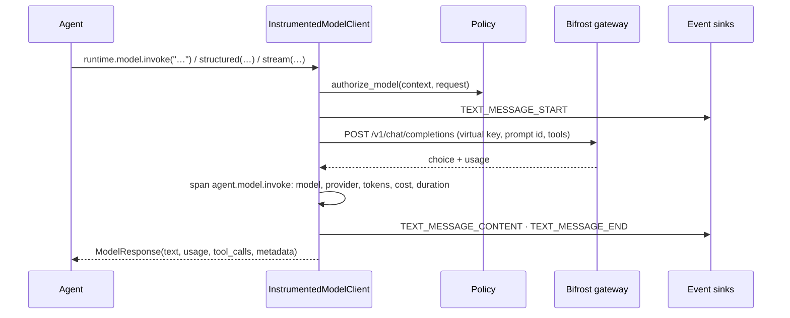

# Models

Two questions, one page: **how do I call a model from an agent**, and **which models does this
platform actually use, for what, and under whose licence**.

## Part 1 — calling a model

Every LLM call leaves through a gateway. The harness contains no provider SDK, and
`tests/unit/test_architecture.py` asserts that no `trellis` package imports one: a model call
is HTTP to Bifrost, which owns the keys, the prompts, the budgets and the MCP servers.



| Client | Use it for |
| --- | --- |
| `BifrostModelClient(base_url, api_key=…, model=…)` | the gateway: retries, `Retry-After`, a circuit breaker, streaming, structured output, tool calls. `client.gateway` is reused by `MCPToolClient(client)`, so inference and tools share one key and one breaker |
| `DirectModelClient(obj)` | an object you already have with `ainvoke`/`invoke`/`complete`/`generate`; `harness.wrap_model(obj)` builds one and names the provider for the spans |
| `UnconfiguredModelClient` | what you get with no `model=`: raises `ConfigurationError` naming the fix |
| `tool_schemas(specs)` | `ToolSpec`s as OpenAI-shaped function schemas, for a request you build yourself |

```python
import asyncio

from trellis.harness import AgentHarness, BifrostModelClient, ModelRequest

model = BifrostModelClient("http://localhost:8091", api_key="vk-…", model="gpt-4.1-nano")
harness = AgentHarness(model=model, defaults={"tenant_id": "acme"})


@harness.agent(agent_id="summariser")
async def summarise(text: str, agent) -> str:
    response = await agent.model.invoke(
        ModelRequest(messages=[{"role": "user", "content": f"Summarise: {text}"}])
    )
    agent.log("summarised", tokens=response.usage.total_tokens if response.usage else None)
    return response.text or ""


print(asyncio.run(summarise("Revenue was EUR 412m in FY26, up 4%.")).data)
```

`structured(request, schema)` asks the gateway for JSON and *parses* rather than trusts it,
allowing one repair round; `stream(request)` yields text deltas and emits one
`TEXT_MESSAGE_CONTENT` per delta. A model call the harness makes for itself — a compaction, a
judge — carries `metadata[INTERNAL]` and is deliberately not announced as a message.

Prompts belong to the gateway: send `x-bf-prompt-id` (and `x-bf-prompt-version`) and Bifrost
injects the stored, versioned prompt. The harness never ships rubric or prompt text where an id
exists — see [evaluation.md](evaluation.md).

## Part 2 — which models this platform uses

| Role | Model | Where it runs | Origin | Licence as the code reports it |
| --- | --- | --- | --- | --- |
| Dense embedding | `ibm-granite/granite-embedding-small-english-r2`, 384-dim | Memory Service, CPU, ONNX runtime | IBM (US) | Apache-2.0 |
| Sparse retrieval | BM25 — client-side term frequencies, Qdrant server-side IDF | Memory Service | this repository's own code, no weights | Apache-2.0 |
| Reranker | **none shipped** | — | — | — |
| Grounding NLI | `MoritzLaurer/DeBERTa-v3-base-mnli-fever-anli` | Memory Service, CPU, torch | fine-tune of Microsoft's DeBERTa-v3 (US) | MIT |
| Online / offline judge | `openrouter/openai/gpt-4.1-nano` (the `judge.model` default) | through Bifrost, on a budgeted virtual key | OpenAI (US) via OpenRouter | provider terms; no weights are run here |
| Agent models | whatever the deployment's virtual key allows | through Bifrost | per key | per provider |
| Document parsing | docling's layout/table models when installed, else the builtin parser | Memory Service | `docling-project/docling` (IBM, US) | MIT |

Two model choices are *measured* rather than preferred, and both numbers come from a gate
artifact rather than this page: the embedding from the Memory Service's
`benchmark/results/embedding.json`, and the decision to ship **no** reranker from the SciFact
run recorded in that repository's `docs/MEASUREMENTS.md` §3e (nDCG@10 79.33 with the
cross-encoder against 84.51 without it, exact sign test p = 0.012, at 21x the latency). Do not
quote either from here — quote the artifact.

The frozen set is `FROZEN_MODELS` in the Memory Service's
`src/memory_service/config/constants.py`. A swap is a code change, reviewed like one, never an
environment edit, and changing the embedding means re-indexing: the model, backend, ONNX graph
and dimension are part of the collection name, so old and new vectors cannot silently mix.

### The origin rule

**No Chinese-origin model or derivative runs anywhere in the stack** — not as a default, a
benchmark challenger, an operator setting, or a model discovered through the gateway. The rule
is about origin, not language: every script is supported, and the multilingual encoder was
chosen for that.

It is one pattern, consulted everywhere a model is named:
`src/memory_service/domain/provenance.py` in the Memory Service
(`EXCLUDED_MODEL_ORIGINS`, `permitted_model`, `require_permitted_model`), asserted by
`tests/unit/test_model_provenance.py` on every surface that names a model — the frozen set, the
download catalogue, LLM settings and gateway discovery. A model name that matches the pattern
raises rather than loads.

The multilingual runtime and its accuracy programme (Memory Service M2 + M4) land with their own
page and ADR 0024 in that repository; until then this table is the English-only set that ships.

### Running with no LLM at all

The Memory Service's extraction, knowledge graph, summaries and tool learning are
deterministic; a model is optional and sharpens specific decisions. In the harness the
equivalent is `judge.grounded_only: true`, which keeps the deterministic half of the judge
(`POST /v1/verify`) and never calls a model — grounding checks at zero marginal cost.
