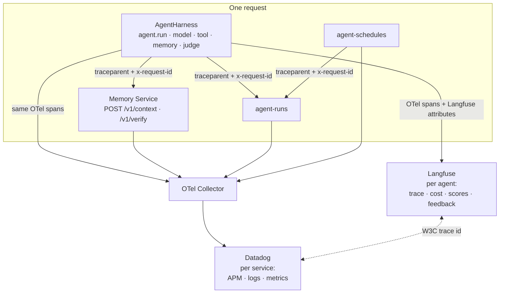

# Observability: one place to look per request

When one request went wrong, there is exactly one place to start: **its Langfuse trace**. Spans,
cost, the judge's score, the human's score and the feedback thread are all on it, and every
surface links to it by `trace_id`.

That is one half. The other half is that agents are not the only thing running: the Memory
Service, agent-runs and agent-schedules are ordinary services with ordinary service concerns.
Those go to Datadog over OTLP. The two halves are joined, not merged.

## The split, and why it is not negotiable



**Langfuse is per agent. Datadog (OTLP) is per service. Never add Langfuse to a non-agent
service.**

Langfuse's model is a *conversation with an LLM*: a trace is a request, an observation is a
generation with a prompt, a model, tokens and a cost, and scores and feedback hang off it. That
is exactly right for an agent and meaningless for a database-backed HTTP service. A Memory
Service span in Langfuse would be an observation with no generation, no cost and no score, and
it would put customer content in a second place for no benefit — a privacy cost with no
observability gain.

OpenTelemetry is the canonical contract in both directions: the harness emits OTel spans and
Langfuse is a *backend on the same spans*, not a parallel tracing model. So nothing is
instrumented twice, and a deployment with no Langfuse at all still has complete traces.

## What joins them

| Join key | Set by | Travels as |
|---|---|---|
| W3C trace context | the OTel propagator the application installed | `traceparent` (and `tracestate`) on every outbound call |
| Request id | the harness, from `AgentExecutionContext.request_id` | `x-request-id` |
| Correlation id | the harness, from `AgentExecutionContext.correlation_id` | `x-correlation-id` |

`trace_headers()` in `trellis.harness.runtime.propagation` is what builds them, and every SDK
call the harness makes carries them. The identity is the platform's: it comes from the trusted
context, never from a caller's body.

So: a slow turn in Langfuse gives you a trace id; the same trace id in Datadog APM shows which
service was slow. A 500 in Datadog gives you a trace id and an `x-request-id`; the same trace id
in Langfuse shows which agent's request it broke, what it was asked, and what it cost.

Search Datadog with either:

```
@trace_id:<the langfuse trace id>
@http.request_id:<the x-request-id>
```

## What memory was served to that request

A judge score or a wrong answer usually raises "what did it actually *know*?". The Memory
Service keeps a read audit:

```bash
curl -s "$MEMORY_SERVICE_URL/v1/reads?limit=50" \
  -H "Authorization: Bearer $MEMORY_API_KEY" \
  -H "X-Tenant-Id: acme"
```

```python
for record in await client.administer("acme").reads(limit=50):
    print(record.at, record.principal, record.kind, record.record_ids)
```

Each entry names the `credential` and the `principal` that read, whether it was a `recall` or a
`context` assembly, the `record_ids` that came back, and a `query_hash` and `scope_fingerprint`
rather than the query text — the audit says *who read which records* without becoming a second
copy of what was asked.

Newest first, pageable with the cursor (or `before=<the last entry's at>`); `after` is a
since-filter. That is the question behind both "why did it say that?" and "who has seen this
customer's data?".

The retrieval itself is also on the trace: `agent.memory.retrieve` carries the bundle's size and
`memory.grounding.*` carries what `/v1/verify` decided. `GET /v1/reads` is the record of *served
memory* that outlives the trace's retention.

## Harness → collector → Datadog

The harness does not configure OpenTelemetry by default: most applications already do, and it
must not fight them for the global provider. Two ways to wire it.

**The application owns the SDK** (recommended — one exporter for everything in the process):

```python
from opentelemetry import trace
from opentelemetry.sdk.resources import Resource
from opentelemetry.sdk.trace import TracerProvider
from opentelemetry.sdk.trace.export import BatchSpanProcessor
from opentelemetry.exporter.otlp.proto.http.trace_exporter import OTLPSpanExporter

trace.set_tracer_provider(
    TracerProvider(resource=Resource.create({"service.name": "refund-agent"}))
)
trace.get_tracer_provider().add_span_processor(
    BatchSpanProcessor(OTLPSpanExporter(endpoint="http://otel-collector:4318/v1/traces"))
)
```

**The harness owns it** (a standalone worker with nothing else in the process):

```yaml
telemetry:
  enabled: true
  service_name: refund-agent
  configure_sdk: true            # off by default
  exporter: otlp
  endpoint: http://otel-collector:4318/v1/traces
```

```bash
export UAH_OTEL_EXPORTER=otlp
export UAH_OTEL_ENDPOINT=http://otel-collector:4318/v1/traces
export UAH_OTEL_CONFIGURE_SDK=true
```

Langfuse rides the same spans; see [Langfuse setup](../README.md#langfuse-setup). In
`mode: otlp` it needs no SDK at all — the spans go straight to Langfuse's own OTLP endpoint
carrying Langfuse attributes.

### The collector

One collector configuration, used by the harness **and** every service. The Datadog exporter is
part of the contrib distribution (`otel/opentelemetry-collector-contrib`).

```yaml
# otel-collector.yaml
receivers:
  otlp:
    protocols:
      grpc: { endpoint: 0.0.0.0:4317 }
      http: { endpoint: 0.0.0.0:4318 }

processors:
  # Datadog's APM stats need this, and it must come before batch.
  probabilistic_sampler:
    sampling_percentage: 100      # lower in production; the harness also samples its own spans
  batch:
    send_batch_max_size: 1000
    send_batch_size: 100
    timeout: 10s
  resourcedetection:
    detectors: [env, system, docker]
    timeout: 5s
  # x-request-id is a span attribute; promote it so Datadog can facet on it.
  attributes/request_id:
    actions:
      - key: http.request_id
        from_attribute: x-request-id
        action: upsert

exporters:
  datadog:
    api:
      key: ${env:DD_API_KEY}
      site: ${env:DD_SITE}        # datadoghq.com, datadoghq.eu, ...
    traces:
      compute_stats_by_span_kind: true
      peer_tags_aggregation: true
    host_metadata:
      enabled: true

service:
  pipelines:
    traces:
      receivers: [otlp]
      processors: [probabilistic_sampler, resourcedetection, attributes/request_id, batch]
      exporters: [datadog]
    metrics:
      receivers: [otlp]
      processors: [resourcedetection, batch]
      exporters: [datadog]
    logs:
      receivers: [otlp]
      processors: [resourcedetection, batch]
      exporters: [datadog]
```

### Per service

Every service points at the same collector and differs only in its `service.name`. These are the
standard OTel SDK variables, so they work whatever each service is written in.

**The harness / an agent worker**

```bash
OTEL_SERVICE_NAME=refund-agent
OTEL_EXPORTER_OTLP_ENDPOINT=http://otel-collector:4318
OTEL_EXPORTER_OTLP_PROTOCOL=http/protobuf
OTEL_RESOURCE_ATTRIBUTES=deployment.environment=production,service.version=0.3.0
# plus the harness's own switches
UAH_OTEL_EXPORTER=otlp
UAH_OTEL_ENDPOINT=http://otel-collector:4318/v1/traces
# Langfuse: agents only
UAH_LANGFUSE_ENABLED=true
LANGFUSE_PUBLIC_KEY=pk-lf-...
LANGFUSE_SECRET_KEY=sk-lf-...
```

**Memory Service**

```bash
OTEL_SERVICE_NAME=agent-memory-service
OTEL_EXPORTER_OTLP_ENDPOINT=http://otel-collector:4318
OTEL_EXPORTER_OTLP_PROTOCOL=http/protobuf
OTEL_RESOURCE_ATTRIBUTES=deployment.environment=production
# no Langfuse variables here, on purpose
```

**agent-runs**

```bash
OTEL_SERVICE_NAME=agent-runs
OTEL_EXPORTER_OTLP_ENDPOINT=http://otel-collector:4318
OTEL_EXPORTER_OTLP_PROTOCOL=http/protobuf
# no Langfuse variables here, on purpose
```

**agent-schedules**

```bash
OTEL_SERVICE_NAME=agent-schedules
OTEL_EXPORTER_OTLP_ENDPOINT=http://otel-collector:4318
OTEL_EXPORTER_OTLP_PROTOCOL=http/protobuf
# no Langfuse variables here, on purpose
```

A deployment that keeps its runs in Temporal instead sees Temporal's own metrics and the
workflow histories as the run store's observability; the harness's spans are unchanged, because
`runs.engine` changes the adapter and nothing else. See
[integrations/temporal/README.md](../integrations/temporal/README.md).

## Reading a trace

```
agent.run                      ← the request. trace_id is what every surface links to
├── agent.memory.retrieve      ← what was served; memory.grounding.* when verified
├── agent.model.invoke         ← model, tokens, cost (a Langfuse generation)
├── agent.tool.call            ← tool, arguments (subject to capture policy)
├── agent.memory.observe       ← what was written back
└── agent.judge                ← judge.score · judge.method · judge.label · judge.cost_usd
```

On the Langfuse trace itself: `judge_score` and `judge_method` as scores, a human's score when
one was given, and the feedback thread. `agent.judge` carries the same numbers as span
attributes, so a Datadog-only deployment is not blind to the judge —
see [docs/evaluation.md](evaluation.md).

## What does not leave

Raw prompts, model inputs and outputs, tool inputs and outputs, memory content and user ids are
**off** until switched on per tenant and environment; the redactor decides what an allowed
payload may contain. One capture policy governs every backend — there is no second policy to
keep in sync, and Langfuse cannot be given more than Datadog gets. See
[docs/privacy.md](privacy.md).

A tracing backend being unreachable never fails a business execution in the default
`failure_mode: non_blocking`.

## Checklist for a new service

1. Point it at the collector with `OTEL_SERVICE_NAME` and `OTEL_EXPORTER_OTLP_ENDPOINT`.
2. Accept and propagate `traceparent`, `x-request-id` and `x-correlation-id`.
3. Put the request id on its spans and its logs.
4. **Do not** give it Langfuse credentials unless it runs agents.
