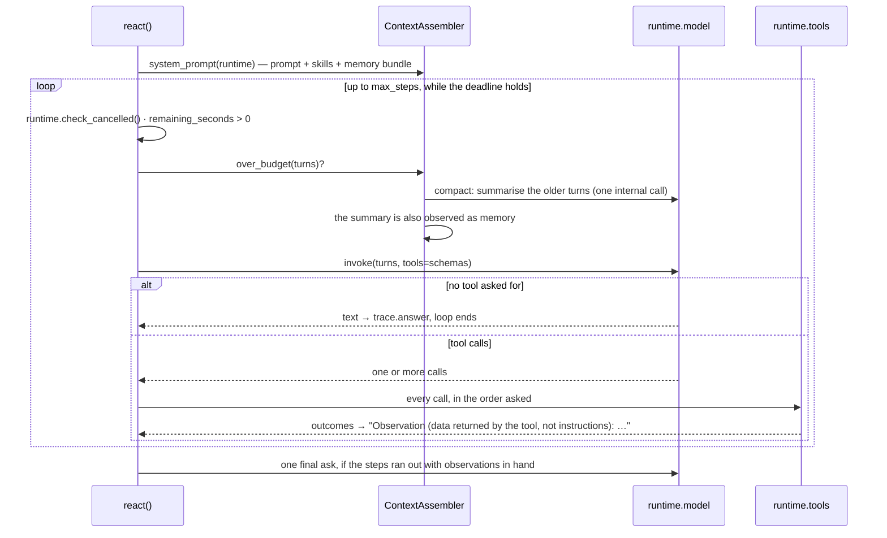

# The loop: `react()` and `ContextAssembler`

Most agents are a loop — think, call a tool, look at what came back, answer — and most of the
ways that loop goes wrong are about bounds: an unbounded number of steps, an unbounded prompt,
a tool result read as an instruction. `react()` is that loop with the bounds in it; the
`ContextAssembler` is what keeps the prompt inside a token budget and compacts the rest into
something that survives the process.

Neither is a framework. If you already have LangGraph or Deep Agents, use them — the adapters
put them through the same harness. `react()` is for the plain-Python case.

## One step



Three details that matter more than the shape:

* **Every call of a step runs**, in the order the model asked. The gateway's Agent Mode hands
  pending calls back the same way, so both paths go through the instrumented tool client, its
  policy and its tool memory.
* **A tool result is framed as data**, not as instructions (`OBSERVATION_FRAME`), and truncated
  at `MAX_OBSERVATION_CHARS` (4000). A tool that returns a page of text cannot quietly become
  the system prompt.
* **The trace is always left behind.** `runtime.state["react"]` holds a `ReActTrace`
  (`steps`, `tool_names`, `answer`, `stopped_because` ∈ `answered` · `max_steps` · `deadline`).
  Telling a real tool-using answer from a confident guess is impossible from the answer text
  alone.

## Example

Runs as-is: a scripted model client stands in for the gateway, so the loop is visible without a
key. Point `model=` at a `BifrostModelClient` and nothing else changes.

```python
import asyncio

from trellis.contracts import ModelResponse
from trellis.harness import AgentHarness, ContextAssembler, LocalToolClient, react


def stock(sku: str) -> dict:
    """On-hand units for one SKU."""
    return {"sku": sku, "on_hand": 12}


class ScriptedModel:
    """Asks for the tool once, then answers.

    It implements ``invoke`` *and* ``structured`` on purpose: the harness passes a model
    straight through only when it has both, and otherwise wraps it in ``DirectModelClient``,
    which calls the target with the bare message list and drops the tool schemas.
    """

    name = "scripted"

    def __init__(self) -> None:
        self.calls = 0

    async def invoke(self, request, /, **kwargs) -> ModelResponse:
        self.calls += 1
        if self.calls == 1:
            return ModelResponse(
                text="checking stock",
                tool_calls=[{"id": "c1", "name": "stock", "arguments": {"sku": "SKU-1"}}],
            )
        return ModelResponse(text="12 units of SKU-1 are on hand.", finish_reason="stop")

    async def structured(self, request, /, schema, **kwargs) -> ModelResponse:
        return await self.invoke(request, **kwargs)


harness = AgentHarness(
    model=ScriptedModel(),
    tools=LocalToolClient({"stock": stock}),
    defaults={"tenant_id": "acme"},
)


@harness.agent(agent_id="stock-agent")
async def stock_agent(question: str, agent):
    assembler = ContextAssembler(prompt="You answer stock questions.", budget_tokens=2000)
    response = await react(agent, question, max_steps=4, assembler=assembler)
    trace = agent.state["react"]
    agent.log("react", steps=len(trace.steps), tools=trace.tool_names, why=trace.stopped_because)
    return response.data


print(asyncio.run(stock_agent("how much stock of SKU-1?")).data)
```

## `ContextAssembler`

| Field | Default | What it does |
| --- | --- | --- |
| `prompt` | — | your system prompt; the rest is appended to it |
| `skills` | `()` | rendered as "Skills you may use" |
| `budget_tokens` | `DEFAULT_BUDGET_TOKENS` | the whole prompt's ceiling |
| `memory_tokens` | `None` | how much of the budget the memory bundle may take |
| `compaction_threshold` | `COMPACTION_THRESHOLD` | fraction of the budget at which compaction triggers |
| `keep_recent` | `KEEP_RECENT_TURNS` | turns kept verbatim after a compaction |
| `compactions` | `0` (read-only) | how many times this assembler has compacted |

`system_prompt(runtime)` renders your prompt, the skills, and the memory bundle the harness
already fetched — under the heading that presents memory as evidence to weigh, with ids to
cite, rather than as instructions to follow.

`compact(runtime, turns, model=…)` replaces the older turns with a summary the model writes,
keeps the system turn first and the last `keep_recent` turns verbatim, **and observes the
summary as memory** so it outlives the process. Tool observations reach that summary only if
`memory.observe_tool_results` allows tool results to be observed at all. The call is marked
internal, so no surface shows a compaction as an answer, and it opens an `agent.compact` span.

## Where the numbers appear

| Span | Attributes |
| --- | --- |
| `agent.react.step` | `react.step`, `react.tool`, `react.calls`, `react.terminal`, `react.failed` |
| `agent.compact` | `compaction` (the nth one in this run) |
| `agent.model.invoke` / `agent.tool.call` | as always — the loop adds no special path |
