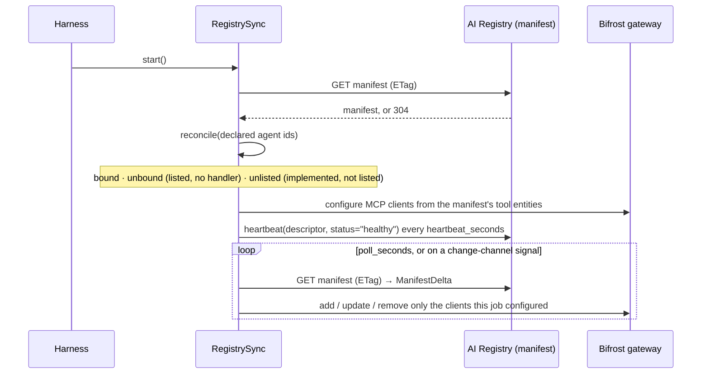
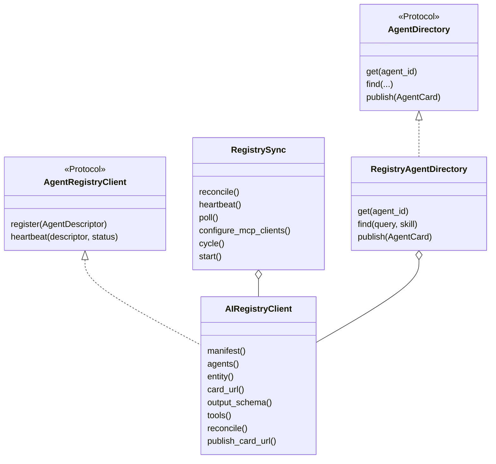

# The Registry: what exists, who may see it, and which version is current

The AI Registry is a **control plane**. It owns what agents and tools exist, who may see them
and what version is current; code owns what they *do*. The two are bound by name: a harness
`agent_id` must equal the registry entity's `name`.

The harness reads the registry's **manifest** (data plane, API-key auth, ETag-cached) rather
than its entity CRUD API (control plane, user JWT). Three consequences:

* a `304` costs nothing, which is what makes polling a reasonable fallback when no change
  channel is configured;
* `views` are pre-resolved per audience *by the registry* — this client picks a view and never
  merges overlays itself, or two surfaces would disagree about what a tool is;
* a cached manifest survives a registry outage: an agent keeps running on last-known-good
  instead of failing to start.

No registry *service* ships in this repository.

## Startup, then a loop



`unbound` (listed but with no local handler) is fail-safe, never fail-crash: those agents are
not served and the warning says so. `unlisted` (implemented here but not listed) is not
exposed — the registry is the source of truth for what exists.

## The pieces



| Call | What it answers |
| --- | --- |
| `manifest(refresh=…)` | the whole catalogue, ETag-cached |
| `agents(...)` / `all_agents()` | the agent entities of a view |
| `tools(...)` | the tool entities, from which MCP clients are configured |
| `card_url(agent_id)` | where that agent's A2A Agent Card is published (`a2a_card_url`, with two legacy aliases) |
| `output_schema(agent_id)` | the JSON Schema a result is validated against (needs the `registry` extra for `jsonschema`) |
| `reconcile(declared)` | `bound` / `unbound` / `unlisted`, by name |
| `publish_card_url(...)` | the one control-plane **write**: where this agent's card lives; skipped with a warning without `registry.control_plane_token`, because creating entities stays a reviewed, human action |
| `qualified(name)` | the registry-qualified name of a local id |

## Example

```python
import asyncio

from trellis.harness import AgentHarness, BifrostModelClient
from trellis.harness.registry import AIRegistryClient, RegistryAgentDirectory, RegistrySync

registry = AIRegistryClient(
    "https://registry.example.com",
    product_key="prd_…",
    api_key="…",
)
harness = AgentHarness(registry=registry, defaults={"tenant_id": "acme"})


@harness.agent(agent_id="refund-agent", skills=["billing.refund"])
async def refund(payload: dict, agent) -> dict:
    return {"refunded": payload["amount"]}


async def main() -> None:
    await harness.register_agents()  # descriptors + heartbeat; a no-op without a registry

    sync = RegistrySync(
        registry,
        descriptors=[harness.describe("refund-agent", skills=["billing.refund"])],
        gateway=BifrostModelClient("http://localhost:8091", api_key="vk-…"),
        heartbeat_seconds=60,
        poll_seconds=30,
    )
    print((await sync.reconcile()).bound)  # which listed agents this process serves
    print((await sync.configure_mcp_clients()).in_sync)
    directory = RegistryAgentDirectory(registry)
    print(await directory.find(skill="billing.refund"))  # Agent Cards, for the A2A client
    await sync.aclose()
    await harness.aclose()


asyncio.run(main())
```

Needs a reachable registry: without one, `manifest()` degrades to the last cached copy and, with
no cache, `reconcile()` reports nothing bound. That is the documented behaviour, not an error.

## Settings

| Setting | Default | Meaning |
| --- | --- | --- |
| `registry.url` · `.product_key` · `.api_key` | `null` | the manifest endpoint and its credentials (`UAH_REGISTRY_*`) |
| `registry.control_plane_token` | `null` | without it the card-location write is skipped with a warning |
| `registry.entity_path` | `/v1/entities/{entity_id}` | where a single entity is addressed — the entity API belongs to the registry product |
| `registry.heartbeat_seconds` · `.poll_seconds` | `60` · `30` | the loop; a poll that finds nothing new costs a `304` |

`RegistrySync(remove_unlisted_mcp_clients=True)` only ever removes gateway clients this job
configured itself, and `allow_local_targets` is a development flag: a tool entity pointing at a
private address is refused otherwise ([privacy.md](privacy.md), `events/targets.py`).

Serving those agents to each other is the A2A surface: [a2a.md](a2a.md).
