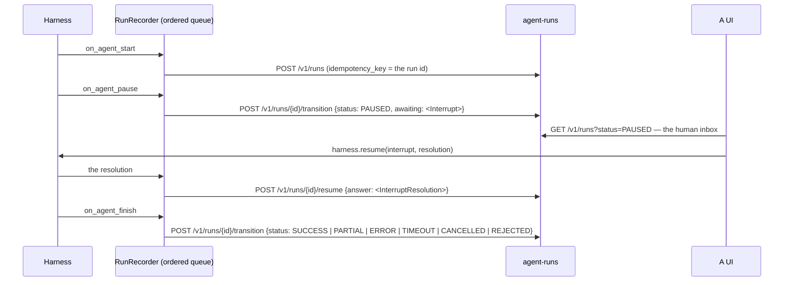
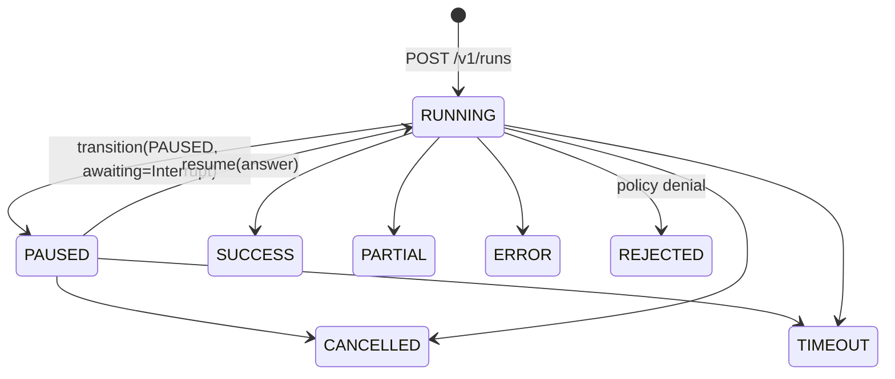
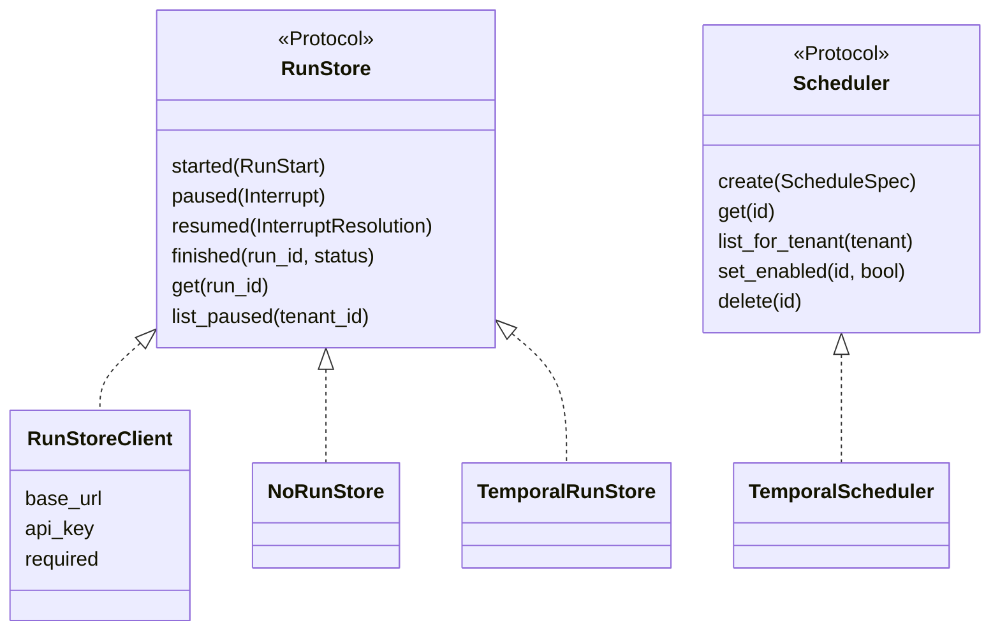

# Runs, durability and the paused inbox

A run is the unit of work a person can walk away from. The harness executes it; something else
remembers it, so a run that pauses for an approval at 2am is still there at 9am and a crashed
worker does not lose the answer a human already gave.

Two implementations sit behind the same `RunStore` port: the `agent-runs` service (default) and
Temporal. Nothing in an agent changes when a deployment swaps one for the other.

## What the harness records



`RunRecorder.on_event` is deliberately **synchronous**: it appends to a queue that one worker
drains in order, because `started` must reach the service before `finished`. `await
harness.drain()` is how a caller knows the record is written — in a short-lived process,
nothing else guarantees it.

## The lifecycle a record can have



`RUNNING` is the service's own state; every terminal state is the contract's `AgentStatus`, so
the harness and the store never hold two vocabularies for one fact. A paused run cannot jump
straight to `SUCCESS` — something has to actually run to produce a result.

## The port, and what implements it



| Route the client uses | When |
| --- | --- |
| `POST /v1/runs` | the run starts; `idempotency_key` **is** the run id, which is derived, so a retried turn reopens nothing |
| `POST /v1/runs/{id}/transition` | every state change, including the pause (`awaiting` carries the `Interrupt`) |
| `POST /v1/runs/{id}/resume` | a person answered; the body is `{"answer": <InterruptResolution>}` |
| `GET /v1/runs/{id}` | one record |
| `GET /v1/runs?status=PAUSED&limit=…` | the inbox of runs waiting on a human |

Headers: `X-Api-Key` and `X-Tenant-Id`. A `409` is not treated as a degradation — the service
refusing an illegal or repeated transition protected the record.

## Best-effort by default

The runs service is a system of record, not a dependency of the turn: an agent that refused to
answer a customer because its bookkeeping was unreachable would have inverted the priority.
Failures are logged (`runs.unavailable`, `effect="turn continues unrecorded"`) and the turn
continues. `required=True` inverts that for a deployment where an unrecorded run is worse than
a failed one, and then a failure raises `RunStoreUnavailable`.

## Configuring it

```yaml
runs:
  engine: agent_runs          # an enum: a typo is a startup error
  url: http://localhost:8095
  api_key: ${AGENT_RUNS_KEY}
  required: false
```

```yaml
runs:
  engine: temporal            # needs pip install "trellis-harness[temporal]"
  temporal:
    target: localhost:7233
    namespace: default
    task_queue: trellis-runs
```

Or explicitly, which is the same thing said in code:

```python
from trellis.harness import AgentHarness
from trellis.harness.runs import RunStoreClient

harness = AgentHarness(
    runs=RunStoreClient("http://localhost:8095", api_key=key, webhook_url=None),
    defaults={"tenant_id": "acme"},
)
```

`webhook_url` tells `agent-runs` where to POST when a run pauses or finishes, so a UI does not
have to poll for the 3am job waiting on an approval. A run's own `webhook_url` (from the request
metadata) wins over it, after passing the same checks.

## Temporal

`TemporalRunStore` and `TemporalScheduler` put runs and standing intents in Temporal behind the
same two ports: a workflow per run, signals for pause and resume, Temporal Schedules for
cadence. `list_paused` on a stock namespace lists this workflow type's running executions and
asks each for its record — bounded by `limit` and `scan_limit` — because there is no search
attribute for "is this run paused" unless an operator registers one. The details, including what
that costs and how to make it a single visibility query, are in
[`integrations/temporal/README.md`](../integrations/temporal/README.md).

## Schedules

`ScheduleSpec` / `Schedule` and the `Scheduler` port are in `trellis-contracts`. Two things
implement the port today: `TemporalScheduler`, and the `agent-schedules` service over HTTP
(`POST /v1/schedules`, `GET /v1/schedules/due`, `POST /v1/schedules/{id}/fire`, …). The harness
ships **no** HTTP client for `agent-schedules` — a deployment that runs it drives it from its
own control plane, and each firing becomes an ordinary run in `agent-runs`. That gap is
deliberate and is recorded in [limitations.md](limitations.md).
