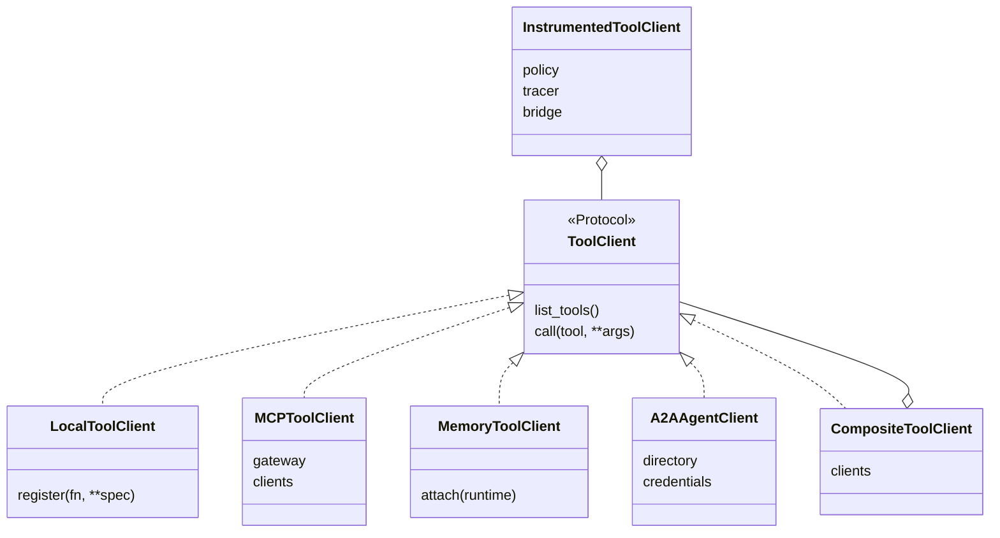

# Tools

Three ways a tool can reach an agent, one policy surface in front of all of them (design §6).
Whether the function is local, a gateway's MCP server or another agent over A2A, a call goes
through the same instrumented client: the same span, the same approval hook, the same tool
memory, the same idempotency key, the same events.

## One call

```mermaid
sequenceDiagram
  participant A as Agent
  participant T as InstrumentedToolClient
  participant P as Policy
  participant C as ToolClient (local · MCP · A2A)
  participant M as Memory Service
  participant S as Event sinks
  A->>T: runtime.tools.call("refund", amount=40)
  T->>P: authorize_tool(context, call)
  alt REQUIRE_APPROVAL
    P-->>T: require_approval
    T->>S: INTERRUPT (the run pauses; a person answers)
  else DENY
    P-->>T: deny(reason)
    T-->>A: ToolOutcome(status=REJECTED)
  else ALLOW
    T->>S: TOOL_CALL_START · ARGS
    T->>C: execute, inside timeouts.tool_seconds
    C-->>T: result or error
    T->>M: record_tool_call (tool memory)
    T->>S: TOOL_CALL_END · RESULT
    T-->>A: ToolOutcome
  end
```

`tool_call_id` on those events **is** the call's idempotency key, derived from the run's
lineage and the arguments — so a framework replay produces the same id and the call
deduplicates instead of doubling.

## The clients



| Client | Where the tool runs | Notes |
| --- | --- | --- |
| `LocalToolClient` | in your process | `tools=[fn]`, `tools={"name": fn}` or `harness.register_tool(fn)` build one for you |
| `MCPToolClient(gateway)` | an MCP server behind Bifrost | lists `GET /api/mcp/clients` and executes through the gateway; names stay exactly as the gateway gives them (`<server>-<tool>`), `clients=[…]` restricts which servers are listed |
| `MemoryToolClient` | the Memory Service | `memory.recall` and `memory.remember`, offered to the model only when `memory.as_tools: true` |
| `A2AAgentClient` | another agent | every agent the Registry lists becomes a tool — [a2a.md](a2a.md) |
| `CompositeToolClient([...])` | several of the above | first client that declares a name owns it; `list_tools` is the union |
| `wrap_tool(fn)` | in your process, called directly | instrument a function you call yourself, no client involved |
| `ToolCallBridge` | — | what an adapter uses to put a framework's own tool call through this pipeline |

A tool the model may not call is not a listing problem: `policy.authorize_tool` decides per
call, and `PolicyOutcome.REQUIRE_APPROVAL` turns the call into an `Interrupt` instead of a
refusal ([interrupts.md](interrupts.md)).

## Example — local tools, MCP tools and memory tools behind one port

Runs as-is; the MCP and memory clients are added only when their dependencies exist, so the
snippet stays honest about what is actually reachable.

```python
import asyncio

from trellis.harness import AgentHarness, CompositeToolClient, LocalToolClient


def reprice(sku: str, pct: float) -> dict:
    """Reprice one SKU. The docstring becomes the tool's description."""
    return {"sku": sku, "new_price": round(100 * (1 + pct / 100), 2)}


local = LocalToolClient({"reprice": reprice})
harness = AgentHarness(tools=CompositeToolClient([local]), defaults={"tenant_id": "acme"})


@harness.agent(agent_id="pricing-agent")
async def pricing(payload: dict, agent) -> dict:
    specs = await agent.tools.list_tools()
    outcome = await agent.tools.call("reprice", sku=payload["sku"], pct=5)
    return {"tools": [s.name for s in specs], "status": outcome.status, "data": outcome.output}


print(asyncio.run(pricing({"sku": "SKU-1"})).data)
```

With a gateway, the same agent gains every MCP tool its virtual key is allowed:

```python
from trellis.harness import BifrostModelClient, CompositeToolClient, LocalToolClient, MCPToolClient

model = BifrostModelClient("http://localhost:8091", api_key=virtual_key)
tools = CompositeToolClient([LocalToolClient({"reprice": reprice}), MCPToolClient(model)])
```

Passing the `BifrostModelClient` rather than a second gateway client is deliberate:
inference and tool execution then share one virtual key, one retry policy and one circuit
breaker.

## What the harness records for every call

| Where | What |
| --- | --- |
| span `agent.tool.call` | tool name, source, status, duration, the call's idempotency key; arguments and output only when `telemetry.capture.inputs`/`.outputs` allow it |
| lifecycle bus | `on_tool_start` / `on_tool_end` |
| `RunEvent` stream | `TOOL_CALL_START` · `ARGS` · `END` · `RESULT` (`status`, `output`, `error_class`, `invocation_id`) |
| Memory Service | one `tool_invocations` row per call when `tools.record_to_memory` is on, so procedures can be mined from what actually worked |
| `runtime.tool_calls` | the run's own list of summaries |

A tool that raises becomes a `ToolOutcome` with `status=ERROR` and a normalized `ToolError`
(category `TOOL`); a tool a policy refused becomes `status=REJECTED` with the reason
(`ToolStatus` is `ok` · `error` · `timeout` · `rejected` · `cancelled` — there is no `DENIED`).
Neither is an exception your agent has to catch unless you want to.

## Tool memory

Tool memory is the Memory Service's, not the harness's: the harness records what it called
and whether the run succeeded (`memory.record_outcome`), and the service mines validated
procedures from that. `runtime.memory.tools.plan(task, available_tools=…)` asks for the
best-known chain for a task. The design is in the service's
[`docs/TOOL_MEMORY.md`](https://github.com/amitmohapatra/agent-memory-service).
