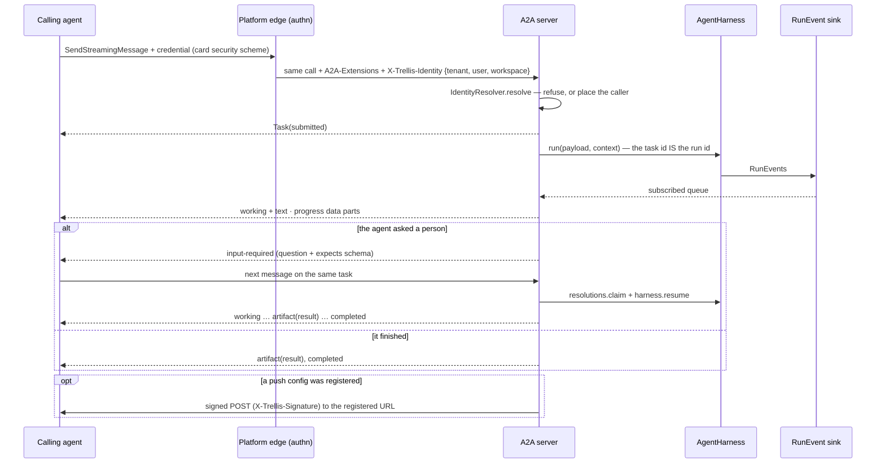
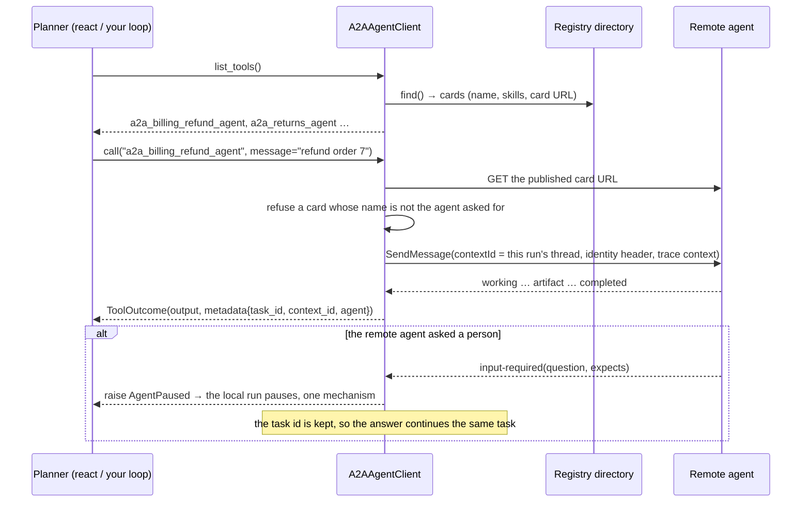

# trellis-harness-a2a

The [A2A](https://a2a-protocol.org) surface and client for `trellis-harness`, on the official
`a2a-sdk` (pinned to **1.1.5**, which speaks A2A protocol **v1.0** with protobuf types). Serve any
harness agent to other agents; call the agents your AI Registry lists as tools. The harness core
imports nothing of this package, and this package is the only place `a2a-sdk` is imported.

```bash
pip install "trellis-harness[a2a]"
```

## Serving

```python
from trellis.harness_a2a import A2AServer, TrustedHeaderIdentity

server = await A2AServer.from_registry(
    harness,
    agent=refund_agent,  # a callable the harness can wrap
    url="https://agents.example.com/a2a",  # the public A2A endpoint
    registry=harness.registry,  # the AI Registry client
    identity=TrustedHeaderIdentity(allowed_tenants={"acme"}),
    webhook_secret=os.environ["TRELLIS_WEBHOOK_SECRET"],  # enables push notifications
)
app.mount("/", server.app())  # or: server.add_to_fastapi(app)
```

`url` decides everything that has to agree: JSON-RPC is served at its path, the card document at
`<url>/.well-known/agent-card.json`, and that same string is written back to the Registry entity so
discovery points where the agent actually answers.



| Run event | A2A |
|---|---|
| `RUN_STARTED` | `working` |
| `TEXT_MESSAGE_CONTENT` | `working`, the delta as agent text |
| `TOOL_CALL_*`, `STEP_*`, `CONTEXT_LOADED`, `STATE_*`, `CUSTOM`, `RAW` | `working`, the event as a data part |
| `RUN_FINISHED(success/partial)` | `artifact(result)` then `completed` |
| `RUN_FINISHED(interrupt)` | `input-required` with the question and its `expects` schema |
| `RUN_FINISHED(error/timeout)` | `failed` with the error's code and message |
| `RUN_FINISHED(rejected)` | `rejected` — a policy refusal is a refusal, not a crash |
| `RUN_FINISHED(cancelled)` | `canceled` |

**Identity is the deployment's, never the caller's.** The caller's tenant, user and workspace arrive
on `X-Trellis-Identity` (JSON), set by an edge that authenticated the caller and *overwrites* any
header a client sent, and the A2A extension `https://trellis.dev/a2a/extensions/trusted-identity/v1`
is declared on the card. Nothing is ever read from the message, and the `tenant` field A2A requests
carry in their body is refused when it contradicts the authenticated caller. A deployment with no
such edge uses `FixedIdentity(tenant_id=...)` and serves exactly one tenant; a deployment that
authenticates in-process as well adds `require_authenticated=True`, so a server that becomes
reachable directly fails closed rather than believing a client's header. A refused call ends before a
run starts: no run, no memory, no task state for anyone else.

**Tasks.** The A2A task id *is* the harness run id, so a task can be rebuilt from the run store
(`HarnessTaskStore` falls back to `harness.runs.get(task_id)` for a task this process never saw, and
returns nothing for a run that is not the caller's). Tasks are partitioned by the authenticated
tenant and user, which is what makes a task id useless to anyone else. Durable run records stay the
harness's own `RunRecorder`'s job: this store writes no run transitions. A terminal task is
immutable — a refinement is a new task on the same `contextId`.

**Pauses.** `input-required` is the platform's one pause (`AgentPaused`, a LangGraph `interrupt()`,
a policy `require_approval`). The next message on the same task is claimed through
`harness.resolutions.claim(...)` — the run's own tenant, user, workspace and context, or nothing —
and answered through `harness.resume(...)`, so the run store, the feedback record and tool memory
see an A2A answer exactly as they see a UI's. A caller may answer an approval with `approve`,
`reject`, `cancel`, a data part naming the `decision`, or an object of edited arguments. An answer
that cannot be acted on leaves the task waiting and the pause announced, rather than failing a task
that is still owed an answer. What a caller learns about a pause is the question, the interrupt id,
the reason and the answer's schema — never the held tool call's arguments.

**Push notifications** reuse the harness's webhook rules end to end: https only, no credentials in
the URL, public addresses only, re-resolved at delivery (the same validator is handed to the SDK, so
a bad URL is refused when it is *registered*), `X-Trellis-Signature: t=…,v1=…` verifiable with
`trellis.memory.webhooks.verify_signature`, plus A2A's own `X-A2A-Notification-Token`.

## Calling

```python
from trellis.harness import CompositeToolClient, LocalToolClient
from trellis.harness.registry import RegistryAgentDirectory
from trellis.harness_a2a import A2AAgentClient

agents = A2AAgentClient(
    RegistryAgentDirectory(harness.registry),
    credentials={"teamKey": os.environ["TRELLIS_TEAM_KEY"]},  # per card security scheme
)
harness.tool_client._client = CompositeToolClient(
    [LocalToolClient(...), agents]
)  # or pass at build
```



A remote agent is a tool with a long timeout, which is the point: put `A2AAgentClient` in a
`CompositeToolClient` next to local functions and the gateway's MCP tools and policy,
instrumentation, idempotency keys and tool memory apply to it unchanged — an approval rule about
"tools that spend money" covers a remote agent that spends money. Tool names are
`a2a_<agent id>` with unsafe characters replaced, because a model's tool list will not take the
`product:agent` form. Card and catalogue text is flattened to one bounded line before a model reads
it, and a skill id is cut to the id it should have been.

The caller's thread is the A2A `contextId`, so a conversation between two agents is one thread on
both sides. A task id is kept per (tenant, context, agent) so a follow-up continues the same task,
and forgotten once the task ends; a `task_id` the planner names is honoured only when it is this
conversation's own. Card URLs are fetched only after passing the harness's target checks
(`allow_local_targets` / `verify_targets` for development, as on the webhook sink). Credentials come from your own store through `MappingCredentials` (a
mapping or a callable); an agent whose card requires a scheme you have no credential for is refused
by name rather than called unauthenticated. No credential value is ever written into a card.

## Agent Cards

`agent_card(descriptor, url=..., entity=...)` builds the platform card
(`trellis.contracts.a2a.AgentCard`, spelled as A2A 0.3) from the `AgentDescriptor` and the Registry
entity: the catalogue's description and skills overlay the code's, `version` stays the code's and
the catalogue's is kept beside it in `metadata`. `to_sdk_card()` translates it to the protobuf card
v1.0 puts on the wire — where the endpoint lives in `supported_interfaces` and `security` is
`security_requirements` — and `from_sdk_card()` is the way back for a card read from another agent.
The default security scheme is the team's key (`teamKey`, an API key in `Authorization`); a card
carries scheme *names*, never secrets.

## Registry sync

Card publication and discovery both go through the Registry, and the harness core (not this package)
owns that: `RegistryAgentDirectory` reads the manifest, `AIRegistryClient.publish_card_url` writes a
card's location onto the entity when a control-plane token is configured, and `RegistrySync` keeps a
deployment honest — heartbeat, manifest deltas (ETag poll, or a channel the deployment supplies) and
Bifrost's MCP clients configured from the Registry's tool entities. See
[docs/a2a.md](../../docs/a2a.md).

## Limits, stated plainly

- **JSON-RPC** is the transport that is tested. REST routes are available (`rest=True`); gRPC is not
  (`grpcio` is not installed and the SDK's gRPC transport is `None` without it).
- **Card signing** (`a2a-sdk[signing]`) and the SDK's **SQL task store** are not used.
- **Resume is in-process.** A pause is answered by the process that announced it, because
  `harness.resolutions` is in-process by design; the durable record is the run store. Behind a load
  balancer, pin a task's follow-ups to the instance that owns the run, or resume through the run
  store's own API.
- **A2A 0.3 clients** can be served by passing `enable_v0_3_compat=True`, which is untested here.
