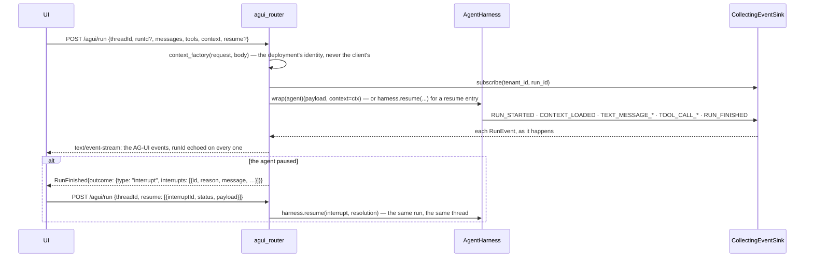

# trellis-harness-agui

The [AG-UI](https://docs.ag-ui.com) surface for `trellis-harness`: `POST /agui/run` streams
the run's events as the 17 AG-UI events over `text/event-stream`. A pause arrives as
`RunFinished{outcome: {type: "interrupt", interrupts: [{id, reason, message, toolCallId,
responseSchema, metadata}]}}`, a cancellation as `{type: "cancelled"}`, and the answer comes
back in the next request's `resume` entries (`{interruptId, status: "resolved" | "cancelled",
payload}`: a question's answer, or `true` / `false` / the edited arguments for an approval;
`decision` names a contracts decision outright). The client's `runId` is echoed on every
event; the agent's result rides on `RunFinished.result`. The harness core imports nothing of
this package.

## One request, one stream



## Runnable

`app.py`:

```python
from fastapi import FastAPI, Request

from trellis.harness import AgentHarness
from trellis.harness_agui import agui_router

harness = AgentHarness(defaults={"tenant_id": "acme"})


async def refund_agent(payload, agent) -> str:
    """``payload`` is the latest user message's text, or the request's ``state``."""
    return f"looking at {payload!r} (run {agent.run_id})"


def identity_from_request(request: Request, body) -> dict:
    """Your authentication, not the client's claim. Constant here to keep this runnable."""
    return {"tenant_id": "acme", "user_id": "u1"}


app = FastAPI()
app.include_router(
    agui_router(
        harness,
        agent=refund_agent,
        agent_id="refund-agent",
        context_factory=identity_from_request,
    )
)
```

```bash
pip install "trellis-harness[agui]" uvicorn
uvicorn app:app --port 8000
curl -N -X POST http://localhost:8000/agui/run \
  -H 'content-type: application/json' \
  -d '{"threadId": "chat-42", "messages": [{"id": "m1", "role": "user", "content": "refund 40"}]}'
```

What comes back is the SSE stream: `RUN_STARTED`, `CONTEXT_LOADED`, the message events, then
`RUN_FINISHED` carrying the agent's result.

Identity is the deployment's, never the client's: put the route behind your own
authentication and have `context_factory(request, body)` return the caller's `tenant_id`,
`user_id` and `workspace_id`; without a factory every run belongs to the router's
`tenant_id` and no user. `forwardedProps`, `tools` and `context` reach the agent as request
metadata (`forwarded_props`, `frontend_tools`, `context`) and decide nothing about who is
calling; calling a frontend tool is the agent's own contract with its UI. A resume is
accepted only from the thread and the caller that received the interrupt.
