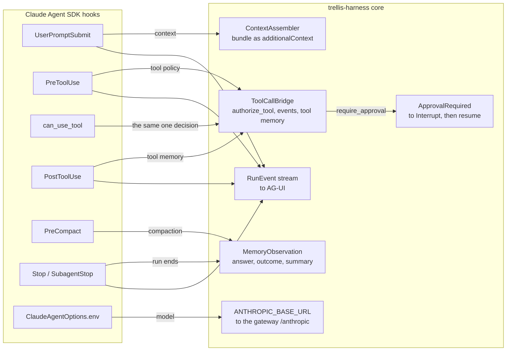

# trellis-harness-claude-agent-sdk

The [Claude Agent SDK](https://github.com/anthropics/claude-agent-sdk-python) adapter for the
[trellis-harness](../../README.md). The harness core never imports the SDK; installing this
package is what makes `harness.claude_agent_sdk` work.

```bash
pip install "trellis-harness[claude-agent-sdk]"
```

```python
from trellis.harness import AgentHarness

harness = AgentHarness(memory=memory_client, model=bifrost, defaults={"tenant_id": "acme"})

run = harness.claude_agent_sdk.agent(
    agent_id="reviewer",
    system_prompt="You review pull requests.",
    allowed_tools=["Read", "Grep"],
    gateway_url="http://localhost:8091",  # or the BIFROST_URL env var
)
answer = await run("what changed in src/?", context=context)
```

The CLI reads its credential from the environment it inherits, so export it in the process
that starts the agent:

```bash
export ANTHROPIC_AUTH_TOKEN="$BIFROST_VIRTUAL_KEY"   # never copied into the options
```

## The six bindings



| Moment | Where | Notes |
|---|---|---|
| run start / context | `UserPromptSubmit` returns the bundle as `additionalContext` | the SDK cannot replace a running session's system prompt; this is the hook it offers instead |
| model call | `ClaudeAgentOptions.env["ANTHROPIC_BASE_URL"]` points the CLI at the gateway | verified 2026-09-28: Bifrost serves an Anthropic-compatible API under `/anthropic` |
| tool call | `PreToolUse` returns `permissionDecision` allow / deny, and `updatedInput` for an approved edit | `can_use_tool` is the same single decision, reused |
| pause | `can_use_tool` returns `PermissionResultDeny(interrupt=True)` and the adapter raises `ApprovalRequired` | one `Interrupt`, the same shape as the other adapters |
| run end | `Stop` and `SubagentStop` write the answer and close the step | the core writes the outcome |
| compaction | `PreCompact` summarises what the adapter saw and remembers it, run-scoped | see below: the hook carries no summary |

## What the Claude Agent SDK cannot express

* **There is no model seam at all.** The SDK does not call a model: it spawns the `claude`
  CLI, which does. So there is no client to instrument and no `Model` interface to implement,
  and the whole model moment is an environment variable. What that costs, concretely: the
  per-call span, the per-call token and cost metrics, the model policy check and the
  execution's remaining deadline do **not** apply to the CLI's model calls the way they do for
  the other two adapters. What is recovered: the CLI's own `ResultMessage` reports usage,
  cost and turn count once per run, and the adapter records that on the runtime.
* **`PreCompact` carries no summary.** It fires *before* compaction with only the trigger
  (`manual` / `auto`) and any custom instructions, and the SDK has no hook that hands over the
  summary the CLI then makes. So the adapter writes its *own* summary of the same conversation
  — from the turns it saw on the stream, through the harness's model port — which is what
  `ContextAssembler.compact` does everywhere else. The remembered summary is therefore the
  harness's, not the CLI's.
* **A tool call cannot be suspended and resumed in place.** The CLI has no "hold this call and
  come back to it", so a call the policy holds for a person stops the run
  (`PermissionResultDeny(interrupt=True)`) and the resumed run re-plans. That is the same
  behaviour as the other two adapters, for a different reason.
* **Tool execution is the CLI's.** The adapter authorizes, records and closes a call, but the
  tool itself runs inside the CLI subprocess. The tests drive every hook directly with the
  payloads the CLI sends and never spawn it, so what they prove is the decision and the
  records — not a tool function running. Running the example needs the `claude` CLI installed.
* **The credential is never handled here.** The SDK's transport builds the CLI's environment
  as `{**os.environ, **options.env}`, so a token exported in this process is already inherited.
  Copying it into `options.env` would put a secret into a dataclass that gets logged, repr'd
  and attached to traces, so the adapter only *checks* that the variable is set — a clear
  failure at build time instead of a 401 from a subprocess later — and never reads its value.
  An operator who manages the credential another way passes `require_token=False`.

## What it does not do

Own the session, the subagents, the MCP servers, the skills or the permission mode. An
unconfigured gateway is refused rather than silently letting the CLI reach a provider
directly: an agent that bypassed the gateway would spend against a budget nobody set and
leave no record on the team's virtual key.

A runnable example:
[`examples/claude_agent_sdk_agent.py`](../../examples/claude_agent_sdk_agent.py).
Tested against the versions in [COMPATIBILITY.md](../../COMPATIBILITY.md).
