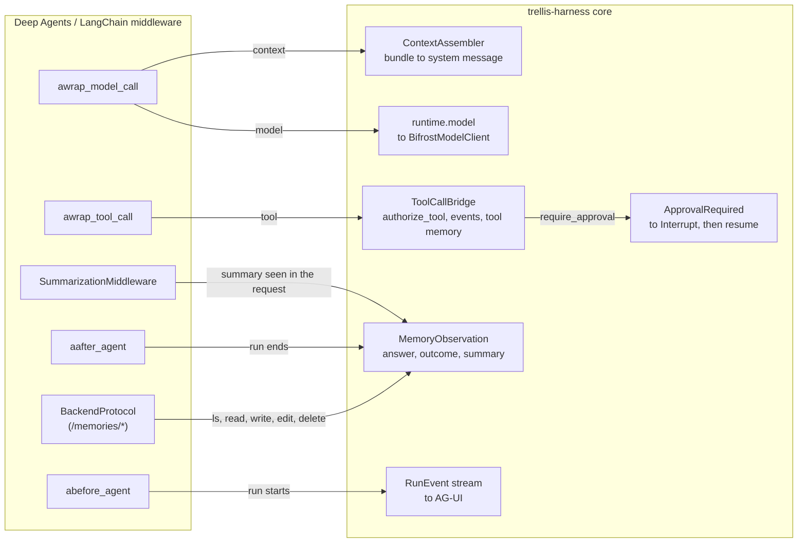

# trellis-harness-deepagents

The [Deep Agents](https://github.com/langchain-ai/deepagents) adapter for the
[trellis-harness](../../README.md). The harness core never imports Deep Agents; installing
this package is what makes `harness.deepagents` work.

```bash
pip install "trellis-harness[deepagents]"
```

```python
from trellis.harness import AgentHarness

harness = AgentHarness(memory=memory_client, model=bifrost, defaults={"tenant_id": "acme"})

# let the adapter assemble the agent
run = harness.deepagents.agent(agent_id="researcher", tools=[search])
result = await run({"messages": [{"role": "user", "content": "how much stock?"}]}, context=context)

# or keep the agent you already have
agent = create_deep_agent(
    model=harness.deepagents.model(),
    tools=[search],
    backend=harness.deepagents.backend(),
    middleware=[harness.deepagents.middleware()],
)
run = harness.deepagents.wrap(agent, agent_id="researcher")
```

## The six bindings



| Moment | Where | Notes |
|---|---|---|
| run start / context | `abefore_agent` opens a step; `awrap_model_call` renders the bundle into `ModelRequest.system_message` | the renderer is the core's `ContextAssembler`, so a fact reads the same here as in the harness's own loop |
| memory files | `MemoryServiceBackend` implements Deep Agents' `BackendProtocol` for `/memories/*` | tenant/workspace/user/run visibility, revisions and forgetting come from the service |
| model call | `awrap_model_call` replaces `request.model` with `BifrostChatModel` | a `BaseChatModel` over `runtime.model`: traced, metered, policy-checked, deadline-bounded |
| tool call | `awrap_tool_call` through `ToolCallBridge` | policy, the `TOOL_CALL_*` events and tool memory, then the framework runs the tool |
| pause | `ApprovalRequired` leaves the graph and the harness records one `Interrupt` | the framework's own `interrupt_on=` HITL also works: its `GraphInterrupt` becomes the same `Interrupt` |
| run end | `aafter_agent` writes the final message; the core writes the outcome | under the deployment's memory policy, not around it |
| compaction | `awrap_model_call` spots the summarisation summary and observes it, run-scoped | see below: LangChain has no post-summary hook |

## What Deep Agents cannot express

* **No post-summary compaction hook.** Design §8 named a `SummarizationMiddleware` hook;
  `deepagents` 0.7.19 has no class of that name (it ships
  `create_summarization_middleware(model, backend, …)`), and LangChain's
  `SummarizationMiddleware` offers no callback after it summarises. It rewrites `messages` in
  `before_model`, and the summary arrives as a `HumanMessage` carrying
  `additional_kwargs={"lc_source": "summarization"}`. The adapter therefore reads the summary
  out of the assembled model request rather than being told about it. That is not a shortcut:
  it is the only seam, and it is more robust than a second `before_model` would be, because
  it does not depend on middleware ordering.
* **A memory note's filename is the service's, not the model's.** Deep Agents lets the model
  choose a path; the Memory Service assigns memory ids and does not keep a caller-chosen
  filename (verified against the running service: a `title`/`path` passed with the write does
  not survive extraction). So `write_file("/memories/refund-policy.md", …)` succeeds and
  returns `/memories/mem_01J….md`. Notes are found by `ls` then `read`, which is exactly how
  the Deep Agents memory middleware already works: it reads every note into the prompt. A
  write over a path the service *does* know supersedes that memory, keeping the revision.
* **`grep` and `glob` over `/memories` happen in the adapter.** The service has no regex
  endpoint, and `recall` is a different thing — a ranked semantic search, not a literal match
  — so substituting it would answer a different question than the model asked. The scan is
  bounded to the most recent 200 notes.
* **A write over an existing note is not atomic.** `write_file` on a path the service knows
  supersedes that memory: it resolves the id, forgets it, then writes the new content. Two
  concurrent writes to the same note can therefore both resolve and both write, leaving two
  memories where one was meant. It is not serialised because the model writes its notes one at
  a time and the service keeps every revision, so the failure mode is a duplicate note rather
  than lost content. If that matters for your agent, keep the note under a `RUN`-visible
  backend instead of a shared one.
* **A policy denial ends the run; an approver's rejection does not.** `authorize_tool`
  returning `deny` raises `PolicyDeniedError`, which is what the harness's own loop does. To
  let the model see "no" and plan around it, use `require_approval` and reject the call: the
  refusal comes back as the tool's result.

## One security property worth knowing

A note the model writes under `/memories/` is a durable, model-authored fact that later runs
read back into their prompt — that is the whole point of the feature, and it is also a
persistence path: a model that has been steered by an untrusted tool result can leave a note
that influences the *next* run. Three things bound it, and none of them is "we sanitise the
text":

* the note is written through the run's scoped memory client, so it lands under this run's
  tenant, workspace and user and nowhere else — verified against the running service, which
  refuses a cross-scope read or forget with `AuthorizationError`;
* the bundle is rendered under "What is remembered (cite memory ids when you rely on them)",
  as evidence to weigh rather than as instructions to follow;
* `visibility` is yours to choose: the default `USER` keeps a remembered preference with the
  person it is about, and `harness.deepagents.backend(visibility="RUN")` stops a note
  outliving the run that wrote it.

Pick `RUN` for an agent whose tools read anything you do not control.

## What it does not do

Own the graph, the subagents, the skills, the todo list, the checkpointer or the state
schema. One compiled agent serves every run: the middleware, the chat model and the backend
resolve the current execution per call, so nothing is rebuilt per turn.

A runnable example: [`examples/deepagents_agent.py`](../../examples/deepagents_agent.py).
Tested against the versions in [COMPATIBILITY.md](../../COMPATIBILITY.md).
