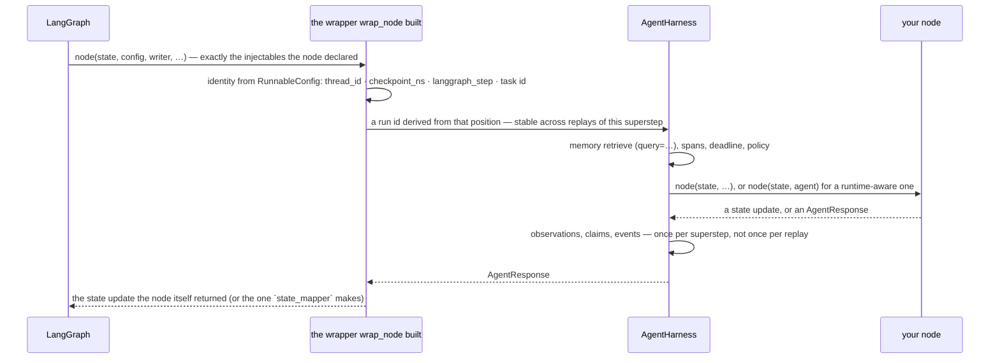

# trellis-harness-langgraph

The LangGraph adapter for the [trellis-harness](../../README.md). The harness core
never imports LangGraph; installing this package is what makes `harness.langgraph` work.

```bash
pip install "trellis-harness[langgraph]"
```

```python
from trellis.harness import AgentHarness

harness = AgentHarness(memory=memory_client, defaults={"tenant_id": "acme"})

# an existing node, unchanged
graph.add_node(
    "inventory",
    harness.langgraph.wrap_node(
        existing_node,
        agent_id="inventory-agent",
        query="question",
    ),
)


# a runtime-aware node
@harness.langgraph.agent(agent_id="answer-agent", query="question")
async def answer_node(state, agent):
    response = await agent.model.invoke(state["question"])
    return {"answer": response.text}
```

A complete graph that runs as written is [`examples/langgraph_agent.py`](../../examples/langgraph_agent.py)
(`python examples/langgraph_agent.py`); the full picture — parallel nodes, a nested sub-agent,
tools, artifacts, memory — is [`examples/reorder_workflow.py`](../../examples/reorder_workflow.py).

## What one superstep does



A subgraph nests: each `checkpoint_ns` segment becomes a parent agent run, so a nested graph
appears as a child run of the node that started it rather than as an unrelated trace. Wrapping
`app.ainvoke(...)` in `harness.execution(...)` is what gives the whole turn a single root —
without it, LangGraph runs each superstep in its own task and every node starts its own trace.

## What it does

* derives identity from the `RunnableConfig` — `thread_id` → memory thread,
  `checkpoint_ns` segments → agent-run lineage (subgraphs become parent runs),
  `langgraph_step` → turn, the executing task id → task;
* produces an agent run id that is **stable across replays of the same superstep**, so a
  checkpoint retry does not duplicate memory writes;
* builds a wrapper that declares exactly the injectables the wrapped node declared
  (`config`, `store`, `writer`, `previous`, `runtime`) and forwards them;
* maps `AgentResponse` back to a normal state update — by default, whatever the node itself
  returned.

## What it does not do

Own the graph topology, routing, reducers, the checkpointer or the state schema, or reach
into `langgraph._internal`. Application identity can be supplied per invocation:

```python
await app.ainvoke(
    state,
    {
        "configurable": {
            "thread_id": "chat-42",
            "harness": {"tenant_id": "acme", "user_id": "u1", "work_id": "wo-9"},
        }
    },
)
```

Tested against the versions listed in [COMPATIBILITY.md](../../COMPATIBILITY.md).
