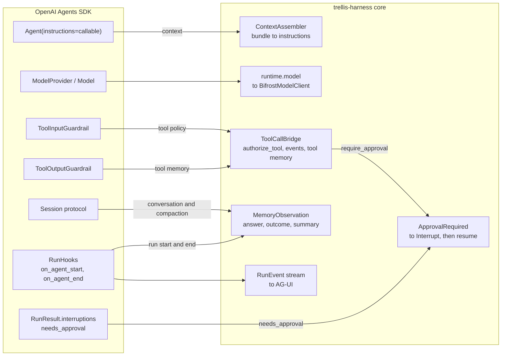

# trellis-harness-openai-agents

The [OpenAI Agents SDK](https://github.com/openai/openai-agents-python) adapter for the
[trellis-harness](../../README.md). The harness core never imports the SDK; installing this
package is what makes `harness.openai_agents` work.

```bash
pip install "trellis-harness[openai-agents]"
```

```python
from trellis.harness import AgentHarness

harness = AgentHarness(memory=memory_client, model=bifrost, defaults={"tenant_id": "acme"})

# let the adapter assemble the agent
run = harness.openai_agents.agent(agent_id="inventory", tools=[lookup])
result = await run("how much stock of SKU-1?", context=context)

# or keep the agent you already have
agent = Agent(
    name="inventory",
    instructions=harness.openai_agents.instructions("You answer stock questions."),
    tools=[lookup],
)
run = harness.openai_agents.wrap(agent, agent_id="inventory")
```

## The six bindings



| Moment | Where | Notes |
|---|---|---|
| run start / context | `Agent(instructions=<callable>)`, which the SDK calls per run, plus `on_agent_start` | the bundle is rendered by the core's `ContextAssembler` |
| conversation | `MemoryServiceSession` implements `get_items` / `add_items` / `pop_item` / `clear_session` | the thread lives in the Memory Service, where the boundary is enforced |
| model call | `BifrostModel(Model)` and `BifrostModelProvider(ModelProvider)` | converts the SDK's input items to a `ModelRequest` and the answer back to output items and `Usage` |
| tool call | `ToolInputGuardrail` decides, `ToolOutputGuardrail` records, both through `ToolCallBridge` | the guardrail is the only seam that can still refuse a call |
| pause | two paths, one `Interrupt`: a policy `require_approval` raises, and the SDK's own `needs_approval` interruptions are mapped | `apply_resolution` puts an answer back through `RunState.approve` / `reject` |
| run end | `on_agent_end` writes the final output; the core writes the outcome | output guardrails stay the application's own |
| compaction | `MemoryServiceSession.compact()` | the SDK has no summarisation hook, so the session carries the moment |

## What the OpenAI Agents SDK cannot express

* **SDK streaming is not implemented, and says so.** `Runner.run_streamed` expects a sequence
  of Responses-API *server* events (`response.created`, `response.output_text.delta`, …). A
  chat-completions gateway does not produce them, and synthesising them convincingly is a
  translation layer of its own; one that emitted a wrong event order would break the runner in
  ways a caller could not diagnose. `BifrostModel.stream_response` raises `NotImplementedError`
  with that explanation. `Runner.run` is fully supported, and the harness's own `RunEvent`
  stream is what a UI should watch — that is what the AG-UI surface consumes.
* **`Session.pop_item` cannot remove a message.** The Memory Service thread is an audited
  record with no per-message delete, and "forget" is a deliberate operation on a memory rather
  than a silent rewrite of what was said. Returning `None` would claim the conversation is
  empty, so the session returns `None` only when the thread really is empty and raises
  `NotImplementedError` when there is something it cannot remove. Use `clear_session()`, or
  keep the undo in your application's state.
* **Resuming the SDK's own run is opt-in.** `harness.resume(..., agent=wrapped)` re-runs the
  agent, which is what the other adapters do and what a stateless surface wants. An
  application that would rather continue the SDK's run in place takes
  `harness.openai_agents.pending_result(runtime)` (the paused `RunResult`), turns it into a
  `RunState`, applies the answer with `apply_resolution`, and hands the state back to
  `Runner.run`.
* **An approver cannot edit a call.** The SDK approves or rejects a tool call; it has no
  equivalent of the harness's `EDIT` decision, so `apply_resolution` refuses `EDIT` rather
  than approving the call with arguments the approver wanted changed. (The Deep Agents and
  Claude adapters do support `EDIT`.)
* **The SDK wraps guardrail exceptions.** Anything a tool guardrail raises comes back as
  `UserError("Error running tool …")`. That is reasonable for the SDK, but it would turn a
  policy denial into an unclassifiable failure and a paused run into a crash, so the adapter
  unwraps the harness's own signals: a denial stays a denial and a pause stays a pause.
* **Hosted tools are not offered to the model.** Only function tools are projected onto the
  gateway's `tools` list, because a hosted tool (web search, the code interpreter) is executed
  by a provider the gateway does not proxy; offering it would promise the model something
  nothing can run.
* **No provider SDK is imported.** The SDK's own LiteLLM provider reaches for
  `openai.types.responses`; this adapter builds the same objects from `agents.items`, which is
  where the SDK keeps its item vocabulary. `tests/unit/test_architecture.py` enforces it.

## What it does not do

Own the agent, its handoffs, its output type or its own guardrails. `wrap` copies the agent
and its tools before attaching the adapter's guardrails, so wrapping a module-level `Agent`
never attaches one harness's policy to another's.

A runnable example:
[`examples/openai_agents_agent.py`](../../examples/openai_agents_agent.py).
Tested against the versions in [COMPATIBILITY.md](../../COMPATIBILITY.md).
