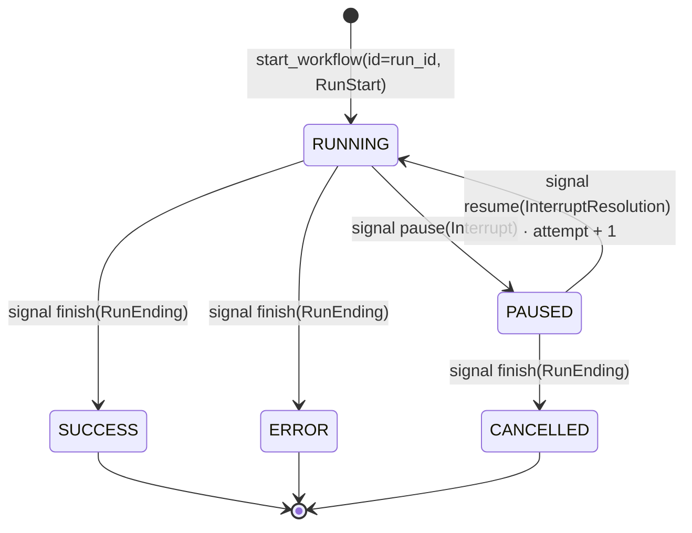
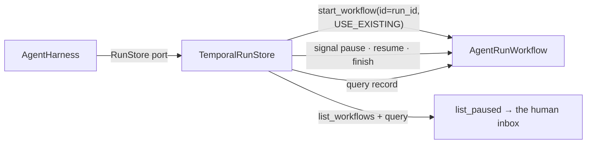
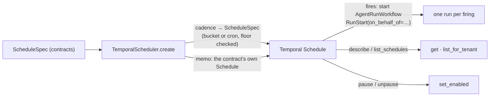

# trellis-harness-temporal

Temporal behind the harness's run and schedule ports. A team that already runs Temporal keeps
its runs there; a team that does not keeps using `agent-runs` and `agent-schedules`. Nothing
about an agent changes either way — the choice is one configuration key.

```bash
pip install 'trellis-harness[temporal]'
```

```python
from trellis.harness import AgentHarness
from trellis.harness_temporal import TemporalRunStore

runs = TemporalRunStore("localhost:7233", task_queue="trellis-runs")
harness = AgentHarness(memory=memory, runs=runs)
```

or, without naming the class at all:

```yaml
runs:
  engine: temporal          # the other value is agent_runs (the default)
  temporal:
    target: localhost:7233
    namespace: default
    task_queue: trellis-runs
```

`runs.engine` is an enum (`RunsEngine`), so a typo is a startup error and not a silently
unrecorded run. Selecting `temporal` without this distribution installed raises a
`ConfigurationError` naming the install command.

## Why a workflow per run

A run outlives the process that started it, a deploy, and a framework swap. Temporal's durable
execution is the strongest available way to say that, so the run *is* a workflow: the record
is the workflow's state, the transitions are signals, and the reads are queries.

The agent does **not** execute inside the workflow. The harness runs the agent; the workflow is
the record, kept alive by the cluster instead of by a process. That is why `AgentRunWorkflow`
has no activities, and why a Temporal outage degrades bookkeeping rather than answers.

## `AgentRunWorkflow` — the run, durable



| Name | Kind | Payload | Meaning |
|---|---|---|---|
| `pause` | signal | `Interrupt` | the run is waiting on something outside it; `awaiting` is the question |
| `resume` | signal | `InterruptResolution` | the answer arrived; back to `RUNNING`, `attempt + 1` |
| `finish` | signal | `RunEnding` | the run ended. A second ending is the same ending, not an error |
| `record` | query | → `RunRecord \| None` | the run as it stands. `None` is `RunStore.get`'s "no such run" |
| `refusals` | query | → `list[str]` | signals this run declined, newest last |

The state machine lives in a plain `RunState` class with no `temporalio` import, so every
transition is unit-testable without a server, and the workflow is a thin deterministic shell
over it. A signal that does not apply — a resolution for a different interrupt, a pause on a
finished run — is **refused and recorded**, never raised: a raising signal handler fails the
workflow task, which Temporal then retries forever, so an answer to the wrong question would
stop the run answering the right one.

The workflow type name is `TrellisAgentRun` and is deliberately decoupled from the class name:
it is what a visibility query filters on.

### The worker is the deployment's job

The adapters are what the harness owns. One worker somewhere keeps the run workflows alive:

```python
from temporalio.worker import Worker
from trellis.harness_temporal import AgentRunWorkflow, TemporalRunStore

runs = TemporalRunStore("localhost:7233", task_queue="trellis-runs")
worker = Worker(
    await runs.connection.client(),  # already carries the pydantic data converter
    task_queue="trellis-runs",
    workflows=[AgentRunWorkflow],
)
await worker.run()
```

Connect through `TemporalConnection` (which `TemporalRunStore` and `TemporalScheduler` both
hold) rather than `Client.connect` directly. Every payload crossing the workflow boundary is a
`trellis-contracts` pydantic model and Temporal's default JSON converter cannot round-trip one;
the connection installs `temporalio.contrib.pydantic.pydantic_data_converter` so that mistake is
not available. `Client.connect` is a coroutine and a harness is built synchronously, so the
connection is opened lazily on first use — a deployment does not have to connect before it can
build a harness.

## `TemporalRunStore` — the `RunStore` port



| Port method | Temporal |
|---|---|
| `started(RunStart)` | `start_workflow(id=run_id, id_conflict_policy=USE_EXISTING)` |
| `paused(Interrupt)` | `pause` signal, then the `record` query |
| `resumed(InterruptResolution)` | `resume` signal, then the `record` query |
| `finished(run_id, status, …)` | `finish` signal, then the `record` query |
| `get(run_id)` | the `record` query; workflow-not-found → `None` |
| `list_paused(tenant_id)` | `list_workflows` for running executions of this type, then the query |

**Idempotency is Temporal-native.** The workflow id *is* the run id, and the conflict policy is
`USE_EXISTING` rather than `FAIL`: a retried turn finding its own run is the normal case, not an
error. Nothing is reopened and nothing is duplicated.

**Best-effort, like the agent-runs client, and for the same reason.** The run store is a system
of record, not a dependency of the turn; an agent that refused to answer because its bookkeeping
was unreachable has inverted the priority. `required=True` inverts it back for deployments where
an unrecorded run is worse than a failed one — then a failure raises `TemporalRunsUnavailable`.

**`list_paused` on a stock namespace.** There is no search attribute for "is this run paused",
so the inbox is assembled by listing this workflow type's *running* executions and asking each
one for its record. It is bounded twice — `limit` results and `scan_limit` questions (default
1000) — so an inbox query can never walk a whole cluster. The start memo carries `tenant_id` as
a cheap pre-filter, and the record's own `tenant_id` is what decides: a memo that cannot be read
means "ask", never "admit".

For a namespace where you can register search attributes this scales better — register
`TrellisRunStatus` and `TrellisTenantId` as keyword attributes, set them when the run starts and
on every pause and resume, and the listing becomes one visibility query with no per-run
round trip:

```python
# Temporal's visibility list filter has no bound parameters, so the value is quoted by hand.
# A tenant id is platform-issued, but this is the one place where letting an apostrophe
# through would end the string early and widen the filter — so escape it, and keep the
# record's own tenant_id as the check that decides, exactly as the default path does.
def _quoted(value: str) -> str:
    return "'" + value.replace("'", "''") + "'"


query = (
    "WorkflowType = 'TrellisAgentRun' "
    f"AND TrellisTenantId = {_quoted(tenant_id)} AND TrellisRunStatus = 'paused'"
)
```

That is a namespace-configuration decision, so it is not the default: an adapter that only
worked on a namespace somebody had prepared would not be a drop-in for `agent-runs`.

## `TemporalScheduler` — the `Scheduler` port



| Port method | Temporal |
|---|---|
| `create(ScheduleSpec)` | `create_schedule` whose action starts `AgentRunWorkflow` |
| `get(schedule_id)` | `describe()`; not-found → `None` |
| `list_for_tenant(tenant_id)` | `list_schedules()`, filtered on the memo |
| `set_enabled(id, bool)` | `pause()` / `unpause()` |
| `delete(id)` | `delete()`; already gone is the outcome the caller asked for |

**A firing is an ordinary run.** The schedule's action starts the same workflow with the same
`RunStart` as any other entry point, carrying `on_behalf_of` — so a 6 a.m. run acts as the
person who set the schedule, and memory scope and policy see the right identity. Temporal
appends the nominal time to the action's workflow id, and the workflow takes its own id as the
run id, so every firing is its own run rather than a reopening of the template.

**Unlike the run store, the scheduler is not best-effort.** Creating a schedule is a user's
explicit act, and a "saved" schedule that does not exist is worse than an error. Failures raise.

**The contract's spec lives in the schedule's memo.** Temporal owns *when* a schedule fires; the
contract owns *what* it is. Reverse-engineering a cadence back out of a Temporal spec would lose
the difference between `weekdays` and the cron it compiled to. `enabled` is the exception and is
read back from Temporal's own `state.paused`: a memo cannot be updated on an existing schedule,
so the one thing that decides whether it actually fires has exactly one source of truth.

### Cadence

| Contract cadence | Cron | Note |
|---|---|---|
| `hourly` | `0 * * * *` | |
| `daily` | `0 0 * * *` | midnight in the schedule's `timezone` |
| `weekly` | `0 0 * * 1` | |
| `weekdays` | `0 0 * * 1-5` | |
| `manual` | — | created paused, with no automatic spec: triggered by hand |
| anything else | passed through | validated: 5, 6 or 7 fields, and the floor below |

Buckets compile to midnight rather than an invented "9 a.m." — a bucket that guessed a business
hour would be wrong in half the deployments that use it.

A cadence faster than `floor_seconds` (default 60) is refused at `create` time with a
`ConfigurationError`, not discovered as a bill. Cron's own resolution is a minute, so the floor
only ever bites the six-field form, which is the one that can ask for once per second.

`set_enabled(id, True)` on a `manual` schedule raises rather than unpausing it: enabling it would
give it a cadence it does not have. Trigger it instead.

## Tests

```bash
uv run pytest integrations/temporal/tests -q
```

Three layers, none of which needs a Temporal cluster and none of which spends money:

| File | What it proves | Needs |
|---|---|---|
| `test_state_and_cadence.py` | the transitions, the refusals, the cadence mapping and floor, both adapters' degradation | nothing |
| `test_scripted_client.py` | `list_paused` and `list_for_tenant`: the scan bound, the tenant filter, the schedule shape and the memo round trip | nothing |
| `test_workflow.py` | the workflow, its signals, its queries and the `RunStore` port end to end | temporalio's time-skipping test server |

The time-skipping server (`WorkflowEnvironment.start_time_skipping()`) is downloaded on first
use; every test that needs it skips with a reason when it cannot start. That server has no
schedule support, so the schedule test skips there and says so — `test_scripted_client.py` is
what actually covers `TemporalScheduler`, and it covers it more thoroughly than a live cluster
could, because a bound and a two-tenant filter need a controlled listing to mean anything.

Registering `AgentRunWorkflow` needs no sandbox configuration. Temporal's workflow sandbox
re-imports the module a workflow lives in, and this package's `__init__` passes the adapters
through rather than letting them drag `httpx` into a sandbox that (rightly) refuses it.

## What this distribution is not

* **Not a worker deployment.** A worker is the deployment's job; the adapters are what the
  harness owns. The registration above is the whole of it.
* **Not a second definition of a run.** `RunRecord`, `RunStatus`, `Interrupt`,
  `InterruptResolution`, `Schedule` and `ScheduleSpec` are `trellis-contracts` types and cross
  the workflow boundary unchanged. A Temporal outage never changes what a paused run *means*.
* **Not imported by the core.** `tests/compatibility/test_matrix.py` proves that importing
  `trellis.harness` pulls in no `temporalio`.
